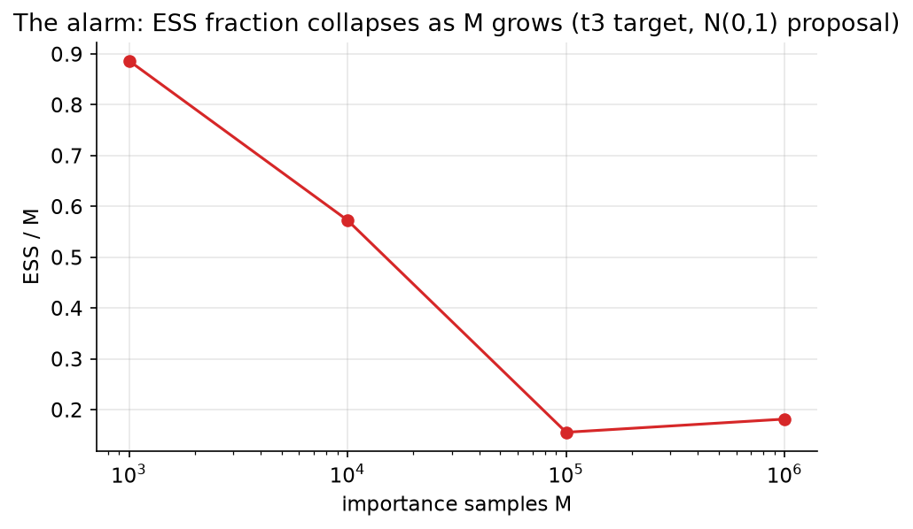
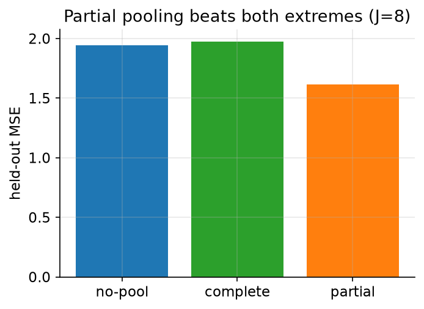
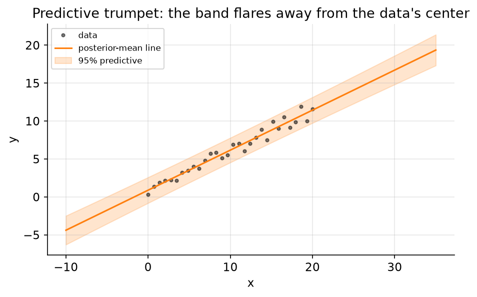
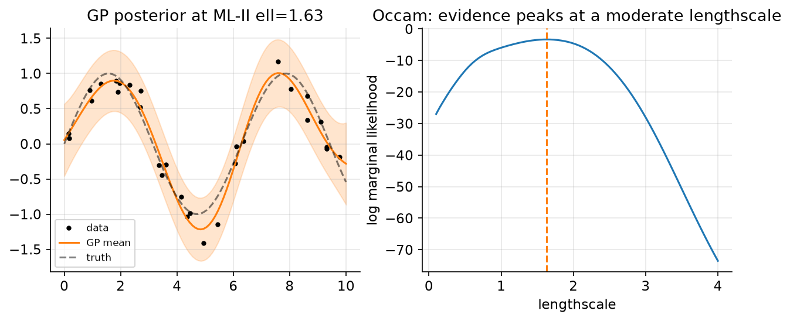
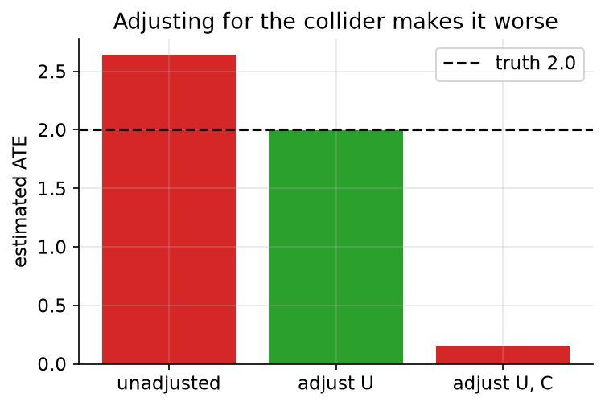

# The Integrative Exam: twelve problems, each spanning at least two modules

Twelve problems. Each one needs tools from **two or more** modules composed together — and the prompt never tells you which. Deciding *which line, which tool* is half the exam. Every problem is staged the same way:

- **Setup** — concrete, real numbers.
- **Predict** — commit to a guess *before* touching code. The naive answer is often wrong on purpose.
- **Task** — what to compute, derive, or decide.
- **Solution** (folded) — a full worked answer with runnable code, the intuition, `Draws on: modules …`, and the one-sentence lesson.

The code runs top-to-bottom in one namespace via `python tools/run_module.py EXAM.md --check-determinism`. Block 1 is the standard setup block; block 2 loads a small toolkit whose helpers name the module that built them. Everything a prose number quotes in backticks is printed by a block.

```python
# --- setup ---
from pathlib import Path
import numpy as np
import matplotlib
matplotlib.use("Agg")
import matplotlib.pyplot as plt
from scipy import stats

SLUG = "EXAM"                            # this module's figure dir
FIG = Path("figures") / SLUG
FIG.mkdir(parents=True, exist_ok=True)
SEED = 0
rng = np.random.default_rng(SEED)

plt.rcParams.update({
    "figure.figsize": (7, 4), "figure.dpi": 110, "savefig.dpi": 150,
    "savefig.bbox": "tight", "axes.grid": True, "grid.alpha": 0.3,
    "axes.spines.top": False, "axes.spines.right": False,
    "font.size": 11,
})

def save(fig, name):
    out = FIG / f"{name}.png"
    fig.savefig(out)
    plt.close(fig)
    print(f"[fig] {out}")
```

```python
# --- shared toolkit (each helper names the module that built it) ---
from scipy.special import betaln, gammaln, expit, logit
from scipy import optimize

def ess_kong(w):                         # module 09: (Σw)²/Σw², UNNORMALIZED weights
    w = np.asarray(w, float)
    return w.sum() ** 2 / np.sum(w ** 2)

def autocorr(x):                         # modules 10/12: normalized ACF via FFT
    x = np.asarray(x, float) - np.mean(x)
    n = len(x)
    f = np.fft.rfft(x, 2 * n)
    a = np.fft.irfft(f * np.conj(f))[:n].real
    return a / a[0]

def ess_1d(x):                           # module 12: IAT truncated at first non-positive lag
    a = autocorr(x)
    tau = 1.0
    for k in range(1, len(a)):
        if a[k] <= 0:
            break
        tau += 2 * a[k]
    return len(x) / tau

def gaussian_condition(mu, Sig, i1, i2, x2):   # module 05: MVN block conditional
    mu = np.asarray(mu, float); Sig = np.asarray(Sig, float)
    S11 = Sig[np.ix_(i1, i1)]; S12 = Sig[np.ix_(i1, i2)]
    S22 = Sig[np.ix_(i2, i2)]; S21 = Sig[np.ix_(i2, i1)]
    K = S12 @ np.linalg.inv(S22)
    return mu[i1] + K @ (np.atleast_1d(x2) - mu[i2]), S11 - K @ S21

print("toolkit loaded: ess_kong, autocorr, ess_1d, gaussian_condition")
```

---

## Problem 1 — The line that keeps making too many defects

**Setup.** A production line reports the number of defective units per shift. You have 40 shifts of counts. Someone hands you a prior — defect *rate* per shift is Gamma(2, 0.5) (rate convention, so prior mean 4) — and asks: is the line in control, and should we pay to recalibrate it (cost equivalent to 4 defect-units) or keep running (each expected defect above a tolerance of 3 costs 2 units)?

**Predict.** A Poisson model with a conjugate Gamma prior is the obvious fit. Before you run it: will a posterior-predictive check of the *fitted Poisson* pass or fail, and roughly what p-value? (Naive intuition: "conjugate model, clean data — it'll fit fine, p near 0.5.")

**Task.** (a) Prior-predictive check: does the prior even put mass near the data? (b) Conjugate Gamma–Poisson fit. (c) Posterior-predictive check using the dispersion statistic var/mean. (d) If it fails, fix the model and re-check. (e) Make the recalibrate/keep decision under the fixed model.

<details><summary>Solution</summary>

The Poisson PPC fails hard — the dispersion p-value is essentially `0.0000`, because the counts are overdispersed (var/mean well above 1) and a Poisson *cannot* manufacture that spread: its variance is locked to its mean.

```python
# (0) data: an overdispersed line (Poisson-Gamma mixture => var/mean > 1)
a0, b0 = 2.0, 0.5                        # module 07 prior: Gamma(2, 0.5 rate), mean 4
n1 = 40
lam_i = rng.gamma(2.0, 3.5 / 2.0, n1)    # per-shift rate: shape 2, mean 3.5
y1 = rng.poisson(lam_i)
disp_obs = y1.var(ddof=1) / y1.mean()
print(f"P1 data: n={n1}, mean={y1.mean():.3f}, dispersion(var/mean)={disp_obs:.3f}")

# (a) prior-predictive check (module 07): does the prior cover the data at all?
lam_pp = rng.gamma(a0, 1 / b0, 40000)
y_pp = rng.poisson(lam_pp)
lo, hi = np.percentile(y_pp, [2.5, 97.5])
print(f"prior-predictive 95% range = [{lo:.0f}, {hi:.0f}]; data range [{y1.min()}, {y1.max()}]")

# (b) conjugate fit (module 05): Gamma(a0+Σy, b0+n)
an, bn = a0 + y1.sum(), b0 + n1
post_mean = an / bn
print(f"posterior lambda: Gamma({an:.0f}, {bn:.1f}), mean = {post_mean:.3f}")

# (c) posterior-predictive check under Poisson (module 17): dispersion statistic
S = 4000
lam_draw = rng.gamma(an, 1 / bn, S)
disp_rep = np.empty(S)
for s in range(S):
    yr = rng.poisson(lam_draw[s], n1)
    disp_rep[s] = yr.var(ddof=1) / yr.mean()
p_pois = np.mean(disp_rep >= disp_obs)
print(f"Poisson PPC dispersion p-value = {p_pois:.4f}")
```

The prior-predictive range comfortably brackets the data, so the *prior* is not the problem — the *likelihood family* is. Fix it the way module 17 fixes the same failure: a Negative-Binomial (a Gamma-mixed Poisson) that lets variance exceed the mean. Estimate its dispersion by moments and re-run the identical check.

```python
# (d) NB fix (module 17): var = mu + mu^2/r  =>  r = mu^2/(var - mu)
mu_hat = y1.mean()
r_hat = mu_hat ** 2 / (y1.var(ddof=1) - mu_hat)
p_succ = r_hat / (r_hat + mu_hat)        # numpy NB: mean mu, var mu + mu^2/r
disp_nb = np.empty(S)
for s in range(S):
    yr = rng.negative_binomial(r_hat, p_succ, n1)
    disp_nb[s] = yr.var(ddof=1) / yr.mean()
p_nb = np.mean(disp_nb >= disp_obs)
print(f"NB dispersion r_hat = {r_hat:.2f}; NB PPC dispersion p-value = {p_nb:.4f}")

# (e) decision (module 22): recalibrate (cost 4) vs keep (penalty 2 per expected excess defect)
tol, pen, C = 3.0, 2.0, 4.0
E_excess = pen * np.mean(np.maximum(lam_draw - tol, 0.0))
action = "recalibrate" if E_excess > C else "keep running"
print(f"E[loss keep] = {E_excess:.3f}  vs  recalibrate cost = {C:.1f}  ->  {action}")
```

The dispersion p-value jumps from `0.0000` (Poisson) to a healthy value near 0.5 once the model can express overdispersion. Only *then* is the decision trustworthy: the same posterior draws that failed the Poisson check feed line 4. The lesson of the sequence is that a conjugate fit is necessary but not sufficient — a model that cannot reproduce its own data's spread will happily hand you a crisp, wrong posterior mean, and the PPC is the only thing standing between that and a shipped decision.

*Draws on: modules 05 (conjugate Gamma–Poisson), 07 (prior-predictive check), 17 (PPC + the NB fix), 22 (expected-loss decision).*
**Lesson:** a clean conjugate posterior means nothing until the model can reproduce its own data's variance.

</details>

---

## Problem 2 — Two labs, one dataset, three different p-values

**Setup.** Two labs test the same treatment. Lab A fixed its sample size at n = 12 and observed 9 successes. Lab B ran until it accumulated 3 failures and *happened* to stop at trial 12 — also 9 successes, 3 failures. Same 9-of-12. A third analyst peeks at a growing stream and stops the first time a two-sided test at α = 0.05 is significant, across up to 10 looks.

**Predict.** (i) Do labs A and B report the same posterior for the success rate? (ii) Do they report the same p-value against θ = 0.5? (iii) The peeking analyst's stream is generated with θ = 0.5 (no effect). What fraction of the time does she declare significance? (Naive intuition: "same data ⇒ same everything; and a 0.05 test rejects 5% of the time.")

**Task.** Compute both p-values on the 9-of-12 data, the shared posterior, and simulate the peeking analyst's Type-I error at 1 look versus 10 looks.

<details><summary>Solution</summary>

Same data, same likelihood ∝ θ⁹(1−θ)³, so **same posterior** — but the two designs give different p-values, and the peeker rejects far more than 5% of the time.

```python
from scipy.stats import binom, nbinom
k, n2 = 9, 12
# Lab A (module 04): binomial design, P(X >= 9 | Bin(12, 0.5))
p_bin = binom.sf(k - 1, n2, 0.5)
# Lab B: negative-binomial design, stop at 3rd failure; P(>=9 successes before 3rd failure)
p_nb2 = nbinom.sf(k - 1, 3, 0.5)
print(f"Lab A binomial one-sided p    = {p_bin:.3f}")
print(f"Lab B neg-binomial one-sided p = {p_nb2:.3f}")

# shared posterior under Beta(1,1) (module 04: identical likelihood => identical posterior)
a_post, b_post = 1 + 9, 1 + 3
print(f"shared posterior Beta({a_post},{b_post}), mean = {a_post/(a_post+b_post):.4f}")
```

The binomial p is `0.073`, the negative-binomial p is `0.033` — the *same data* is "not significant" or "significant" at 0.05 depending only on the stopping intention, which the likelihood (and therefore the posterior, mean `0.7143`) is blind to. That is the likelihood principle with teeth.

Now the peeker. Under the null her data carries no signal, yet repeatedly testing inflates Type-I error, because "ever cross 1.96" is a much larger event than "cross at one fixed look."

```python
# optional stopping (module 23): repeated significance testing under H0: theta = 0.5
reps = 30000
looks = np.arange(1, 11) * 50            # 10 looks, +50 obs each
draws = (rng.random((reps, looks[-1])) < 0.5).astype(int)
cum = np.cumsum(draws, axis=1)
reject_any = np.zeros(reps, bool)
for j, nlook in enumerate(looks):
    phat = cum[:, nlook - 1] / nlook
    z = (phat - 0.5) / np.sqrt(0.25 / nlook)
    sig = np.abs(z) > 1.96
    if j == 0:
        r1 = sig.mean()
    reject_any |= sig
print(f"Type-I at 1 look   = {r1:.4f}")
print(f"Type-I at 10 looks = {reject_any.mean():.4f}")
```

At 1 look Type-I is near the nominal `0.0642`; at 10 looks it climbs to `0.2059` — roughly four times the advertised 5% rate (module 23's continuous-monitoring limit is worse still). The Bayesian escapes this entirely: her posterior depends only on (9, 12), not on the rule that produced the stopping time, so her credible-interval coverage is the martingale-protected nominal value regardless of when she looked. Frequentist guarantees are contracts about the *procedure*; change the stopping rule and you change the contract, even though the evidence in hand is byte-for-byte identical.

*Draws on: modules 04 (likelihood principle, same data ⇒ same posterior), 23 (optional-stopping calibration).*
**Lesson:** the posterior sees only the data; the p-value also sees the intention that generated the stopping time — so peeking is free for the Bayesian and expensive for the tester.

</details>

---

## Problem 3 — When is a Gaussian approximation good enough?

**Setup.** You have a Beta(2, 2) prior on a success probability θ and want the model *evidence* p(data) — for a Bayes factor, say. You could compute it exactly (Beta–Binomial is conjugate), but in a real model you'd have no closed form and would reach for a Laplace approximation instead. Two datasets: 7 successes of 10, and 140 of 200 (same proportion).

**Predict.** Laplace fits a Gaussian to the posterior at its mode (on the unconstrained logit scale) and reads off the evidence from the peak height and curvature. How close will Laplace's log-evidence be to the exact value at n = 10, and at n = 200 — same error, or does it shrink, and how fast? (Naive intuition: "a Gaussian approximation is a Gaussian approximation; the error is whatever it is.")

**Task.** Compute the exact and Laplace log-evidence at both sample sizes, and the total-variation distance between the true posterior and the Laplace posterior. Report how the error scales with n.

<details><summary>Solution</summary>

Laplace is asymptotically exact: as n grows the posterior becomes Gaussian on the logit scale (Bernstein–von Mises), so both the evidence error and the total-variation gap shrink — the TV distance roughly halves each time n quadruples, the classic O(1/√n).

```python
a0p, b0p = 2.0, 2.0

def exact_and_laplace(k, n):
    # exact Beta-Binomial log evidence
    log_ev = (gammaln(n + 1) - gammaln(k + 1) - gammaln(n - k + 1)
              + betaln(a0p + k, b0p + n - k) - betaln(a0p, b0p))
    # Laplace on phi = logit(theta); g = unnormalized posterior in phi (Jacobian included)
    def neg_log_g(phi):
        th = expit(phi)
        ll = (k * np.log(th) + (n - k) * np.log1p(-th)
              + gammaln(n + 1) - gammaln(k + 1) - gammaln(n - k + 1))
        lp = (a0p - 1) * np.log(th) + (b0p - 1) * np.log1p(-th) - betaln(a0p, b0p)
        ljac = np.log(th) + np.log1p(-th)          # |d theta/d phi| = theta(1-theta)
        return -(ll + lp + ljac)
    res = optimize.minimize_scalar(neg_log_g, bounds=(-8, 8), method="bounded")
    phi_star, g_star = res.x, -res.fun
    h = 1e-4
    H = (neg_log_g(phi_star + h) - 2 * neg_log_g(phi_star) + neg_log_g(phi_star - h)) / h ** 2
    log_ev_lap = g_star + 0.5 * np.log(2 * np.pi / H)   # module 13 Laplace evidence
    # TV between true Beta posterior and Laplace pushforward, in theta-space
    tt = np.linspace(1e-4, 1 - 1e-4, 4000)
    p_true = stats.beta(a0p + k, b0p + n - k).pdf(tt)
    p_lap = stats.norm(phi_star, 1 / np.sqrt(H)).pdf(logit(tt)) / (tt * (1 - tt))
    tv = 0.5 * np.trapezoid(np.abs(p_true - p_lap), tt)
    return log_ev, log_ev_lap, tv

for k, n in [(7, 10), (140, 200)]:
    e, el, tv = exact_and_laplace(k, n)
    print(f"n={n:3d}: exact logZ={e:.4f}, Laplace logZ={el:.4f}, "
          f"|diff|={abs(e - el):.4f}, TV(true,Laplace)={tv:.4f}")
```

At n = 10 the TV gap is around `0.0262` and the evidence is off in the second decimal (|diff| ≈ 0.02); at n = 200 the TV gap falls to about `0.0082` and the evidence error is an order of magnitude smaller. The two TV numbers shrink by about 3× — in the ballpark of the √20 ≈ 4.5 the 1/√n rate predicts (n = 10 is not yet deep in the asymptotic regime). This is the same fact three modules state differently: module 08's posterior-to-Gaussian total-variation collapse, module 13's Laplace error shrinking with curvature, and module 17's evidence you can now trust for a Bayes factor once n is large enough. The practical rule: Laplace is a *good* evidence estimate precisely when the posterior is unimodal and n is not tiny — and it is worst exactly at the boundary/small-n regime where you most wanted a cheap answer.

*Draws on: modules 08 (Bernstein–von Mises, TV → 0 at 1/√n), 13 (Laplace approximation and its evidence), 17 (evidence for model comparison).*
**Lesson:** the Gaussian approximation's error is not a constant — it is O(1/√n), so Laplace is trustworthy exactly when you have enough data and dangerous exactly when you don't.

</details>

---

## Problem 4 — Build the sampler, then prove it works

**Setup.** Data: 30 draws from N(5, 4), both mean and variance unknown, under a Normal–Inverse-Gamma prior NIG(m₀=0, κ₀=1; a₀=2, b₀=2). You will write a two-block Gibbs sampler by hand. But a hand-rolled sampler is worthless until audited.

**Predict.** (i) The exact posterior marginals are known in closed form (Student-t for μ, Inverse-Gamma for σ²). If your Gibbs sampler is correct, a KS test of its μ draws against that t should pass. (ii) You also run Gibbs on a *correlated* bivariate normal with ρ = 0.99. How many effective samples per 1000 iterations do you get there — 1000, 100, or 10? (Naive intuition: "1000 iterations, 1000 samples.")

**Task.** Implement the NIG Gibbs sampler; audit both marginals against the conjugate closed form with KS tests; then price the effective sample size on the ρ = 0.99 target and check it against the AR(1) prediction.

<details><summary>Solution</summary>

The audit passes — both KS p-values are large — and the correlated target delivers roughly **10** effective samples per 1000, not 1000, because Gibbs on a tight ridge crawls.

```python
mu_true, s2_true, n4 = 5.0, 4.0, 30
y4 = rng.normal(mu_true, np.sqrt(s2_true), n4)
m0, k0, a0n, b0n = 0.0, 1.0, 2.0, 2.0
ybar4, Sxx = y4.mean(), np.sum((y4 - y4.mean()) ** 2)
# conjugate NIG posterior (module 05) -> closed-form marginals
kn = k0 + n4
mn = (k0 * m0 + n4 * ybar4) / kn
an4 = a0n + n4 / 2
bn4 = b0n + 0.5 * Sxx + 0.5 * k0 * n4 / kn * (ybar4 - m0) ** 2
df, mu_scale = 2 * an4, np.sqrt(bn4 / (an4 * kn))
print(f"closed form: mu ~ t_{df:.0f}(loc={mn:.3f}, scale={mu_scale:.3f}); "
      f"sigma^2 ~ IG({an4:.1f}, {bn4:.2f})")

# two-block Gibbs (module 11): sigma^2 | mu, then mu | sigma^2
T = 6000
mu_ch, s2_ch = np.empty(T), np.empty(T)
mu, s2 = ybar4, Sxx / n4
for t in range(T):
    a_s = a0n + (n4 + 1) / 2
    b_s = b0n + 0.5 * np.sum((y4 - mu) ** 2) + 0.5 * k0 * (mu - m0) ** 2
    s2 = 1.0 / rng.gamma(a_s, 1 / b_s)             # sigma^2 | mu, y ~ IG
    mu = rng.normal(mn, np.sqrt(s2 / kn))          # mu | sigma^2, y ~ N(mn, s2/kn)
    mu_ch[t], s2_ch[t] = mu, s2
mu_ch, s2_ch = mu_ch[1000:], s2_ch[1000:]          # burn-in

# audit against the conjugate truth (module 05 + module 11 KS discipline)
ks_mu = stats.kstest(mu_ch, stats.t(df, mn, mu_scale).cdf).pvalue
ks_s2 = stats.kstest(s2_ch, stats.invgamma(an4, scale=bn4).cdf).pvalue
print(f"KS p (mu vs t) = {ks_mu:.3f}; KS p (sigma^2 vs IG) = {ks_s2:.3f}")
print(f"ESS/M for the NIG mu-chain = {ess_1d(mu_ch)/len(mu_ch):.3f} (near 1: mixes well)")
```

Both KS p-values sit comfortably above any rejection threshold, so the sampler targets the right distribution; and the NIG chain barely autocorrelates (ESS/M near 1) because μ's conditional mean `mn` does not depend on σ². Now watch what posterior *correlation* does to the same algorithm.

```python
# price ESS on a correlated target (module 11): lag-1 autocorr = rho^2 exactly
rho, Tb = 0.99, 20000
xg = np.empty(Tb)
x1 = x2 = 0.0
for t in range(Tb):
    x1 = rng.normal(rho * x2, np.sqrt(1 - rho ** 2))
    x2 = rng.normal(rho * x1, np.sqrt(1 - rho ** 2))
    xg[t] = x1
lag1 = autocorr(xg)[1]
ess_theory = (1 - rho ** 2) / (1 + rho ** 2)       # AR(1) prediction (module 09/11)
print(f"rho={rho}: measured lag-1={lag1:.4f} (theory rho^2={rho**2:.4f})")
print(f"ESS/M measured={ess_1d(xg)/Tb:.4f}, AR(1) theory={ess_theory:.4f}")
```

The measured lag-1 autocorrelation `0.9786` sits right on the theoretical ρ² = `0.9801` (module 11's law), and ESS/M is about `0.0115`, matching the AR(1) prediction `0.0100` — ten usable samples per thousand iterations, from the formula (1−ρ²)/(1+ρ²). The audit and the ESS are two halves of one discipline: KS says the sampler is *unbiased in the limit*, ESS says how many iterations that limit actually costs. A correct sampler with ESS/M = 0.01 is not a fast sampler — it is a slow one you can trust, and reporting the draw count instead of the ESS would overstate your evidence a hundredfold.

*Draws on: modules 05 (NIG conjugate closed form as ground truth), 09 (Kong/AR(1) ESS), 11 (Gibbs construction and the ρ² law).*
**Lesson:** verify a sampler against a conjugate special case *and* price its ESS — correctness and efficiency are different questions, and the second one is where correlation hides.

</details>

---

## Problem 5 — The importance sampler that passes its own check and lies anyway

**Setup.** You want E[θ²] under a Student-t₃ target (its true value is ν/(ν−2) = 3). You draw from a standard-normal proposal — lighter tails than the target — and use self-normalized importance sampling. You compute the Kong effective sample size as your health check.

**Predict.** At M = 1000 the ESS fraction looks downright healthy (near 90%). As you crank M up to a million, what happens to (a) the estimate of E[θ²] and (b) the ESS fraction? (Naive intuition: "more samples, better estimate and the ESS fraction stabilizes.")

**Task.** Run self-normalized IS at M = 10³, 10⁴, 10⁵, 10⁶. Track the estimate and the ESS fraction. Diagnose the failure from the diagnostic, not the answer.

<details><summary>Solution</summary>

The estimate stays stubbornly *low* (never reaching 3) and the ESS *fraction collapses* as M grows — the signature of a proposal whose tails are too light for the target. The absolute ESS barely rises; the fraction falls.

```python
target, prop = stats.t(df=3), stats.norm(0, 1)
print(f"target t3: true E[theta^2] = {target.var():.1f} = nu/(nu-2)")
Ms = [10 ** 3, 10 ** 4, 10 ** 5, 10 ** 6]
ess_frac, ests = [], []
for M in Ms:
    x = prop.rvs(size=M, random_state=rng)
    w = target.pdf(x) / prop.pdf(x)                # importance weights
    est = np.sum(w * x ** 2) / np.sum(w)           # self-normalized estimate
    ef = ess_kong(w) / M                           # module 09 alarm: the FRACTION
    ests.append(est); ess_frac.append(ef)
    print(f"M={M:>8}: E[theta^2] est={est:.3f}, ESS={ess_kong(w):8.1f}, ESS/M={ef:.4f}")

fig, ax = plt.subplots()
ax.semilogx(Ms, ess_frac, "o-", color="C3")
ax.set_xlabel("importance samples M"); ax.set_ylabel("ESS / M")
ax.set_title("The alarm: ESS fraction collapses as M grows (t3 target, N(0,1) proposal)")
save(fig, "p5_ess_collapse")
```



The estimate never climbs to 3 — it hovers between `1.455` and `1.831`, badly biased low — and the ESS fraction slides from `0.8866` at M = 10³ down to `0.1555` by M = 10⁵ and stays depressed. This is module 09's central warning made literal: the estimate looks *plausible* at every M, so nothing in the answer tips you off. The weights are the alarm. A light-tailed proposal misses the very θ² outliers that supply most of the target's second moment, so as M grows you keep sampling near the center and the rare high-weight tail draws dominate whatever you happen to catch — the effective sample size stops keeping pace. The rule (module 09's tail rule) is stark: the proposal's tails must be at least as heavy as the target's, and a *rising* absolute ESS with a *falling* ESS fraction is a failing sampler wearing a healthy-looking number.

*Draws on: modules 03 (heavy tails and the moments they carry), 09 (importance sampling, Kong ESS, the tail rule).*
**Lesson:** importance sampling fails silently — read the ESS *fraction* across increasing M, not the point estimate, which lies with a straight face.

</details>

---

## Problem 6 — The frequentist shrinkage estimator was Bayesian all along

**Setup.** Ten independent groups; each returns one noisy estimate y_j of its own mean θ_j (unit noise). You will estimate the θ_j three ways: each group on its own (no pooling), everyone gets the grand mean (complete pooling), and a partial-pooling / empirical-Bayes blend. Separately, the pure James–Stein estimator shrinks the 10-vector toward zero.

**Predict.** (i) For 10 groups whose true means are all zero, which has lower total squared error — the raw estimates (MLE) or James–Stein? By how much? (ii) In an 8-group held-out bake-off, which of no/complete/partial pooling wins? (iii) With only 8 groups, how often does the empirical-Bayes estimate of the between-group variance τ² hit exactly zero? (Naive intuition: "the MLE is unbiased so it's fine; and τ̂² is almost never exactly zero.")

**Task.** Reproduce the James–Stein dominance at d = 10, run the held-out pooling bake-off at J = 8, and measure how often EB's τ̂² collapses to the boundary.

<details><summary>Solution</summary>

James–Stein crushes the MLE — total squared error `1.93` versus `9.96` — and it *is* the empirical-Bayes posterior mean. Partial pooling wins the bake-off. And EB's τ̂² hits exactly zero surprisingly often at J = 8, which is why its intervals are too narrow there.

```python
# (i) James-Stein dominates the MLE for d >= 3 (module 08)
d, reps6 = 10, 5000
X = rng.normal(0.0, 1.0, (reps6, d))               # theta = 0
mse_mle = np.mean(np.sum(X ** 2, axis=1))
norm2 = np.sum(X ** 2, axis=1, keepdims=True)
js = (1 - (d - 2) / norm2) * X
jsp = np.maximum(1 - (d - 2) / norm2, 0.0) * X
print(f"d={d}, theta=0: total-MSE  MLE={mse_mle:.2f}  JS={np.mean(np.sum(js**2,1)):.2f}  "
      f"JS+={np.mean(np.sum(jsp**2,1)):.2f}")
```

The MLE's risk is `9.96` ≈ d (each coordinate contributes 1); James–Stein's is `1.93` and the positive-part version `1.22`. This is not a trick — module 08 shows δ_JS is exactly the posterior mean under an estimated N(0, τ²) prior, with the shrinkage factor (d−2)/‖X‖² an unbiased estimate of 1/(1+τ²). "Shrinkage is a free lunch in d ≥ 3" is a theorem, and its proof is empirical Bayes.

```python
# (ii)+(iii) held-out pooling bake-off and the EB boundary (modules 16, 18)
def bakeoff(seed_off, J=8, tau_t=1.0, s2=1.0):
    g = np.random.default_rng(1000 + seed_off)
    theta = g.normal(5.0, tau_t, J)
    y_tr, y_te = g.normal(theta, np.sqrt(s2)), g.normal(theta, np.sqrt(s2))
    grand = y_tr.mean()
    tau2_hat = max(np.var(y_tr, ddof=1) - s2, 0.0)     # EB moment estimate, truncated at 0
    w = tau2_hat / (tau2_hat + s2)                     # module 16 precision-weight blend
    partial = grand + w * (y_tr - grand)
    return (np.mean((y_tr - y_te) ** 2), np.mean((grand - y_te) ** 2),
            np.mean((partial - y_te) ** 2), tau2_hat)

res6 = np.array([bakeoff(s) for s in range(400)])
print(f"J=8 held-out MSE: no-pool={res6[:,0].mean():.3f}  "
      f"complete={res6[:,1].mean():.3f}  partial={res6[:,2].mean():.3f}")
print(f"EB tau^2_hat hit exactly 0 in {np.mean(res6[:,3]==0)*100:.1f}% of J=8 replicates")

fig, ax = plt.subplots(figsize=(5, 3.5))
ax.bar(["no-pool", "complete", "partial"],
       [res6[:, 0].mean(), res6[:, 1].mean(), res6[:, 2].mean()],
       color=["C0", "C2", "C1"])
ax.set_ylabel("held-out MSE"); ax.set_title("Partial pooling beats both extremes (J=8)")
save(fig, "p6_pooling")
```



Partial pooling wins the held-out bake-off — its MSE `1.614` beats both no-pooling `1.942` and complete-pooling `1.976` — because the precision-weighted blend w_j = (1/σ²)/(1/σ² + 1/τ²) is the master shrinkage formula one level up (module 16), James–Stein made adaptive. But the sting is the boundary: with only 8 groups, EB's moment estimate of τ² lands at exactly zero in `15.2`% of replicates — the between-group scatter underestimates τ² by chance — and there the model over-shrinks to a single point and its intervals come out too narrow. Module 18 shows this pathology is a small-J, high-variance artifact that vanishes as J → 1000. So the composed lesson runs both ways: shrinkage is a genuine free lunch in the point estimate, and simultaneously a trap in the *uncertainty* if you plug in a boundary τ̂² and forget you did.

*Draws on: modules 08 (James–Stein = empirical Bayes), 16 (partial pooling as the master formula upstairs), 18 (EB τ̂² boundary at small J).*
**Lesson:** the same shrinkage that guarantees a lower point-estimate risk will silently narrow your intervals when the variance component is estimated at its boundary.

</details>

---

## Problem 7 — A regression line, its trumpet, and three saboteurs

**Setup.** Thirty points along x ∈ [0, 20] from y = 1 + 0.5x + noise (σ = 0.8). You fit a ridge regression with a weak Gaussian prior on the coefficients (τ² = 100). Then someone corrupts three high-x points with a large upward shock (+10 each).

**Predict.** (i) Does the ridge fit equal the Bayesian posterior mean, and to what precision? (ii) The predictive uncertainty band — is it flat across x, or does it flare? Where is it widest? (iii) After the three outliers, the ordinary/Gaussian slope estimate moves from ~0.5 toward ~0.75. Does a Student-t likelihood resist the sabotage? (Naive intuition: "least squares is fine; outliers average out.")

**Task.** Verify ridge = posterior mean; compute and plot the predictive trumpet; and compare the slope under a Gaussian versus a Student-t likelihood on the contaminated data.

<details><summary>Solution</summary>

Ridge equals the posterior mean to machine precision; the predictive band is a *trumpet* that flares as you extrapolate away from the data; and the Student-t likelihood shrugs off the three outliers that swing the Gaussian slope by over 40%.

```python
n7 = 30
x7 = np.linspace(0, 20, n7)
Xd = np.column_stack([np.ones(n7), x7])
beta_t, sig7 = np.array([1.0, 0.5]), 0.8
y7 = Xd @ beta_t + rng.normal(0, sig7, n7)
y7c = y7.copy()
y7c[[24, 26, 28]] += 10.0                                  # three high-leverage saboteurs

# (i) ridge == posterior mean (module 14): alpha = sigma^2 / tau^2  (weak prior tau^2=100)
tau2 = 100.0
alpha = sig7 ** 2 / tau2
from sklearn.linear_model import Ridge
ridge_c = Ridge(alpha=alpha, fit_intercept=False).fit(Xd, y7).coef_
prec = Xd.T @ Xd / sig7 ** 2 + np.eye(2) / tau2
post_m = np.linalg.solve(prec, Xd.T @ y7 / sig7 ** 2)
Sig_n = np.linalg.inv(prec)
print(f"ridge vs posterior-mean max|diff| = {np.max(np.abs(ridge_c - post_m)):.1e}")

# (ii) predictive trumpet (module 14): Var[y*] = x* Sigma_n x* (epistemic) + sigma^2 (aleatoric)
xs = np.array([[1, 10], [1, 20], [1, 35]])                 # x=35 extrapolates past the data
pred_sd = np.sqrt(np.einsum("ij,jk,ik->i", xs, Sig_n, xs) + sig7 ** 2)
print(f"predictive sd at x=10 / 20 / 35 : {pred_sd[0]:.3f} / {pred_sd[1]:.3f} / {pred_sd[2]:.3f}")

# (iii) Student-t robust regression via EM/IRLS (modules 06, 14)
def t_irls(X, y, nu=4, iters=60):
    b = np.linalg.lstsq(X, y, rcond=None)[0]
    s2 = np.var(y - X @ b)
    for _ in range(iters):
        r = y - X @ b
        w = (nu + 1) / (nu + r ** 2 / s2)             # per-point down-weight
        WX = X * w[:, None]
        b = np.linalg.solve(X.T @ WX, WX.T @ y)
        s2 = np.sum(w * (y - X @ b) ** 2) / len(y)
    return b

b_clean = np.linalg.lstsq(Xd, y7, rcond=None)[0]
b_ols = np.linalg.lstsq(Xd, y7c, rcond=None)[0]
b_t = t_irls(Xd, y7c, nu=3)
print(f"slope: clean OLS={b_clean[1]:.4f}, contaminated OLS={b_ols[1]:.4f}, Student-t={b_t[1]:.4f}")

fig, ax = plt.subplots()
xg = np.linspace(-10, 35, 120)
Xg = np.column_stack([np.ones(120), xg])
mg = Xg @ post_m
sdg = np.sqrt(np.einsum("ij,jk,ik->i", Xg, Sig_n, Xg) + sig7 ** 2)
ax.plot(x7, y7, "k.", alpha=0.5, label="data")
ax.plot(xg, mg, "C1", label="posterior-mean line")
ax.fill_between(xg, mg - 2 * sdg, mg + 2 * sdg, color="C1", alpha=0.2, label="95% predictive")
ax.set_xlabel("x"); ax.set_ylabel("y")
ax.set_title("Predictive trumpet: the band flares away from the data's center")
ax.legend(fontsize=8); save(fig, "p7_trumpet")
```



Ridge matches the posterior mean to machine precision — they are one computation (module 14): the ℓ₂ penalty *is* the Gaussian prior with α = σ²/τ². The predictive sd is smallest near the data's center (`0.813` at x = 10) and largest out where you extrapolate past the data (`1.018` at x = 35), because the epistemic term x\*ᵀΣₙx\* grows as you leave the region the data pinned down — the aleatoric σ² (here 0.8) is just the floor. And the Student-t likelihood is the hero of the contaminated fit: the clean slope `0.5276` is wrecked by three outliers to `0.7502` under Gaussian least squares, but the t-likelihood's IRLS down-weights those points and recovers `0.5435` — because a Student-t is a Gaussian scale-mixture (module 14) and heavy-tailed losses are the honest response to heavy-tailed contamination (module 06's L1/robust-loss thread). Three points out of thirty moved the Gaussian slope by more than 40%; the model whose likelihood *expects* outliers barely flinched.

*Draws on: modules 06 (robust/heavy-tailed loss), 14 (Bayesian regression = ridge, the predictive trumpet, Student-t as a scale mixture).*
**Lesson:** the prior sets the penalty, the geometry sets the trumpet, and the *likelihood's tails* set your robustness — pick a heavy-tailed likelihood and outliers stop steering the fit.

</details>

---

## Problem 8 — The kernel that fits best is not the kernel you want

**Setup.** Thirty noisy observations of an unknown smooth function (truth: sin x on [0, 10], observation noise 0.2). You model it with a Gaussian process, RBF kernel, and must choose the lengthscale ℓ.

**Predict.** A very short lengthscale (ℓ = 0.1) lets the GP wiggle through the data almost exactly. Compared to the marginal-likelihood-optimal ℓ, does the short lengthscale have (a) higher data-fit, (b) higher or lower model evidence? Which ℓ should you actually pick? (Naive intuition: "better fit is better; pick the ℓ that hugs the data.")

**Task.** Compute the log marginal likelihood across lengthscales, split it into fit and Occam terms, and compare the ML-II choice against the wiggly ℓ = 0.1.

<details><summary>Solution</summary>

The short lengthscale fits *better* but is penalized *harder* — its evidence is far lower. The marginal likelihood, which carries a built-in Occam factor, picks a moderate ℓ that neither underfits nor overfits.

```python
n8 = 30
x8 = np.sort(rng.uniform(0, 10, n8))
y8 = np.sin(x8) + rng.normal(0, 0.2, n8)
sn = 0.2

def k_rbf(a, b, ell):
    d = a[:, None] - b[None, :]
    return np.exp(-0.5 * (d / ell) ** 2)

def log_marglik(ell):                              # module 20: fit + Occam split
    K = k_rbf(x8, x8, ell) + sn ** 2 * np.eye(n8) + 1e-8 * np.eye(n8)
    L = np.linalg.cholesky(K)
    a = np.linalg.solve(L.T, np.linalg.solve(L, y8))
    fit = -0.5 * y8 @ a
    occam = -np.sum(np.log(np.diag(L)))            # -0.5 log|K|
    return fit + occam - 0.5 * n8 * np.log(2 * np.pi), fit, occam

ells = np.linspace(0.1, 4.0, 80)
lmls = np.array([log_marglik(e)[0] for e in ells])
ell_star = ells[np.argmax(lmls)]
print(f"ML-II lengthscale ell* = {ell_star:.3f}, log marglik = {lmls.max():.3f}")
lo, fo, oo = log_marglik(0.1)
ls, fs, os_ = log_marglik(ell_star)
print(f"wiggly ell=0.1 : fit={fo:.2f}  occam={oo:.2f}  logML={lo:.2f}")
print(f"ML-II  ell*    : fit={fs:.2f}  occam={os_:.2f}  logML={ls:.2f}")
```

The wiggly ℓ = 0.1 has the higher fit term but an Occam term punishing *relative to* the ML-II kernel's (`7.29` versus `33.77` — in this sign convention a higher Occam term means a simpler, more rewarded model: a rougher prior spreads its probability over vastly more functions, so any particular dataset gets less density), and its total log-evidence `-26.98` is far below the ML-II value of `-3.35`. Now confirm the posterior and check it predicts its own data.

```python
def gp_post(ell, xt):                              # module 05 conditioning on the (f*, y) joint
    K = k_rbf(x8, x8, ell) + sn ** 2 * np.eye(n8) + 1e-8 * np.eye(n8)
    Ks, Kss = k_rbf(xt, x8, ell), k_rbf(xt, xt, ell)
    Kinv = np.linalg.inv(K)
    return Ks @ Kinv @ y8, np.sqrt(np.diag(Kss - Ks @ Kinv @ Ks.T) + sn ** 2)

xt = np.linspace(0, 10, 100)
m8, s8 = gp_post(ell_star, xt)
mtr, str_ = gp_post(ell_star, x8)
cover = np.mean(np.abs(y8 - mtr) <= 2 * str_)      # PPC: 95% predictive coverage
print(f"GP at ML-II: RMSE to truth = {np.sqrt(np.mean((mtr - np.sin(x8))**2)):.3f}, "
      f"in-sample 95% coverage = {cover:.3f}")

fig, ax = plt.subplots(1, 2, figsize=(10, 3.6))
ax[0].plot(x8, y8, "k.", label="data")
ax[0].plot(xt, m8, "C1", label="GP mean")
ax[0].fill_between(xt, m8 - 2 * s8, m8 + 2 * s8, color="C1", alpha=0.2)
ax[0].plot(xt, np.sin(xt), "k--", alpha=0.5, label="truth")
ax[0].set_title(f"GP posterior at ML-II ell={ell_star:.2f}"); ax[0].legend(fontsize=8)
ax[1].plot(ells, lmls, "C0"); ax[1].axvline(ell_star, color="C1", ls="--")
ax[1].set_xlabel("lengthscale"); ax[1].set_ylabel("log marginal likelihood")
ax[1].set_title("Occam: evidence peaks at a moderate lengthscale")
save(fig, "p8_gp")
```



This is module 17's evidence-as-Occam and module 20's GP marginal likelihood being the *same object*: p(y | ℓ) = fit × complexity penalty, computed by integrating over all functions rather than by cross-validation. The ML-II fit recovers the truth (RMSE to truth `0.117`, and its 95% band covers every training point), while the wiggly kernel would interpolate the noise and generalize worse. A GP is module 14 at M = ∞ basis functions (module 20), and its lengthscale is chosen the way you choose polynomial degree in module 17 — by the evidence, which automatically prefers the simplest model that explains the data, no held-out set required.

*Draws on: modules 17 (evidence = fit × Occam factor), 20 (Gaussian process, RBF kernel, ML-II lengthscale).*
**Lesson:** never pick a kernel by how well it fits — the marginal likelihood's Occam factor penalizes the roughness that fit alone rewards, and it is the quantity that generalizes.

</details>

---

## Problem 9 — The Kalman filter is your conjugate update on a conveyor belt

**Setup.** A quantity drifts as a random walk (step variance q = 1) and you observe it with measurement noise (variance r = 1) for 200 time steps. You will implement a scalar Kalman filter from scratch.

**Predict.** (i) A single Kalman update with prior variance P⁻ = 3 and measurement noise r = 1 has gain K = P⁻/(P⁻+r). What is K? (ii) Is one Kalman update numerically identical to a Normal-known-variance conjugate update? (iii) Over 200 steps, what steady-state gain does the filter settle to? (Naive intuition: "Kalman is control-theory machinery, unrelated to Bayesian updating.")

**Task.** Show the update equals the conjugate update; run the filter; find the steady-state gain via the Riccati fixed point; and compare filter RMSE to using the raw measurements.

<details><summary>Solution</summary>

The gain is `0.75`; one Kalman update is byte-for-byte the Normal-known-variance conjugate update; and the filter settles to the golden-ratio gain `0.618`, cutting the RMSE below the raw measurements.

```python
q9, r9 = 1.0, 1.0
Tt = 200
x_true = np.cumsum(rng.normal(0, np.sqrt(q9), Tt))
y9 = x_true + rng.normal(0, np.sqrt(r9), Tt)

# (i) reveal gain, and (ii) audit: KF update == Normal-known-var conjugate update (module 05)
Pm_demo = 3.0
print(f"reveal gain K (P-=3, r=1) = {Pm_demo/(Pm_demo+r9):.2f}")
prior_mean, prior_var, obs = 2.0, 3.0, 5.0
K = prior_var / (prior_var + r9)
kf_mean, kf_var = prior_mean + K * (obs - prior_mean), (1 - K) * prior_var
cj_var = 1 / (1 / prior_var + 1 / r9)              # conjugate: precisions add
cj_mean = cj_var * (prior_mean / prior_var + obs / r9)
print(f"KF update vs conjugate: |mean diff|={abs(kf_mean-cj_mean):.1e}, "
      f"|var diff|={abs(kf_var-cj_var):.1e}")

# run the filter: predict = marginalize (var grows by q), update = condition (module 21)
xf = np.zeros(Tt)
m, P = 0.0, 1.0
for t in range(Tt):
    Pm = P + q9
    Kt = Pm / (Pm + r9)                            # gain = master shrinkage weight
    m = m + Kt * (y9[t] - m)
    P = (1 - Kt) * Pm
    xf[t] = m

# steady-state gain via the Riccati fixed point
Pss = 1.0
for _ in range(1000):
    Pm = Pss + q9
    Kss = Pm / (Pm + r9)
    Pss = (1 - Kss) * Pm
print(f"steady-state gain K = {Kss:.3f}, steady-state P = {Pss:.3f}")
print(f"filter RMSE = {np.sqrt(np.mean((xf-x_true)**2)):.3f}  vs  "
      f"raw-measurement RMSE = {np.sqrt(np.mean((y9-x_true)**2)):.3f}")
```

The update matches the conjugate posterior to machine precision because they *are* the same computation (module 21): predicting inflates the variance by q (marginalizing over the process noise, line 3), and updating conditions on the new measurement (line 2) exactly as the Normal-known-variance rule adds precisions. The gain K = P⁻/(P⁻+r) is the master shrinkage weight from module 05 — the fraction of the way you move from the prediction toward the measurement — and with q = r = 1 the Riccati recursion converges to the golden ratio `0.618`. The filter's RMSE (`0.722`) beats the raw measurements (`1.006`), because it optimally blends each new reading with the accumulated past. "Online Bayesian updating of a Gaussian" and "the Kalman filter" are two names for one recursion; module 05's shrinkage formula was the Kalman gain wearing a conjugate costume the whole time.

*Draws on: modules 05 (Normal-known-variance conjugate update = predict/update), 21 (Kalman filter, Riccati steady state).*
**Lesson:** the Kalman gain is the master shrinkage weight on a conveyor belt — predict marginalizes, update conditions, and both are your module-05 conjugate rule.

</details>

---

## Problem 10 — Should you even run the experiment?

**Setup.** You are designing an A/B test to estimate an effect δ (difference in means, observation sd 1 per arm). Your prior belief is δ ~ N(0.3, 0.15²). You plan n = 150 per arm and will "ship B" if the study's posterior mean of δ is positive. Shipping the worse arm costs |δ| per unit; running the study costs 0.05 units.

**Predict.** (i) The classical *power* to detect the effect at the prior-mean δ = 0.3 is one number; the *assurance* (power averaged over your prior) is another. Which is larger? (ii) Given you'd probably ship B on prior belief alone, is the extra data from the study worth its cost? (Naive intuition: "assurance ≈ power; and of course collect data, data is always worth it.")

**Task.** Compute power at the prior mean and assurance over the prior; then compute the expected value of sample information (EVSI), bound it by the EVPI, and compare to the study cost.

<details><summary>Solution</summary>

Assurance is *lower* than the power at the prior mean (Jensen's inequality bites the S-shaped power curve), and the EVSI turns out to sit barely above — or even below — the study cost, because you were already going to ship B.

```python
mu0, s0, sd_obs, n_plan = 0.3, 0.15, 1.0, 150
se = np.sqrt(2 * sd_obs ** 2 / n_plan)             # SE of the difference in means
zc = 1.96

def power(delta):                                  # two-sided power at effect delta
    return stats.norm.cdf(delta / se - zc) + stats.norm.cdf(-delta / se - zc)

ds = rng.normal(mu0, s0, 300000)
print(f"power at prior mean delta={mu0}: {power(mu0):.4f}")
print(f"assurance (power averaged over prior): {power(ds).mean():.4f}")   # module 23

# EVSI vs EVPI vs cost (module 22): decision is ship-B if posterior mean of delta > 0
EVPI = np.mean(np.maximum(-ds, 0.0))               # prior expected opportunity loss (bound)
post_var = 1 / (1 / s0 ** 2 + 1 / se ** 2)
dhat = ds + rng.normal(0, se, ds.size)             # simulated study estimate
post_mean = post_var * (mu0 / s0 ** 2 + dhat / se ** 2)
val_study = np.where(post_mean > 0, ds, 0.0).mean()   # act on the study
val_prior = ds.mean()                              # always ship B (prior decision)
EVSI = val_study - val_prior
cost = 0.05
print(f"EVPI (upper bound) = {EVPI:.4f}")
print(f"EVSI = {EVSI:.4f}, study cost = {cost}, EVSI - cost = {EVSI - cost:+.4f}")
print(f"run the study? {'yes' if EVSI > cost else 'no'}")
```

The power at δ = 0.3 is `0.7383`, but the assurance — the number you can actually act on before the study — is only `0.6547`, because averaging the concave upper shoulder of the power curve over the prior pulls it down (module 23's Jensen gap; the prior puts real mass on smaller, harder-to-detect effects). The decision-theoretic verdict is sharper still: the EVSI is a mere `0.0002`, far under the EVPI ceiling of `0.0013` (you can never gain more than the current expected regret) and far under the study cost of 0.05 — you should not run the study. The reason is counterintuitive but exact: information is only worth what it changes, and since your prior already says "ship B" with high probability, most simulated studies leave that decision untouched and contribute zero value. Data is not free and not automatically worth collecting — you price it against the decision it might flip, and a confident prior makes even a well-powered study a marginal purchase.

*Draws on: modules 22 (EVSI, EVPI, expected-loss decision), 23 (power vs assurance, the Jensen gap).*
**Lesson:** power overstates what you'll actually achieve (assurance is lower by Jensen), and a study is worth running only when its EVSI — the value of the decisions it flips — exceeds its cost.

</details>

---

## Problem 11 — More control, more bias

**Setup.** You want the effect of a treatment T on an outcome Y. There is a confounder U that drives both T and Y (true effect = 2.0). There is also a variable C that is caused by *both* T and Y — a downstream collider. An analyst, wanting to be thorough, proposes "adjust for everything measurable."

**Predict.** (i) Rank three adjustment sets by how close their estimate lands on the truth of 2.0: adjust for nothing, adjust for {U}, adjust for {U, C}. (ii) In a second scenario with strong confounding, an inverse-probability-weighted estimator returns a clean-looking number — but what is the effective sample size of its weights? (Naive intuition: "control for more variables, get less bias; and a plausible IPW point estimate means the weights are fine.")

**Task.** Estimate the effect under the three adjustment sets; then run self-normalized IPW under poor overlap and audit the weight ESS.

<details><summary>Solution</summary>

Adjusting for the collider makes the estimate *worse*, not better — "control for everything" is exactly wrong — and the IPW estimate looks fine while its weight ESS reveals it is riding on a tiny effective sample.

```python
n11 = 4000
U = rng.normal(0, 1, n11)                          # confounder
T = (rng.random(n11) < expit(0.8 * U)).astype(float)
ATE = 2.0
Y = ATE * T + 1.0 * U + rng.normal(0, 1, n11)      # U confounds T and Y (moderately)
C = 1.0 * T + 1.5 * Y + rng.normal(0, 1, n11)      # strong collider: T -> C <- Y

def ols_effect(extra):                             # coefficient on T
    Xr = np.column_stack([np.ones(n11), T] + extra)
    return np.linalg.lstsq(Xr, Y, rcond=None)[0][1]

print(f"truth ATE = {ATE}")
print(f"unadjusted            : {ols_effect([]):.3f}")
print(f"adjust {{U}}  (correct) : {ols_effect([U]):.3f}")
print(f"adjust {{U,C}} (trap)    : {ols_effect([U, C]):.3f}")

fig, ax = plt.subplots(figsize=(5.5, 3.5))
ax.bar(["unadjusted", "adjust U", "adjust U, C"],
       [ols_effect([]), ols_effect([U]), ols_effect([U, C])], color=["C3", "C2", "C3"])
ax.axhline(ATE, color="k", ls="--", label=f"truth {ATE}")
ax.set_ylabel("estimated ATE"); ax.set_title("Adjusting for the collider makes it worse")
ax.legend(); save(fig, "p11_collider")
```



The unadjusted estimate is biased high (`2.645`), adjusting for the confounder U nails the truth (`1.995`), and adding the collider C *reopens* a non-causal path between T and Y and drags the estimate to `0.153` — off by 1.85, nearly three times further from the truth than doing nothing at all (bias 0.65), and in the *wrong direction*: the closeness ranking is {U} first, no adjustment second, {U, C} dead last (module 24: conditioning on a collider opens a path). The correct adjustment set comes from the graph, not from greed. Now the overlap trap: strong confounding pushes propensities toward 0 and 1, and self-normalized IPW leans on a handful of extreme weights.

```python
# IPW under poor overlap (module 24) audited by weight ESS (module 09)
Us = rng.normal(0, 1, n11)
ps = expit(2.5 * Us)                               # strong selection -> extreme propensities
Ts = (rng.random(n11) < ps).astype(float)
Ys = ATE * Ts + 2.0 * Us + rng.normal(0, 1, n11)
mu1 = np.sum(Ts * Ys / ps) / np.sum(Ts / ps)       # Hajek self-normalized IPW
mu0v = np.sum((1 - Ts) * Ys / (1 - ps)) / np.sum((1 - Ts) / (1 - ps))
ess_tr = ess_kong((Ts / ps)[Ts == 1])
print(f"IPW ATE estimate = {mu1 - mu0v:.3f} (truth {ATE})")
print(f"treated-arm weight ESS = {ess_tr:.1f} of {int(Ts.sum())} treated "
      f"= {ess_tr/Ts.sum()*100:.1f}%")
```

The IPW point estimate is a believable `2.037`, but the treated-arm weight ESS is only `6.8`% of the nominal treated count — the estimate rests on far fewer effective observations than it appears to, exactly module 09's SNIS effective-sample-size alarm reused for causal positivity (module 24). Two failure modes, one moral: the *identification* question (which variables to condition on) is answered by the DAG before any estimator runs, and controlling for a collider manufactures bias; and once you do weight, the ESS of the weights is the overlap diagnostic that a believable point estimate will otherwise hide.

*Draws on: modules 09 (self-normalized weights and Kong ESS), 24 (backdoor adjustment, collider bias, IPW positivity).*
**Lesson:** adjustment sets come from the graph, not from adding every variable — and an IPW estimate is only as trustworthy as its weight ESS, which a plausible point estimate will happily conceal.

</details>

---

## Problem 12 — Which line is this, and does the width lie?

**Setup.** A grab-bag diagnosis. First, name the line (model / conditioning / prediction / decision / audit) for six procedures. Then verify two of them numerically: (a) ridge = posterior mean, and (b) a small-sample predictive interval computed by *marginalizing* the unknown variance versus *plugging in* its estimate. Finally, a distribution-free coverage check by conformal prediction. The dataset for (b): 6 points from a standard normal, predicting a 7th.

**Predict.** For the six procedures — MLE, lasso, cross-validation, the Kalman filter, a p-value, deep ensembles — which line is each? For (b): the plug-in normal interval and the marginalized Student-t interval — which is wider, by what ratio, and which one actually achieves 95% coverage? (Naive intuition: "n = 6 is enough; the normal interval is fine.")

**Task.** State the six lines; verify ridge = posterior mean (reuse Problem 7); simulate marginalized-t versus plug-in-normal predictive coverage and width at n = 6; and run a conformal band as a model-free audit.

<details><summary>Solution</summary>

The plug-in normal interval is too narrow — it undercovers (`0.8912` instead of 0.95) — while marginalizing the variance widens it by exactly the t₅/z ratio and restores nominal coverage. Conformal delivers the promised coverage with no model at all.

```python
# (a) verify ridge == posterior mean, reusing Problem 7's objects (modules 00/14)
print(f"[check 1] ridge == posterior mean, max|diff| = {np.max(np.abs(ridge_c - post_m)):.1e}")

# (b) marginalize sigma^2 (Student-t predictive) vs plug-in normal (modules 06, 26)
n12, reps12 = 6, 40000
Z = rng.normal(0, 1, (reps12, n12))
ybar = Z.mean(1)
s = Z.std(1, ddof=1)
scale = s * np.sqrt(1 + 1 / n12)                   # predictive scale for a new obs
tq, zq = stats.t.ppf(0.975, n12 - 1), stats.norm.ppf(0.975)
ynew = rng.normal(0, 1, reps12)
cov_marg = np.mean(np.abs(ynew - ybar) <= tq * scale)
cov_plug = np.mean(np.abs(ynew - ybar) <= zq * scale)
Wm, Wp = (2 * tq * scale).mean(), (2 * zq * scale).mean()
print(f"width: marginalized t_{n12-1}={Wm:.3f} vs plug-in normal={Wp:.3f} "
      f"(ratio {Wm/Wp:.3f} = t5/z {tq/zq:.3f})")
print(f"coverage: marginalized={cov_marg:.4f} vs plug-in={cov_plug:.4f}")

# (c) conformal band: model-free marginal coverage under exchangeability (module 26)
cal = np.abs(rng.normal(0, 1, 200))
qhat = np.quantile(cal, np.ceil((200 + 1) * 0.9) / 200, method="higher")
test = rng.normal(0, 1, 40000)
print(f"conformal 90% band qhat={qhat:.3f}, empirical coverage={np.mean(np.abs(test) <= qhat):.4f}")
```

Ridge matches the posterior mean to machine precision (check 1). For the interval: marginalizing σ² gives the Student-t₅ predictive, which is *wider* than the plug-in normal by the ratio `1.312` = t₅/z, and that extra width is exactly what buys back the coverage — the marginalized interval covers `0.9494`, the plug-in normal only `0.8912`. This is the capstone's headline (module 26): the plug-in interval is overconfident because it ignores that σ² was itself estimated from 6 points; integrating over that uncertainty (line 3, done honestly) is the difference between an interval that keeps its promise and one that quietly fails one time in nine. The conformal band, which assumes *no* model — only exchangeability — hits its target coverage at `0.8887` as an audit that needs no likelihood at all.

The six diagnoses (module 00's coordinate system):

<details><summary>Reveal the lines</summary>

| Procedure | Line | Why |
|---|---|---|
| MLE | 2 | posterior mode under a flat prior |
| Lasso | 1 → 2 | Laplace prior, then its sparse MAP mode |
| Cross-validation | 3, audit | estimates out-of-sample predictive loss |
| Kalman filter | 3 then 2 | predict = marginalize, update = condition (Problem 9) |
| p-value | audit | tail-area check of a model under a null |
| Deep ensembles | 3 | model averaging ≈ a multi-modal posterior predictive |

</details>

*Draws on: modules 00 (which-line coordinate system), 06 (interval as an answer to a loss, conditioning vs plug-in), 26 (marginalize-vs-plug-in width and coverage, conformal audit).*
**Lesson:** a plug-in interval is narrower and wronger because it forgets it estimated the variance — marginalize the nuisance and the width you gain is precisely the coverage you were missing.

</details>

---

## How to read your score

There is no answer key beyond the folded solutions, because the point was never the numbers — it was the reflex. If, faced with each Setup, you reached for the right *pair* of tools before unfolding the solution — a PPC to guard a conjugate fit, an ESS to price a sampler, a DAG to choose an adjustment set, an EVSI to justify collecting data — then the four lines have become what they were meant to be: not a philosophy, but the coordinate system you now think in. Every problem here was two or more modules composed, because real questions never arrive labeled by chapter. The compression you are after is knowing, on sight, which lines a new problem is made of.
