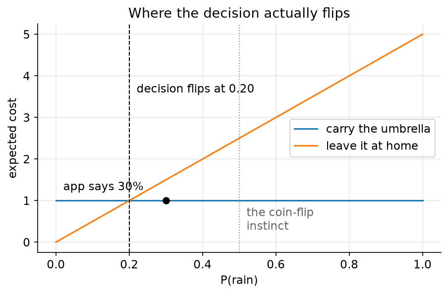
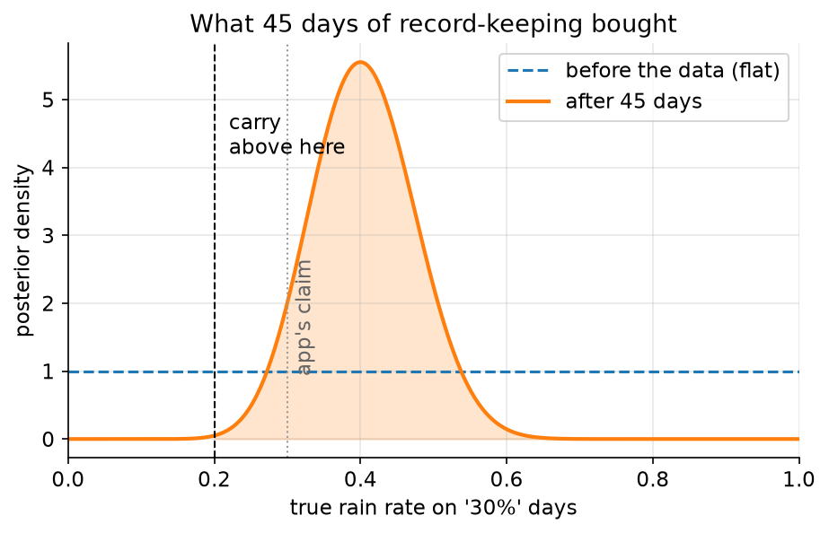
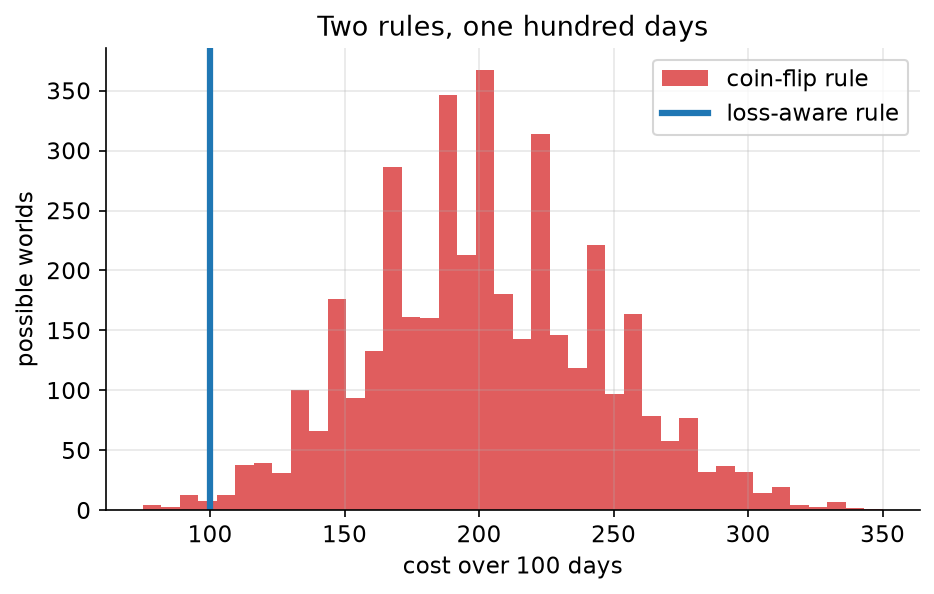

# 00. Draw the owl

> **The problem.** The weather app says 30% chance of rain. Do you take an umbrella?
> **What you'll be able to do.** Run all seven steps of [the loop](../WORKFLOW.md) on a real decision, in about forty lines of Python, and explain why the answer is not "no, because 30% is less than half".
> **Where this sits on the loop.** All of it, in miniature.
> **Runtime.** ~8 s. **Prereqs.** Python, numpy, and a willingness to be wrong in writing.

There is a well-worn joke about a two-panel drawing tutorial: *step 1, draw two
circles; step 2, draw the rest of the owl.* Statistics courses have the same
gap. Chapter 1 is coin flips and Bayes' rule. Chapter 12 is a hierarchical
model of eight schools. Nobody shows you the part in between, where you decide
what to model, what to ignore, whether it worked, and what to do on Monday.

This guide is the rest of the owl. Every chapter takes one concrete problem —
a commute, a price, a support queue, a classifier — and runs the same seven
steps on it until the steps become reflex. This chapter runs all seven on the
smallest real decision I could find.

## 00.1 A decision, not a number

You are leaving the house. The app says 30% chance of rain. Most people apply
what we can call the coin-flip rule: rain is less likely than not, so skip the
umbrella.

The coin-flip rule is wrong, and it is wrong for a reason that has nothing to
do with the weather. Being caught in the rain is worse than carrying an
umbrella you didn't need. Any rule that ignores that asymmetry is answering a
question nobody asked.

So start where the loop starts — **step 1, name the decision** — and write the
costs down. Units are arbitrary but their *ratios* are not; here, getting
soaked is five times as annoying as carrying an umbrella around all day.

```python
# --- setup ---
from pathlib import Path
import numpy as np
import matplotlib
matplotlib.use("Agg")
import matplotlib.pyplot as plt
from scipy import stats

SLUG = "00-draw-the-owl"
FIG = Path("figures") / SLUG
FIG.mkdir(parents=True, exist_ok=True)
rng = np.random.default_rng(0)

plt.rcParams.update({
    "figure.figsize": (7, 4), "figure.dpi": 110, "savefig.dpi": 150,
    "savefig.bbox": "tight", "axes.grid": True, "grid.alpha": 0.3,
    "axes.spines.top": False, "axes.spines.right": False, "font.size": 11,
})

def save(fig, name):
    out = FIG / f"{name}.png"
    fig.savefig(out)
    plt.close(fig)
    print(f"[fig] {out}")
```

```python
# The cost of each (action, outcome) pair, in units of mild annoyance.
COST = {("carry", "rain"): 1.0,     # you carried it and needed it
        ("carry", "dry"):  1.0,     # you carried it and didn't
        ("skip",  "rain"): 5.0,     # soaked
        ("skip",  "dry"):  0.0}     # the best case

def expected_cost(action, p_rain):
    """Average cost of an action when rain has probability p_rain."""
    return p_rain * COST[(action, "rain")] + (1 - p_rain) * COST[(action, "dry")]

p_app = 0.30
for action in ("carry", "skip"):
    print(f"expected cost of {action:>5}: {expected_cost(action, p_app):.2f}")

# Carrying wins when  1 < 5 * p_rain,  i.e. above this probability:
switch = COST[("carry", "rain")] / COST[("skip", "rain")]
print(f"carry whenever P(rain) > {switch:.2f}")
```

Expected cost `1.00` for carrying, `1.50` for skipping. Carry the umbrella.
And the general rule that falls out has nothing to do with 50%: carry whenever
the probability of rain exceeds `0.20`, the ratio of the two costs.



```python
p = np.linspace(0, 1, 201)
fig, ax = plt.subplots()
ax.plot(p, [expected_cost("carry", q) for q in p], label="carry the umbrella")
ax.plot(p, [expected_cost("skip", q) for q in p], label="leave it at home")
ax.axvline(switch, color="k", ls="--", lw=1)
ax.annotate(f"decision flips at {switch:.2f}", (switch + 0.02, 3.6))
ax.axvline(0.5, color="0.6", ls=":", lw=1)
ax.annotate("the coin-flip\ninstinct", (0.52, 0.3), color="0.4")
ax.plot([p_app], [expected_cost("carry", p_app)], "ko", ms=6)
ax.annotate("app says 30%", (p_app - 0.28, 1.25))
ax.set_xlabel("P(rain)"); ax.set_ylabel("expected cost")
ax.set_title("Where the decision actually flips")
ax.legend()
save(fig, "decision-lines")
```

That is **step 7, decide**, and we did it first on purpose. Knowing the
decision tells you how much precision the rest of the work needs. Here we need
to know whether the probability of rain is above or below 0.20 — and *nothing
else about it*. A study that pins the number down to three decimals is wasted
effort. That is a judgement you can only make from this end of the loop.

> **Golems.** McElreath calls a statistical model a *golem*: a clay robot,
> animated by truth, immensely powerful, and utterly without judgement. It does
> exactly what it is told, including when what it was told is stupid. The
> coin-flip rule is a golem: a correct calculation (is 0.30 bigger than 0.50?)
> answering a question that was never the one at hand. Most statistical
> disasters look like this. Not arithmetic errors — well-executed answers to
> the wrong question.

## 00.2 Where did the 30% come from?

Now be suspicious of the input. That 30% is the output of somebody else's
model, and models are golems. Does it rain on 30% of the days this app says
"30%"?

That is an answerable question if you kept records. Say you logged 45 days on
which the app forecast around 30%, and it rained on 18 of them. **Step 2, the
story**: on each such day the app is right or wrong like a biased coin, with
some fixed underlying rain rate θ that we don't know. **Step 3, the model**:

```
rained_i ~ Bernoulli(theta)      for each of the 45 logged days
theta    ~ Uniform(0, 1)         before looking: could be anything
```

**Step 5, fit** — condition on the data. For this model the arithmetic is a
one-liner (chapter 05 explains why): start from Beta(1, 1), add the rainy days
to the first number and the dry days to the second.

```python
days, rained = 45, 18
post = stats.beta(1 + rained, 1 + days - rained)     # Beta(19, 28)

print(f"raw frequency:          {rained/days:.3f}")
print(f"posterior mean rate:    {post.mean():.3f}")
lo, hi = post.ppf([0.055, 0.945])
print(f"89% of the posterior:   {lo:.3f} to {hi:.3f}")
print(f"P(true rate > 0.20)   = {1 - post.cdf(0.20):.4f}")
print(f"P(true rate > 0.30)   = {1 - post.cdf(0.30):.4f}")
```

The app is not well calibrated at this level: on days it says 30%, rain comes
about `0.404` of the time, and the 89% interval `0.293` to `0.520` barely
touches 0.30. There is a `0.9319` chance the app is *underforecasting* here.

But look at what that does to the decision: nothing. The threshold is 0.20, and
the probability that the true rate clears it is `0.9992`. We were carrying the
umbrella at 30% and we are carrying it at 40%.

That is not a wasted calculation — it is the single most useful thing a
posterior tells you. *The uncertainty is large and the decision is unaffected.*
Which means: stop measuring, act, and go do something else.



```python
grid = np.linspace(0, 1, 400)
fig, ax = plt.subplots()
ax.plot(grid, stats.beta(1, 1).pdf(grid), color="C0", ls="--",
        label="before the data (flat)")
ax.plot(grid, post.pdf(grid), color="C1", lw=2, label="after 45 days")
ax.fill_between(grid, post.pdf(grid), where=(grid > switch), alpha=0.2,
                color="C1")
ax.axvline(switch, color="k", ls="--", lw=1)
ax.annotate("carry\nabove here", (switch + 0.02, 4.2))
ax.axvline(0.30, color="0.6", ls=":", lw=1)
ax.annotate("app's claim", (0.31, 1.0), color="0.4", rotation=90)
ax.set_xlabel("true rain rate on '30%' days")
ax.set_ylabel("posterior density"); ax.set_xlim(0, 1)
ax.set_title("What 45 days of record-keeping bought")
ax.legend()
save(fig, "posterior")
```

## 00.3 What the two rules cost over a season

Abstract loss units are unconvincing. Add them up over a hundred days.

This is **step 6 territory** — pushing the fitted model forward to see what it
implies — and it uses the third of the four lines below: to predict, average
over everything you still don't know. We don't know θ, so we don't pick one; we
carry the whole posterior through the simulation.

```python
theta = post.rvs(4000, random_state=np.random.default_rng(1))  # 4000 possible worlds
n_days = 100
rain = rng.random((4000, n_days)) < theta[:, None]             # a season in each

def season_cost(carry_flags, rain_flags):
    return np.where(carry_flags, 1.0, np.where(rain_flags, 5.0, 0.0)).sum(axis=1)

cost_carry = season_cost(np.ones_like(rain), rain)     # loss-aware rule
cost_skip = season_cost(np.zeros_like(rain), rain)     # coin-flip rule

for name, c in [("carry (loss-aware)", cost_carry), ("skip (coin-flip)", cost_skip)]:
    lo, hi = np.quantile(c, [0.055, 0.945])
    print(f"{name:>19}: mean {c.mean():6.1f}   89% [{lo:5.0f}, {hi:5.0f}]")
print(f"the coin-flip rule costs {cost_skip.mean() - cost_carry.mean():.1f} "
      f"extra units per 100 days")
```

`202.4` against `100.0`. Following your instinct about which outcome is *more
likely* costs you twice as much as following the arithmetic about which action
is *cheaper*. And notice the intervals: the loss-aware rule costs exactly 100
every time, while the coin-flip rule's cost ranges from `135` to `275` — worse
on average and unpredictable, because it leaves you exposed to an outcome you
don't control.



```python
fig, ax = plt.subplots()
ax.hist(cost_skip, bins=40, color="C3", alpha=0.75, label="coin-flip rule")
ax.axvline(cost_carry.mean(), color="C0", lw=3, label="loss-aware rule")
ax.set_xlabel("cost over 100 days"); ax.set_ylabel("possible worlds")
ax.set_title("Two rules, one hundred days")
ax.legend()
save(fig, "season-cost")
```

## 00.4 The four lines you just used

Everything above is four ideas, and the rest of this guide is those same four
ideas in less friendly settings.

1. **A model is a story about how the data came to be**, written as a joint
   distribution over everything you don't know (θ) and everything you saw (18
   rainy days out of 45).
2. **Learning is conditioning.** Keep the values of θ consistent with what you
   observed, weighted by how well each explains it. The flat prior became a
   hump over 0.4.
3. **Predicting is averaging over what you still don't know.** We never chose a
   value of θ for the season simulation. We used all 4,000 of them.
4. **Deciding is minimising expected loss.** Not "is the probability above
   50%", but "which action costs less on average, given everything I know".

Those four lines are due to nobody in particular and everybody in general; they
are what Bayesian statistics *is*, once you strip off the philosophy. Every
technique in this guide — regression, hierarchical models, model comparison,
classification — is one of these four steps in a specific costume.

## 00.5 When does the uncertainty actually matter?

We found a wide posterior that changed nothing. It is worth knowing when the
opposite happens. Suppose the umbrella is a large, awkward one and the walk is
long, so carrying it costs 2 units instead of 1.

```python
for c_carry in (1.0, 2.0, 3.0):
    t = c_carry / 5.0                       # new switch point
    p_above = 1 - post.cdf(t)
    verdict = "carry" if post.mean() > t else "skip"
    print(f"carrying costs {c_carry:.0f}: flip at P(rain)={t:.2f}, "
          f"P(rate above it)={p_above:.3f} -> {verdict}")
```

At a carrying cost of 2 the threshold moves to 0.40, and the posterior mean sits
at 0.404 — right on top of it. The probability that the true rate clears the
threshold is `0.516`: a coin flip. *That* is when more data is worth
collecting, and it is worth collecting precisely because the decision is close,
not because the uncertainty is large. Uncertainty only matters where it touches
a decision boundary. Chapter 10 puts a price on it.

At a carrying cost of 3 the threshold is 0.60, the posterior is nowhere near
it, and you leave the umbrella at home with confidence.

Same data. Same posterior. Three different actions. Nothing about "the result"
is separable from what it costs you to be wrong — which is why this guide
refuses to end a chapter on an interval.

## Pitfalls

- **Reporting a probability when someone asked for a decision.** "There's a 40%
  chance" is not an answer to "do we ship it". Always carry the loss through.
- **Assuming the threshold is 0.5.** It is 0.5 only when the two errors cost
  exactly the same, which is almost never. In fraud detection the ratio is
  1:100 and the threshold is near 0.01.
- **Trusting other people's probabilities.** The app's 30% is a model output.
  So is your colleague's forecast, so is the vendor's accuracy claim. If you
  have records, check the calibration (chapter 13); if you don't, widen your
  uncertainty.
- **Collecting more data because the interval looks wide.** Wide is fine if the
  whole interval is on one side of the threshold. Narrow is not enough if it
  straddles it.
- **Sweeping the loss under "utility is subjective".** Yes, the 5:1 ratio was a
  judgement. Making it explicit is what lets someone disagree with it
  productively — try 3:1 and see whether anything changes.

## Exercises

**Exercise 00.1 — The interview.**
*Setup:* Same forecast, same posterior, but today you have a job interview and
arriving soaked would cost 40 units instead of 5. Carrying still costs 1.
*Predict:* What happens to the threshold, and does the *data* matter more or
less than before?
*Reason:* Most people expect a higher-stakes decision to demand more evidence.
*Run:*
```python
t = 1.0 / 40.0
print(f"threshold {t:.3f}, P(rate above it) = {1 - post.cdf(t):.6f}")
```
<details><summary>Reconcile</summary>

The threshold drops to `0.025` and the probability the true rate is above it is
`1.000000` to six decimals. Higher stakes on one side of the decision made the data *less*
relevant, not more: the action is now so lopsided that no plausible rain rate
could flip it. You would carry the umbrella if the app said 3%.

The general lesson is that evidence and stakes trade off in the opposite
direction to intuition. Evidence matters most for *close* calls. This is why
"we need more data" is so often the wrong response to a high-stakes decision —
and why chapter 10's value-of-information calculation always asks first whether
the decision could flip at all.
</details>

**Exercise 00.2 — A different prior.**
*Setup:* A friend who has lived here for twenty years insists it rains on about
a quarter of such days. Encode that as Beta(5, 15) — same mean 0.25, worth
about 20 days of experience — instead of the flat Beta(1, 1).
*Predict:* Will the posterior mean land above or below 0.35? Will the decision
at a carrying cost of 1 change?
*Reason:* You are mixing 20 days of somebody's memory with 45 days of records.
*Run:*
```python
post2 = stats.beta(5 + rained, 15 + days - rained)
print(f"friend's prior mean {stats.beta(5,15).mean():.3f} -> "
      f"posterior mean {post2.mean():.3f}, "
      f"P(>0.20) = {1 - post2.cdf(0.20):.4f}")
```
<details><summary>Reconcile</summary>

The posterior mean is `0.354`, between the friend's 0.25 and the data's 0.40,
and closer to the data because 45 days outweigh 20. The decision is unchanged:
`0.9978` of the posterior is still above 0.20.

Two lessons that recur all the way to chapter 11. First, a prior is data —
literally interchangeable here with a pretend sample of 20 days, which is why
"how many observations is your prior worth?" is always a fair question.
Second, a decision that survives a serious disagreement about the prior is a
decision you can defend without winning the argument about the prior.
</details>

**Exercise 00.3 — The cost of pretending you know.**
*Setup:* A colleague objects to all this and proposes: just use the raw
frequency 18/45 = 0.4 as if it were certain.
*Predict:* Over 100 days, does the plug-in rule cost more, less, or the same as
carrying the full posterior through?
*Reason:* Averaging over uncertainty ought to cost something.
*Run:*
```python
plug_in = 0.4 > switch
print("plug-in says carry:", plug_in, "| posterior-mean rule says carry:",
      post.mean() > switch)
```
<details><summary>Reconcile</summary>

Identical. Both say `True`, both cost 100 units per season. When the loss is
*linear* in the unknown probability — as it is here, since expected cost is a
straight line in p — only the posterior mean can matter, and the spread is
irrelevant to the decision.

That is worth knowing precisely because it stops being true the moment the loss
bends: a nonlinear loss, a threshold effect, an option you can exercise later,
a quantity that gets squared. Chapter 10 is about what happens then, and the
answer is that plugging in the mean can be arbitrarily wrong. Here, though,
your colleague is right, and admitting that is part of the job.
</details>

## Takeaways

- Start at step 7. Knowing what decision the answer feeds tells you how much
  precision you need, and often that the answer is already good enough.
- The action threshold is the cost ratio, not 0.5. Write the loss table down.
- A wide interval that sits entirely on one side of the threshold is *good
  news*: uncertainty that touches no decision costs nothing.
- Every probability you are handed is a model output. Check it against records
  when you can.
- A model is a golem. It answers exactly the question you encoded, with no
  judgement about whether that was the question worth asking.
- To predict, average over what you don't know rather than plugging in your
  best guess. Sometimes this changes nothing (linear loss); when it changes
  something, it changes it a lot.

## Going deeper

- **Statistical Rethinking, chapter 1** (`curriculum_material/statistical_rethinking/ch01-the-golem-of-prague.md`) is the source of the golem framing and the argument against statistics-as-a-flowchart-of-tests.
- **The Bayesian Spine, module 00** (`curriculum/modules/00-four-lines.md`) states the same four lines and proves the harder claim they set up: that ridge regression, maximum likelihood and confidence intervals are all special cases of them.
- **Module 22** (`curriculum/modules/22-decisions-bandits.md`) generalises the threshold rule to sequential decisions, where acting and learning are the same move.
