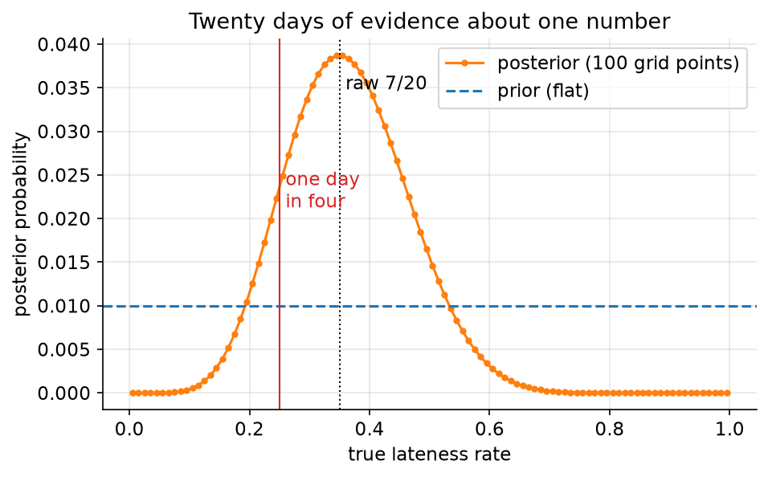
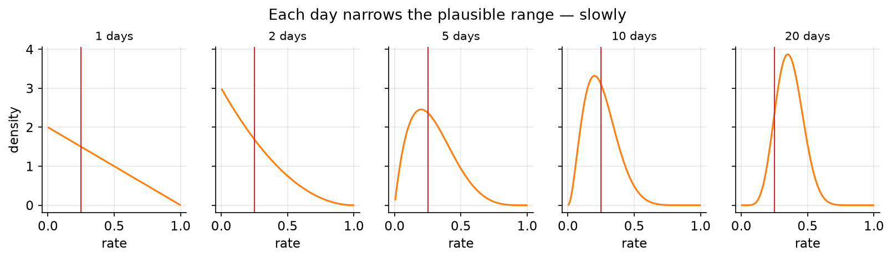

# 01. Counting the ways

> **The problem.** You have been late to the 9:00 stand-up more often than feels normal. Twenty days of records say seven of them. How bad is it really — and is it bad enough to act on?
> **What you'll be able to do.** Turn any small dataset into a posterior by counting, using a grid you can see, and know when the grid stops being a viable tool.
> **Where this sits on the loop.** Steps 2, 3 and 5 — story, model, fit.
> **Runtime.** ~6 s. **Prereqs.** Chapter 00.

Bayesian inference has a reputation for requiring a philosophy. It doesn't. It
requires counting. This chapter counts things by hand until the counting turns
into a posterior, and then hands the counting to a computer.

## 01.1 The garden of forking data

Start smaller than the real problem, because the real problem is too big to
count by hand and you want to see the mechanism at least once.

Your line runs four buses each morning and you catch one at random. Some of
them are junk — old, slow, always late. You don't know how many. It could be
none, one, two, three, or all four, and those five *conjectures* are the entire
small world of this model.

Three days of data: late, on time, late.

Ask, for each conjecture, a purely mechanical question: **how many ways could
this conjecture have produced exactly that sequence?** If two of the four buses
are bad, then on day one there were 2 ways to be late, on day two 2 ways to be
on time, on day three 2 ways to be late again: 2 × 2 × 2 = 8 ways. That is not
a probability, a philosophy, or an estimate. It is a count of paths through
what McElreath calls the *garden of forking data* — every sequence of events
that could have happened, with the ones that contradict your observations
pruned away.

```python
# --- setup ---
import itertools
from pathlib import Path
import numpy as np
import pandas as pd
import matplotlib
matplotlib.use("Agg")
import matplotlib.pyplot as plt
from scipy import stats

from bayeskit import midpoint_grid, grid_posterior, hdi

SLUG = "01-counting-the-ways"
FIG = Path("figures") / SLUG
FIG.mkdir(parents=True, exist_ok=True)
rng = np.random.default_rng(1)

plt.rcParams.update({
    "figure.figsize": (7, 4), "figure.dpi": 110, "savefig.dpi": 150,
    "savefig.bbox": "tight", "axes.grid": True, "grid.alpha": 0.3,
    "axes.spines.top": False, "axes.spines.right": False, "font.size": 11,
})

def save(fig, name):
    out = FIG / f"{name}.png"
    fig.savefig(out)
    plt.close(fig)
    print(f"[fig] {out}")
```

```python
observed = ("late", "ontime", "late")

ways = []
for n_bad in range(5):                       # conjecture: n_bad of the 4 buses
    fleet = ["late"] * n_bad + ["ontime"] * (4 - n_bad)
    paths = itertools.product(fleet, repeat=3)          # every possible 3-day run
    ways.append(sum(1 for path in paths if path == observed))
    print(f"{n_bad} bad buses: {ways[-1]:2d} ways to produce late/ontime/late")

ways = np.array(ways)
print("same thing by multiplying:", [b * (4 - b) * b for b in range(5)])
```

Counts `0`, `3`, `8`, `9`, `0`. Two conjectures are dead: with no bad buses you
could never be late, with four you could never be on time. Among the survivors,
three bad buses explains the data three times better than one does.

Nothing here is exotic. Every likelihood you will ever compute is this count —
or its continuous cousin — and the reason multiplication shows up everywhere in
probability is that this is what multiplication is doing: counting paths
through a garden, layer by layer.

## 01.2 Priors are counts too

You mention this to the depot manager, who says they retired most of the old
buses last quarter: for every line still running three bad buses, there are two
running two and three running one, and none of the lines are all-bad or
all-good.

That is prior information, and it enters the arithmetic in exactly the same
way — as counts, multiplied in.

```python
prior_counts = np.array([0, 3, 2, 1, 0])     # depot's fleet records
post_counts = ways * prior_counts
print("ways from data :", ways)
print("depot's counts :", prior_counts)
print("multiplied     :", post_counts)

posterior = post_counts / post_counts.sum()
for n_bad, p in enumerate(posterior):
    print(f"P({n_bad} bad buses | data) = {p:.3f}")
```

The data alone said three bad buses was the front-runner; the depot's records
pull it back, and two bad buses ends up most plausible at `0.471`. Neither
source of information won. They multiplied.

This is the entire content of Bayes' theorem, and it is worth stating in the
form you will actually use:

> **posterior ∝ likelihood × prior.** The number of ways a hypothesis could
> have produced your data, times the number of ways that hypothesis could have
> been true in the first place. Normalise at the end so the total is 1.

The proportionality sign is doing real work. Absolute counts are meaningless —
3, 8, 9 says exactly what 30, 80, 90 says — which is why you can throw away
every constant that doesn't depend on the unknown, and why the "hard" integral
in the denominator of the textbook formula is, for most purposes, just the
number that makes things sum to 1.

## 01.3 Now the real problem: a grid

Five conjectures were enough for four buses. Your actual question — what
fraction of mornings do you arrive late — has a continuum of answers. So chop
the continuum into a few hundred pieces and do exactly what you just did.

```python
commutes = pd.read_csv("data/commutes.csv")
first20 = commutes.head(20)
n, late = len(first20), int(first20.late.sum())
print(f"{late} late arrivals in {n} days (raw frequency {late/n:.3f})")

# One hundred candidate values for the true lateness rate.
grid = midpoint_grid(0, 1, 100)
post = grid_posterior(lambda th: stats.binom.logpmf(late, n, th), grid)

mean = float((grid * post).sum())
lo, hi = hdi(rng.choice(grid, size=200_000, p=post), 0.89)
print(f"posterior mean       {mean:.4f}")
print(f"89% of the posterior {lo:.3f} to {hi:.3f}")
print(f"P(rate > 1 day in 4) {post[grid > 0.25].sum():.4f}")
```

Three lines of arithmetic and you have everything: the posterior mean is
`0.3636`, the bulk of the posterior runs from `0.205` to `0.515`, and the
probability that you are late more often than one day in four — the line your
manager would notice — is `0.8702`.

Look at that interval. Twenty days of data leaves you unsure whether your true
rate is 19% or 53%. That is not a failure of the method; it is what twenty
observations are worth. Anyone who reports "35% late" from this data and stops
is hiding the only fact that matters for planning.



```python
fig, ax = plt.subplots()
ax.plot(grid, post, "o-", ms=3, color="C1", label="posterior (100 grid points)")
ax.axhline(1 / len(grid), color="C0", ls="--", label="prior (flat)")
ax.axvline(late / n, color="k", ls=":", lw=1)
ax.annotate("raw 7/20", (late / n + 0.01, post.max() * 0.9))
ax.axvline(0.25, color="C3", lw=1)
ax.annotate("one day\nin four", (0.26, post.max() * 0.55), color="C3")
ax.set_xlabel("true lateness rate"); ax.set_ylabel("posterior probability")
ax.set_title("Twenty days of evidence about one number")
ax.legend()
save(fig, "grid-posterior")
```

### Is the grid good enough?

A grid is an approximation, and the honest way to use one is to refine it until
the answer stops moving. For this model there also happens to be an exact
answer to check against — the Beta distribution of chapter 05 — which makes
this a rare chance to see how good the approximation is.

```python
exact = stats.beta(1 + late, 1 + n - late)
print(f"exact:  mean {exact.mean():.4f}   P(>0.25) {1 - exact.cdf(0.25):.4f}")
for k in (20, 100, 1000):
    g = midpoint_grid(0, 1, k)
    p = grid_posterior(lambda th: stats.binom.logpmf(late, n, th), g)
    print(f"{k:5d} points: mean {(g*p).sum():.4f}   "
          f"P(>0.25) {p[g > 0.25].sum():.4f}")
```

Twenty grid points already gets the mean exactly right and the tail probability
to `0.8728` against the true `0.8701`; a thousand points is
indistinguishable from exact. The mean converges faster than the tail
probability, which is the general pattern — averages are forgiving, tails are
not. If a decision hangs on a tail probability, refine the grid and watch the
number settle before you quote it.

## 01.4 One day at a time, or all at once

A practical worry: you got those 20 days over a month, one at a time. Should
you have been updating daily? Does the order matter?

```python
a, b = 1.0, 1.0                       # counts of late / on-time so far
for day, was_late in enumerate(first20.late.values, start=1):
    a, b = a + was_late, b + (1 - was_late)
    if day in (1, 2, 5, 10, 20):
        print(f"after {day:2d} days: mean {a/(a+b):.3f}  "
              f"(pseudo-counts {a:.0f} late / {b:.0f} on time)")

shuffled = rng.permutation(first20.late.values)
a2, b2 = 1 + shuffled.sum(), 1 + len(shuffled) - shuffled.sum()
print(f"same data in a different order: {a2:.0f} / {b2:.0f} — identical")
```

Yesterday's posterior is today's prior, and twenty daily updates land in exactly
the same place as one update on twenty observations. The order is irrelevant:
only the counts survive. That is a property of *this* model — one where each
day is assumed to be an independent draw with the same rate — and it is worth
noticing precisely because the assumption is doing so much work. If Mondays
were worse than Fridays, or if one bad week made the next week worse, the order
would matter and this model would be wrong in a way no amount of data would
fix. Chapter 06 is about noticing that.

Watch the belief move as the days come in:



```python
fig, axes = plt.subplots(1, 5, figsize=(13, 2.6), sharey=True)
a, b = 1.0, 1.0
seen = 0
for ax, upto in zip(axes, (1, 2, 5, 10, 20)):
    while seen < upto:
        was_late = first20.late.values[seen]
        a, b = a + was_late, b + (1 - was_late)
        seen += 1
    ax.plot(grid, stats.beta(a, b).pdf(grid), color="C1")
    ax.axvline(0.25, color="C3", lw=1)
    ax.set_title(f"{upto} days", fontsize=10)
    ax.set_xlabel("rate")
axes[0].set_ylabel("density")
fig.suptitle("Each day narrows the plausible range — slowly", y=1.06)
save(fig, "sequential")
```

Two days in, the posterior is barely distinguishable from the prior. This is
the correct behaviour and it is worth internalising: **small data yields wide
posteriors, and no method fixes that.** What Bayesian arithmetic gives you is
not certainty from thin data — it is an honest account of how little you know,
which is exactly what you need to decide whether to act now or keep logging.

## 01.5 How much data would settle it?

You can ask that question before collecting anything. Suppose the true rate is
around 0.35; how wide would the interval be after 80 days, or 320?

```python
for n_days in (20, 80, 320, 1280):
    d = stats.beta(1 + 0.35 * n_days, 1 + 0.65 * n_days)
    w = d.ppf(0.945) - d.ppf(0.055)
    print(f"n = {n_days:5d}: 89% interval width {w:.4f}")
```

Widths `0.3214`, `0.1679`, `0.0849`, `0.0426`. Four times the data halves the
width — the familiar 1/√n, seen from the inside. If you need to distinguish 35%
from 30%, you need a width well under 0.05, so roughly 1,300 mornings: five
years of commuting. That is a genuinely useful thing to learn *before* starting
a data collection effort, and the calculation cost you four lines.

The decision, though, was never "estimate the rate to two decimals". It was
"should I leave ten minutes earlier". Chapter 00's arithmetic applies: leaving
early costs you ten minutes every day; being late costs whatever being late
costs. With `0.8702` posterior probability that you exceed one late day in four,
you already have your answer, and 1,300 more mornings of data would not improve
it. Estimate to the precision the decision needs, not to the precision that
looks impressive.

## 01.6 Where grids stop working

Grids are wonderful. They are also the first tool you will outgrow, and it is
worth knowing exactly when.

```python
for d in (1, 2, 3, 5, 10):
    print(f"{d:2d} unknowns, 20 values each: {20**d:>18,d} grid points")
```

One unknown: 20 points, instant. Three unknowns — a regression with a slope, an
intercept and a noise level, which is the most ordinary model in the world —
`8,000` points, still fine. Ten unknowns: `10,240,000,000,000`. There is no
computer, present or future, that walks that grid.

And it gets worse than the count suggests: in high dimensions almost all of
those points sit in regions with essentially zero posterior probability, so you
would be spending 99.99% of the effort evaluating places that don't matter.
This is why chapters 05 onward use Markov chain Monte Carlo, which is best
understood as a way of *only visiting the places that matter*. Grids for one or
two unknowns, quadratic approximation (chapter 04) for smooth problems, MCMC
for the rest.

## Pitfalls

- **Reporting the raw frequency with no interval.** 7/20 = 35% is a fact about
  your twenty days, not about your commute. The interval is the finding.
- **Grid too coarse in the tail.** Averages converge fast, tail probabilities
  slowly. Refine and re-check before quoting a threshold probability.
- **Putting grid points on the boundary.** A rate of exactly 0 or exactly 1 has
  zero likelihood the moment you see one of each outcome, and thresholds land
  ambiguously on grid edges. Use cell centres (`midpoint_grid`).
- **Multiplying probabilities instead of adding logs.** With 200 observations
  the likelihood underflows to zero in double precision. Always work with
  `logpmf`/`logpdf`, subtract the maximum, then exponentiate — which is what
  `grid_posterior` does.
- **Assuming exchangeability without checking.** "Order doesn't matter" is a
  property of the model you chose, not of the world. If there is a trend, a
  weekday effect or a run of bad weeks, the counting is still correct arithmetic
  about the wrong question.

## Exercises

**Exercise 01.1 — All the data.**
*Setup:* You have 60 days, not 20. Use all of them.
*Predict:* The raw frequency over 60 days is 0.217, well below the 0.35 you saw
in the first 20. Will P(rate > 0.25) go up or down, and will it move past 0.5?
*Reason:* Tripling the data usually just narrows things.
*Run:*
```python
n60, late60 = len(commutes), int(commutes.late.sum())
p60 = grid_posterior(lambda th: stats.binom.logpmf(late60, n60, th), grid)
print(f"{late60}/{n60} = {late60/n60:.3f}; mean {(grid*p60).sum():.4f}; "
      f"P(>0.25) = {p60[grid > 0.25].sum():.4f}")
```
<details><summary>Reconcile</summary>

The posterior mean falls to `0.2258` and P(rate > 0.25) collapses from 0.87 to
`0.3088`. The extra 40 days did not merely narrow the interval — they moved it,
because the first 20 days were an unlucky stretch.

Two lessons. First, this is regression to the mean happening to you in real
time: an early estimate from a small sample is not just uncertain, it is
*probably too extreme*, and chapter 09 makes that into a tool. Second, the
89% interval from the first 20 days ran from 0.205 to 0.515, and the new
estimate is inside it. The interval did its job. Point estimates from small
samples are the thing that lied to you, and they lie in the direction of
whatever you noticed first — which is why you started logging.
</details>

**Exercise 01.2 — The stubborn prior.**
*Setup:* Your colleague insists you're late "about half the time". Encode that
as Beta(10, 10) — mean 0.5, worth 20 days of pretend data — and apply it to all
60 days of records.
*Predict:* Where does the posterior mean land relative to the data's 0.217?
*Reason:* Twenty pretend days against sixty real ones.
*Run:*
```python
prior = stats.beta(10, 10)
p_col = grid_posterior(lambda th: stats.binom.logpmf(late60, n60, th),
                       grid, log_prior=lambda th: prior.logpdf(th))
print(f"colleague's posterior mean {(grid*p_col).sum():.4f} vs "
      f"flat-prior mean {(grid*p60).sum():.4f}")
```
<details><summary>Reconcile</summary>

`0.2875` against `0.2258`. The colleague's belief is worth 20 days, the data is
worth 60, and the answer sits about a quarter of the way from the data toward
the prior — roughly 20/(20+60). That ratio is not a coincidence; chapter 05
derives it as the shrinkage weight that runs through the rest of this guide,
from ridge regression to the Kalman filter.

Also note what did *not* happen: the colleague's prior did not "bias" the
result in any mysterious way. It contributed exactly the amount of information
it claimed to contain. If they had said "worth 200 days of experience"
(Beta(100, 100)) they would have dominated, and the correct response would be
to ask them where those 200 days are recorded.
</details>

**Exercise 01.3 — When counting is the whole answer.**
*Setup:* A machine-learning tie-in. Fitting this model by maximum likelihood
gives θ̂ = 7/20 = 0.35, the peak of the flat-prior posterior. Now suppose the
first 3 days had been late, and that is all the data you have.
*Predict:* What does maximum likelihood say your lateness rate is? What does the
posterior predictive say about tomorrow?
*Reason:* Both are "fit the model to the data".
*Run:*
```python
g3 = grid_posterior(lambda th: stats.binom.logpmf(3, 3, th), grid)
print(f"MLE = {3/3:.2f}; posterior mean = {(grid*g3).sum():.4f}; "
      f"P(late tomorrow) = {(grid*g3).sum():.4f}")
```
<details><summary>Reconcile</summary>

Maximum likelihood says 1.00: you are late *every* day, with certainty, forever.
The posterior mean says `0.8000`, and that is also the probability you are late
tomorrow.

Maximum likelihood is not wrong about the peak — 1.00 really is the value that
makes the data most probable. It is wrong about everything else, because it
throws away the shape of the posterior and keeps only its highest point. With
three observations, the shape is all there is.

This is the same failure as an overfit neural network reporting 99.9%
confidence on an input class it saw twice in training. The fix is the same too:
carry the whole posterior instead of its argmax, or — equivalently, as chapter
11 shows — regularise, which is what a prior *is*.
</details>

## Takeaways

- A likelihood is a count of the ways a hypothesis could have produced your
  data. Priors are counts of the ways the hypothesis could have been true.
  Multiply, then normalise.
- Grid approximation is three lines: candidate values, log-likelihood at each,
  exponentiate and normalise. Use it whenever you have one or two unknowns.
- Refine the grid until the answer stops moving; tails settle later than means.
- Sequential and batch updating give identical answers, and order never matters
   — under a model that assumes it doesn't. That assumption is a claim about
  the world, and it is checkable.
- Small samples give wide posteriors *and* extreme point estimates. The interval
  is the honest summary; the point estimate is the one that will embarrass you.
- Grids die at three or four unknowns. That is what MCMC exists for.

## Going deeper

- **Statistical Rethinking, chapter 2** (`curriculum_material/statistical_rethinking/ch02-small-worlds-and-large-worlds.md`) is the origin of the garden of forking data, including the marble-bag version of §01.1 and the small-world/large-world distinction that the "check your assumptions" pitfall comes from.
- **The Bayesian Spine, module 02** (`curriculum/modules/02-conditioning-is-inference.md`) does the same conditioning with an explicit joint-distribution table, and pushes it to 2,000 hypotheses on the German tank problem.
- **Module 01** (`curriculum/modules/01-probability-as-logic.md`) explains *why* order can be ignored: de Finetti's theorem says an exchangeable sequence is exactly a mixture over a rate parameter — which is where the parameter θ comes from in the first place.
