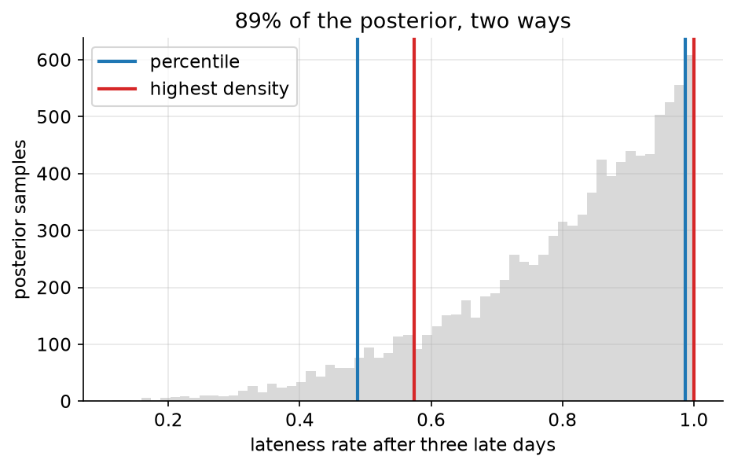
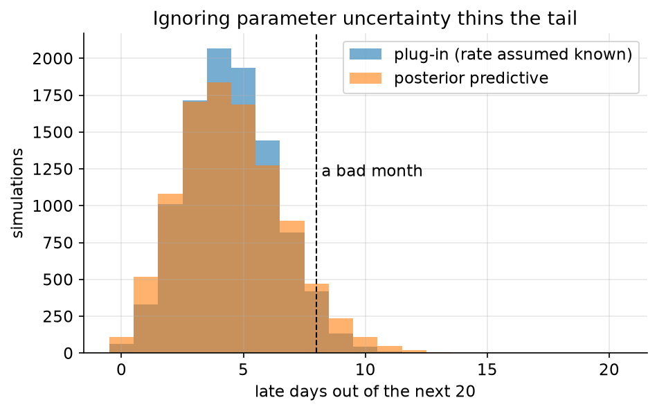
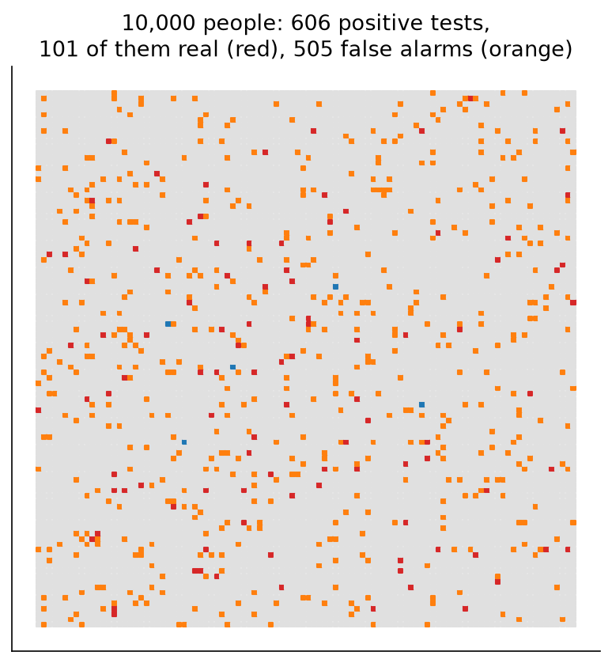

# 02. The posterior is a bag of numbers

> **The problem.** You have a posterior. Now someone asks: how likely is it that I'm late more than a third of the time? How many late days should I expect next month? And — different problem, same tool — the screening test came back positive; how worried should I be?
> **What you'll be able to do.** Answer any question about a fitted model by counting samples, and stop confusing uncertainty about a parameter with uncertainty about the next observation.
> **Where this sits on the loop.** Step 5 into step 7 — from fit to decision.
> **Runtime.** ~10 s. **Prereqs.** Chapters 00–01.

The most useful thing about Bayesian inference is not philosophical. It is that
after the fitting step, the answer is a *bag of numbers* — a few thousand
parameter values drawn in proportion to how plausible they are — and every
question you could ask is then answered by counting things in that bag with
numpy.

No new formula per question. No looking up which test applies. `np.mean`.

## 02.1 Every question is a count

Take all 60 days of commute records, fit the same model as chapter 01, and turn
the grid posterior into samples.

```python
# --- setup ---
from pathlib import Path
import numpy as np
import pandas as pd
import matplotlib
matplotlib.use("Agg")
import matplotlib.pyplot as plt
from scipy import stats

from bayeskit import midpoint_grid, grid_posterior, sample_grid, hdi, pi

SLUG = "02-a-bag-of-numbers"
FIG = Path("figures") / SLUG
FIG.mkdir(parents=True, exist_ok=True)
rng = np.random.default_rng(2)

plt.rcParams.update({
    "figure.figsize": (7, 4), "figure.dpi": 110, "savefig.dpi": 150,
    "savefig.bbox": "tight", "axes.grid": True, "grid.alpha": 0.3,
    "axes.spines.top": False, "axes.spines.right": False, "font.size": 11,
})

def save(fig, name):
    out = FIG / f"{name}.png"
    fig.savefig(out)
    plt.close(fig)
    print(f"[fig] {out}")
```

```python
commutes = pd.read_csv("data/commutes.csv")
n, late = len(commutes), int(commutes.late.sum())

grid = midpoint_grid(0, 1, 1000)
post = grid_posterior(lambda th: stats.binom.logpmf(late, n, th), grid)
theta = sample_grid(grid, post, 10_000, rng)      # <- the bag of numbers

print(f"{late} late days in {n}")
print(f"10,000 samples: mean {theta.mean():.4f}, sd {theta.std(ddof=1):.4f}")
```

Now the questions. Read the right-hand column as English and notice that you
never once had to decide *which procedure applies*.

```python
print(f"P(rate above one day in four)  {np.mean(theta > 0.25):.4f}")
print(f"P(rate between 0.15 and 0.30)  {np.mean((theta > 0.15) & (theta < 0.30)):.4f}")
print(f"P(worse than one day in three) {np.mean(theta > 1/3):.4f}")
print(f"median rate                    {np.median(theta):.4f}")
print(f"expected late days per 20      {20 * theta.mean():.2f}")
```

`0.3119` that you exceed one day in four. `0.0272` that you are worse than one
in three. About `4.52` late days per twenty. Each of those is a one-line count
over the same bag, and each is a direct answer to a question a person actually
asked.

Compare this to the classical machinery, where "probability that the rate
exceeds 0.25" is not a question you are allowed to ask — the rate is a fixed
unknown constant, so the probability is 0 or 1 and you may only speak about the
procedure's long-run behaviour. That restriction is coherent and it has real
uses (chapter 12 makes use of it). But when the person in front of you asks
"how likely is it that we're over the line", the ability to answer with a
number is worth a great deal.

> **The 89% joke.** McElreath uses 89% intervals rather than 95%, on the
> grounds that 89 is prime, that no interval width has any special status, and
> that a reader who notices the odd number will remember to ask where 95 came
> from. (It came from Fisher, informally, and stuck.) This guide follows him.
> Nothing anywhere depends on the choice.

## 02.2 Two kinds of interval, and when they disagree

For a symmetric posterior, all interval definitions agree and the choice is
uninteresting. For a skewed one, they can differ enough to change what you'd
say out loud. Take a deliberately extreme case: three commutes, all late.

```python
p3 = grid_posterior(lambda th: stats.binom.logpmf(3, 3, th), grid)
theta3 = sample_grid(grid, p3, 10_000, rng)

lo_pi, hi_pi = pi(theta3, 0.89)          # equal mass in each tail
lo_hd, hi_hd = hdi(theta3, 0.89)         # narrowest interval containing 89%
print(f"percentile interval {lo_pi:.3f} to {hi_pi:.3f}  (width {hi_pi-lo_pi:.3f})")
print(f"highest-density     {lo_hd:.3f} to {hi_hd:.3f}  (width {hi_hd-lo_hd:.3f})")
```

The percentile interval runs `0.487` to `0.986`; the highest-density interval
runs `0.574` to `1.000`. The percentile interval *excludes* the most probable
value in the whole posterior — a rate of 1.0 — because it insists on chopping
5.5% off each end, and the right end is where the mass is piled up.

Which to use? Percentile intervals are more stable across samples and are what
most software reports. Highest-density intervals answer "where is the model
concentrated", which is usually what you meant. When they disagree noticeably,
that disagreement is itself the finding: the posterior is skewed, and no
two-number summary is going to be honest about it. Plot it.



```python
fig, ax = plt.subplots()
ax.hist(theta3, bins=60, color="0.85", edgecolor="none")
for x, c, lbl in [(lo_pi, "C0", "percentile"), (hi_pi, "C0", None),
                  (lo_hd, "C3", "highest density"), (hi_hd, "C3", None)]:
    ax.axvline(x, color=c, lw=2, label=lbl)
ax.set_xlabel("lateness rate after three late days")
ax.set_ylabel("posterior samples")
ax.set_title("89% of the posterior, two ways")
ax.legend(loc="upper left")
save(fig, "intervals")
```

## 02.3 The point estimate is a decision, not a summary

People ask for a single number. Which single number depends entirely on what it
costs to be wrong in each direction — a fact that is invisible when you type
`.mean()` out of habit.

Search over candidate answers and let the loss pick the winner:

```python
actions = np.linspace(0, 1, 1001)
err = actions[:, None] - theta[None, :]           # (action, sample) error grid

squared = (err ** 2).mean(axis=1)
absolute = np.abs(err).mean(axis=1)
asymmetric = np.where(err < 0, 4.0 * -err, 1.0 * err).mean(axis=1)  # under 4x worse

print(f"squared error  -> {actions[squared.argmin()]:.3f}   (the mean:   {theta.mean():.3f})")
print(f"absolute error -> {actions[absolute.argmin()]:.3f}   (the median: {np.median(theta):.3f})")
print(f"4:1 under:over -> {actions[asymmetric.argmin()]:.3f}   "
      f"(the 80th percentile: {np.quantile(theta, 0.8):.3f})")
```

Squared error picks the mean (`0.226`), absolute error picks the median
(`0.222`), and a loss that punishes underestimates four times harder picks the
80th percentile (`0.271`). Those are theorems, and you just rediscovered them by
brute force over the bag.

The third one is the most useful in practice. It is the newsvendor problem:
stock too little and you lose a sale, stock too much and you eat the inventory.
If the two costs are $c_\text{under}$ and $c_\text{over}$, order at the
$c_\text{under}/(c_\text{under}+c_\text{over})$ quantile of the *predictive*
distribution — here 4/(4+1) = 0.8. Every buffer you have ever set (safety
stock, timeout margins, capacity headroom, how early to leave for the airport)
is this calculation, usually done by feel.

## 02.4 Predicting the next twenty days

Here is the mistake that survives longest, including in people who are otherwise
fluent. You want to know how many late days to expect in the next twenty. You
have a posterior mean of 0.226. So: Binomial(20, 0.226), right?

Almost. That is the *plug-in* prediction, and it quietly asserts that you know
the rate exactly. The honest version draws a rate from the posterior *and then*
a dataset from that rate — averaging over both sources of variation. That is
the **posterior predictive** distribution, and it is the third of the four
lines in chapter 00 doing its job.

```python
plug_in = rng.binomial(20, theta.mean(), size=10_000)   # pretend we know the rate
predictive = rng.binomial(20, theta)                    # one draw per posterior sample

for name, s in [("plug-in", plug_in), ("posterior predictive", predictive)]:
    print(f"{name:>20}: mean {s.mean():.2f}  sd {s.std(ddof=1):.2f}  "
          f"P(8 or more late) {np.mean(s >= 8):.4f}")
```

Same mean, `1.87` versus `2.14` standard deviation, and — the part that
matters — `0.0612` versus `0.0890` for the probability of a genuinely bad month.
Plugging in the point estimate understated the tail by nearly a factor of 1.5.

That gap is small here because 60 observations pin the rate down reasonably
well. It grows without limit as data gets scarcer, and it is exactly the gap
that makes plug-in forecasts embarrassing: capacity plans that are blindsided
by a busy week, confidence intervals for a new customer that ignore that you
have never seen a customer like them.



```python
fig, ax = plt.subplots()
bins = np.arange(-0.5, 21.5)
ax.hist(plug_in, bins=bins, alpha=0.6, label="plug-in (rate assumed known)")
ax.hist(predictive, bins=bins, alpha=0.6, label="posterior predictive")
ax.axvline(8, color="k", ls="--", lw=1)
ax.annotate("a bad month", (8.2, 1200))
ax.set_xlabel("late days out of the next 20"); ax.set_ylabel("simulations")
ax.set_title("Ignoring parameter uncertainty thins the tail")
ax.legend()
save(fig, "predictive")
```

**The rule of thumb:** whenever you predict, ask whether you drew the parameter
or fixed it. Fixing it is only safe when the posterior is narrow compared to the
noise you're predicting, and you can always check by doing both, as above.

## 02.5 The positive test

Different problem, same machine, and the single most consequential piece of
arithmetic in everyday life.

A screening test for a condition that 1% of people have. It catches 95% of true
cases (sensitivity) and wrongly flags 5% of healthy people. Your test is
positive. What is the probability you have the condition?

Predict a number before reading on. Most people — including, in repeated
studies, most physicians — say something between 80% and 95%.

The reliable way to see it is to stop thinking about probabilities and count
people, which is McElreath's "sampling the imaginary": simulate a population and
tally.

```python
n_people = 100_000
prevalence, sensitivity, false_positive = 0.01, 0.95, 0.05

has_condition = rng.random(n_people) < prevalence
tests_positive = np.where(has_condition,
                          rng.random(n_people) < sensitivity,
                          rng.random(n_people) < false_positive)

print(f"people with the condition        {has_condition.sum():6d}")
print(f"people testing positive          {tests_positive.sum():6d}")
print(f"  ...of whom actually have it    {(has_condition & tests_positive).sum():6d}")
print(f"P(condition | positive)          "
      f"{(has_condition & tests_positive).sum() / tests_positive.sum():.4f}")

exact = (prevalence * sensitivity /
         (prevalence * sensitivity + (1 - prevalence) * false_positive))
print(f"P(condition | positive), exactly {exact:.4f}")
```

`0.1610`. Out of `5844` positive tests in a hundred thousand people, only
`912` are real. The test is good; the base rate is brutal. Among 100,000
people there are 1,000 sick and 99,000 healthy, and 5% of 99,000 is a far
bigger number than 95% of 1,000.



```python
show = 10_000                                    # first 10,000 of the simulated people
grid_x, grid_y = np.meshgrid(np.arange(100), np.arange(100))
cond, posi = has_condition[:show], tests_positive[:show]
colour = np.where(cond & posi, "C3",             # true positive
         np.where(~cond & posi, "C1",            # false positive
         np.where(cond & ~posi, "C0", "0.88")))  # false negative / true negative

fig, ax = plt.subplots(figsize=(6.4, 6.4))
ax.scatter(grid_x.ravel(), grid_y.ravel(), c=colour, s=7, marker="s")
ax.set_xticks([]); ax.set_yticks([]); ax.grid(False)
ax.set_title(f"10,000 people: {(posi).sum()} positive tests,\n"
             f"{(cond & posi).sum()} of them real (red), "
             f"{(~cond & posi).sum()} false alarms (orange)")
save(fig, "base-rate")
```

Two practical consequences.

**A second test is worth a lot.** Repeat the (independent) test and the same
arithmetic runs again, now starting from 0.161 instead of 0.01:

```python
second = exact * sensitivity / (exact * sensitivity + (1 - exact) * false_positive)
print(f"after a second positive test: {second:.4f}")
```

`0.7848`. The first test's job was never to diagnose you; it was to move you
from the 1% pool to the 16% pool, where a second test can do real work. This is
why screening programmes are built as cascades, and why a single positive on a
cheap test is not a diagnosis.

**And the decision is still not "is it more likely than not".** Chapter 00's
threshold rule applies. If investigating costs 5 units and a missed case costs
400:

```python
cost_investigate, cost_missed = 5.0, 400.0
threshold = cost_investigate / cost_missed
print(f"act whenever P(condition) > {threshold:.4f}")
for p in (exact, second):
    print(f"  at p={p:.4f}: cost of acting {cost_investigate:.1f}, "
          f"cost of waiting {cost_missed * p:.1f}")
```

The threshold is `0.0125`, and 0.161 is thirteen times past it. Acting costs 5;
waiting costs `64.4`. You act on a 16% probability, and you would act on a 2%
probability. Anyone who says "it's probably nothing, the test is usually wrong"
has correctly computed the posterior and then thrown away the loss function.

This same shape — rare event, imperfect detector, asymmetric costs — is fraud
detection, spam filtering, predictive maintenance, security alerting and medical
screening. Learn it once here and you have it everywhere.

## 02.6 The whole chapter as a lookup table

Once the posterior is a bag of samples `theta`, and predictions are a bag of
simulated datasets `ypred`:

| Question | Code |
|---|---|
| Is the rate above x? | `np.mean(theta > x)` |
| Between a and b? | `np.mean((theta > a) & (theta < b))` |
| Best guess, squared-error cost | `theta.mean()` |
| Best guess, absolute-error cost | `np.median(theta)` |
| Buffer, 4:1 asymmetric cost | `np.quantile(ypred, 0.8)` |
| Where is the model concentrated? | `hdi(theta, 0.89)` |
| Conventional interval | `pi(theta, 0.89)` |
| How many events next month? | `ypred.mean()`, `np.quantile(ypred, [.05,.95])` |
| Chance of a bad month? | `np.mean(ypred >= threshold)` |
| Is A better than B? | `np.mean(theta_B > theta_A)` |
| How much better? | `np.quantile(theta_B - theta_A, [.055,.945])` |

The last two are chapter 07's entire A/B test, and they are already in your
hands.

## Pitfalls

- **Plugging in the posterior mean to predict.** It gives the right centre and a
  tail that is too thin. Draw the parameter, then draw the data.
- **Reporting `.mean()` reflexively.** The mean answers a squared-error
  question. If your costs are asymmetric — and inventory, staffing, timeouts
  and deadlines all are — the right answer is a quantile.
- **Quoting an interval for a skewed or bimodal posterior.** Look at the
  histogram first. If percentile and highest-density intervals disagree
  noticeably, no interval is a fair summary.
- **Too few samples.** 10,000 draws give a Monte Carlo error of roughly
  `0.5/sqrt(10000)` = 0.005 on a probability near 0.5 — fine for reporting two
  decimals, not for chasing a difference in the third. When a decision is close,
  draw more.
- **Forgetting the base rate.** The test's accuracy is a property of the test.
  What you want is a property of the test *and* the population it was applied
  to. If the second number is missing, no amount of accuracy helps.

## Exercises

**Exercise 02.1 — The Monte Carlo error.**
*Setup:* You reported P(rate > 0.25) = 0.3119 from 10,000 samples. A colleague
reruns it with a different seed.
*Predict:* How much will the third decimal move? The second?
*Reason:* Sampling error goes as 1/√n.
*Run:*
```python
reps = [np.mean(sample_grid(grid, post, 10_000, rng) > 0.25) for _ in range(20)]
print(f"20 reruns: sd {np.std(reps, ddof=1):.5f}, "
      f"range {min(reps):.4f} to {max(reps):.4f}")
print(f"theory: sqrt(p(1-p)/M) = {np.sqrt(0.3119*0.6881/10_000):.5f}")
```
<details><summary>Reconcile</summary>

The standard deviation across reruns is about `0.00491`, so the third decimal is
noise and even the second wobbles by one. The rule: with $M$ samples, a
reported probability $p$ carries a standard error of $\sqrt{p(1-p)/M}$ —
`0.00463` here.

Report probabilities to two decimals from 10,000 draws. If you need three, you
need a hundred times more samples, and you should ask first whether any decision
turns on the third decimal. This is also why you should never breathlessly
report that "P(B beats A) rose from 0.951 to 0.958" between two runs.
</details>

**Exercise 02.2 — The rarer disease.**
*Setup:* Same test — 95% sensitivity, 5% false positives — applied to a
condition with prevalence 1 in 10,000 instead of 1 in 100.
*Predict:* Does P(condition | positive) fall by a factor of about 100, or by
less because the test is doing some work?
*Reason:* Bayes' rule multiplies odds by a likelihood ratio.
*Run:*
```python
for prev in (0.01, 0.001, 0.0001):
    p = prev * 0.95 / (prev * 0.95 + (1 - prev) * 0.05)
    print(f"prevalence {prev:7.4f} -> P(condition | positive) {p:.5f}")
```
<details><summary>Reconcile</summary>

`0.16102`, `0.01866`, `0.00190`: essentially a factor of ten each time, tracking
the prevalence almost exactly.

The clean way to see it is in odds. Prior odds are `prev/(1-prev)`; the test
multiplies them by its likelihood ratio, 0.95/0.05 = 19, whatever the
prevalence. A test with a fixed likelihood ratio cannot rescue a base rate that
is small enough — it moves you 19-fold up from wherever you started, and 19
times almost-nothing is still almost-nothing.

This is the argument against screening whole populations for rare conditions
with cheap tests, and the reason your fraud model's precision collapses when
you deploy it on the full transaction stream instead of the balanced sample it
was validated on. Nothing about the model changed. The base rate did.
</details>

**Exercise 02.3 — A buffer that costs money.**
*Setup:* You run a small shop. Demand for tomorrow has a posterior predictive
you can simulate as `rng.poisson(theta_demand)` with `theta_demand` drawn from
Gamma(shape 20, rate 1) — mean 20 units, but genuinely uncertain. A lost sale
costs 9; a leftover unit costs 3.
*Predict:* Should you stock about 20, more, or fewer? Roughly how many more?
*Reason:* The mean demand is 20 and the costs are 3:1 against running out.
*Run:*
```python
theta_d = rng.gamma(20.0, 1.0, size=40_000)
demand = rng.poisson(theta_d)
stock = np.arange(5, 45)
cost = np.array([np.mean(9 * np.maximum(demand - s, 0) + 3 * np.maximum(s - demand, 0))
                 for s in stock])
best = stock[cost.argmin()]
print(f"stock {best} units (predictive mean {demand.mean():.1f}, "
      f"75th percentile {np.quantile(demand, 0.75):.0f})")
```
<details><summary>Reconcile</summary>

The optimum is `24` units, well above the mean of `20.0`, and it sits at the
9/(9+3) = 0.75 quantile of the *predictive* distribution — `24` — exactly as
§02.3 predicted.

Two things are doing work, and it is worth separating them. The asymmetric cost
pushes you above the mean; that would happen even with demand known perfectly.
The *uncertainty about the rate* widens the predictive distribution, which
pushes the 75th percentile further out still. Fit demand with a plug-in rate and
you would stock too little — the classic failure mode of inventory systems that
treat a forecast as a fact.
</details>

## Takeaways

- After fitting, the answer is a bag of samples. Every question is `np.mean` of
  something over that bag; no per-question formula, no test-selection flowchart.
- Percentile and highest-density intervals agree for symmetric posteriors and
  disagree exactly when a two-number summary was going to mislead you.
- Which point estimate is "right" is determined by the loss: mean for squared,
  median for absolute, a quantile for anything asymmetric.
- Predicting means drawing the parameter *and then* the data. Plugging in the
  best estimate keeps the centre and eats the tail.
- With a rare condition, most positives are false — no matter how good the test.
  Fix your intuition by counting simulated people, not by manipulating symbols.
- A 16% probability is often an overwhelming case for action. Probability and
  decision are two different steps and must be kept apart.

## Going deeper

- **Statistical Rethinking, chapter 3** (`curriculum_material/statistical_rethinking/ch03-sampling-the-imaginary.md`) is where the "work with samples, not integrals" discipline and the natural-frequency treatment of the test problem come from.
- **The Bayesian Spine, module 06** (`curriculum/modules/06-estimates-are-decisions.md`) proves the loss-to-estimator correspondences this chapter found numerically, and covers what credible intervals do and do not guarantee.
- **Module 09** (`curriculum/modules/09-monte-carlo.md`) is the error bar on your error bars: how many samples you need, and how importance sampling fails silently when you try to be clever.
