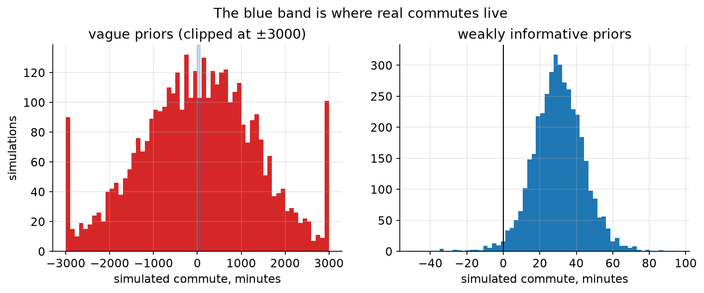
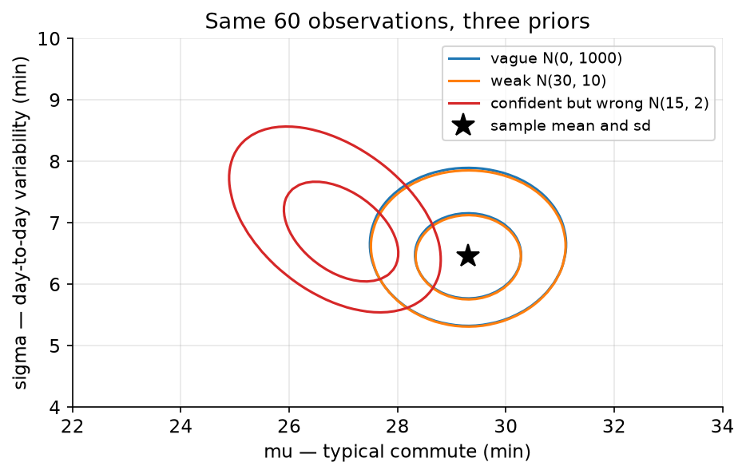
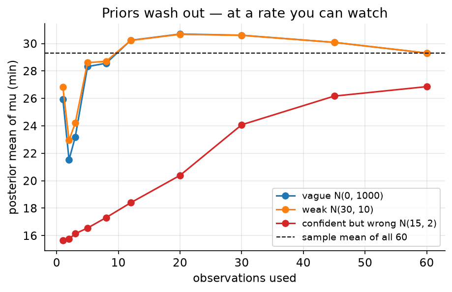

# 03. Priors you can defend

> **The problem.** How long does your commute actually take? You have 60 timings. Before you touch them, you have to say what you believed beforehand — and "nothing" is not an available answer.
> **What you'll be able to do.** Choose priors by simulating the data they imply, say how many observations a prior is worth, and recognise the parameters where the prior never washes out no matter how much data you collect.
> **Where this sits on the loop.** Steps 3 and 4 — model, and the prior check that catches most modelling errors.
> **Runtime.** ~25 s. **Prereqs.** Chapters 01–02.

The objection to Bayesian statistics that everyone raises first is that priors
are arbitrary and therefore cheating. The objection is worth taking seriously,
and the honest answer has three parts: priors are checkable, most of them stop
mattering quickly, and the ones that don't stop mattering are exactly the ones
you most need to see.

## 03.1 A model for a continuous outcome

Same commute, richer data: not "was I late" but "how many minutes".

```python
# --- setup ---
from pathlib import Path
import numpy as np
import pandas as pd
import matplotlib
matplotlib.use("Agg")
import matplotlib.pyplot as plt
from scipy import stats

SLUG = "03-priors-you-can-defend"
FIG = Path("figures") / SLUG
FIG.mkdir(parents=True, exist_ok=True)
rng = np.random.default_rng(3)

plt.rcParams.update({
    "figure.figsize": (7, 4), "figure.dpi": 110, "savefig.dpi": 150,
    "savefig.bbox": "tight", "axes.grid": True, "grid.alpha": 0.3,
    "axes.spines.top": False, "axes.spines.right": False, "font.size": 11,
})

def save(fig, name):
    out = FIG / f"{name}.png"
    fig.savefig(out)
    plt.close(fig)
    print(f"[fig] {out}")
```

```python
commutes = pd.read_csv("data/commutes.csv")
y = commutes.minutes.values
print(f"{len(y)} commutes: mean {y.mean():.2f}, sd {y.std(ddof=1):.2f}, "
      f"range {y.min():.1f} to {y.max():.1f} minutes")
```

**Step 2, the story.** Each morning the trip takes a typical amount of time plus
an unpredictable amount of traffic, weather and luck. Nothing systematic changes
over the two months. **Step 3, the model**, is then two lines of data-generating
process and two lines of prior:

```
minutes_i ~ Normal(mu, sigma)     the typical trip, plus symmetric noise
mu        ~ Normal(?, ?)          what is a typical commute?
sigma     ~ HalfNormal(?)         how variable is it? (positive by definition)
```

The question marks are the work of this chapter. Note what the model has
already claimed, before any prior: that the noise is symmetric (it isn't
really — traffic delays have a long right tail), and that every day is like
every other (it isn't — chapter 04 adds rain and mode). Both claims are
checkable, and chapter 06 checks them. The priors are not the only assumptions
in the room, and usually not the most consequential ones.

## 03.2 Your prior is a claim about data

Here is the move that makes prior choice concrete instead of philosophical:
**draw parameters from your prior, push them through the story, and look at the
fake data.** You have opinions about commutes even if you have none about
Gaussian location parameters.

Start with the prior people reach for when they want to appear neutral.

```python
M = 4000

# "uninformative": very wide priors on both parameters
mu_vague = rng.normal(0, 1000, M)
sd_vague = np.abs(rng.normal(0, 1000, M))
sim_vague = rng.normal(mu_vague, sd_vague)

print("vague priors  mu ~ N(0, 1000^2), sigma ~ HalfNormal(1000)")
print(f"  fraction of simulated commutes that are negative: "
      f"{np.mean(sim_vague < 0):.3f}")
print(f"  median trip length: {np.median(np.abs(sim_vague)):.0f} minutes")
print(f"  longest simulated trip: {np.abs(sim_vague).max()/60:.0f} hours")
```

Nearly half of the commutes this "neutral" prior predicts are *negative* —
`0.488` of them — the median trip is `902` minutes, and the worst is
`150` hours. That is not neutrality. It is a strong, specific and insane claim
about the world, and it is exactly as much an assumption as any other prior.
The word "uninformative" describes how the prior looks in parameter space, not
what it says about data, and data space is where you have judgement.

Now a prior chosen by thinking about commutes for thirty seconds: typical trips
are around half an hour, and I would be surprised by a typical trip under 10 or
over 50 minutes; day-to-day variation of more than 20 minutes would astonish
me.

```python
mu_weak = rng.normal(30, 10, M)
sd_weak = np.abs(rng.normal(0, 10, M))
sim_weak = rng.normal(mu_weak, sd_weak)

lo, hi = np.quantile(sim_weak, [0.05, 0.95])
print("weakly informative  mu ~ N(30, 10^2), sigma ~ HalfNormal(10)")
print(f"  fraction negative: {np.mean(sim_weak < 0):.3f}")
print(f"  90% of simulated commutes between {lo:.1f} and {hi:.1f} minutes")
```

`0.018` negative — still not perfect, since a Normal can always go negative,
and that residual absurdity is a fair criticism of the *model*, not the prior —
and 90% of the simulated trips fall between `8.2` and `52.7` minutes. That is a
prior you can defend to a colleague in one sentence: *it expects a commute
somewhere between ten minutes and an hour, and would be surprised by anything
outside that.*



```python
fig, axes = plt.subplots(1, 2, figsize=(11, 3.6))
axes[0].hist(np.clip(sim_vague, -3000, 3000), bins=60, color="C3")
axes[0].axvspan(0, 60, color="C0", alpha=0.25)
axes[0].set_title("vague priors (clipped at ±3000)")
axes[0].set_xlabel("simulated commute, minutes")
axes[1].hist(sim_weak, bins=60, color="C0")
axes[1].axvline(0, color="k", lw=1)
axes[1].set_title("weakly informative priors")
axes[1].set_xlabel("simulated commute, minutes")
axes[0].set_ylabel("simulations")
fig.suptitle("The blue band is where real commutes live", y=1.02)
save(fig, "prior-predictive")
```

The habit to build: **before fitting anything, simulate from the priors and
look at the fake data.** It takes four lines, it requires no new theory, and in
practice it catches wrong link functions, wrong units, forgotten
standardisation and impossible effect sizes — errors much more damaging than
any reasonable disagreement about a prior.

## 03.3 Fitting, three ways

Two unknowns means a two-dimensional grid, which is chapter 01's method with
one more axis. Beyond this we will need better tools; for now, enjoy being able
to see the whole posterior at once.

```python
mu_grid = np.linspace(10, 45, 280)
sd_grid = np.linspace(2, 18, 220)
MU, SD = np.meshgrid(mu_grid, sd_grid, indexing="ij")

def fit(prior_mu, prior_mu_sd, prior_sigma_scale, data):
    """Posterior on the (mu, sigma) grid for a Normal model."""
    loglik = stats.norm.logpdf(data[None, None, :],
                               MU[..., None], SD[..., None]).sum(axis=-1)
    logprior = (stats.norm.logpdf(MU, prior_mu, prior_mu_sd)
                + stats.halfnorm.logpdf(SD, scale=prior_sigma_scale))
    logpost = loglik + logprior
    logpost -= logpost.max()
    p = np.exp(logpost)
    return p / p.sum()

PRIORS = {"vague N(0, 1000)":        (0, 1000, 1000),
          "weak N(30, 10)":          (30, 10, 10),
          "confident but wrong N(15, 2)": (15, 2, 10)}

print("posterior with all 60 observations")
for name, args in PRIORS.items():
    p = fit(*args, y)
    mu_mean = (mu_grid * p.sum(axis=1)).sum()
    sd_mean = (sd_grid * p.sum(axis=0)).sum()
    print(f"  {name:30s} mu {mu_mean:6.3f}   sigma {sd_mean:5.3f}")
```

The vague and weakly informative priors give `29.302` and `29.307` — a
difference of four thousandths of a minute, which is to say, none. Sixty
observations have overwhelmed both. This is the usual situation, and it is why
prior-choice arguments are usually a waste of everyone's afternoon.

The third prior is different. Someone insisted the commute is 15 minutes and
was confident to within ±2, and the posterior lands at `26.857` — dragged
`2.44` minutes below the data's own average, and still lying. A confident prior
is a strong claim, and if it is wrong, sixty observations are not enough to
undo it. That is the correct behaviour: the model was *told* 15 ± 2 was
reliable information.



```python
fig, ax = plt.subplots()
for (name, args), colour in zip(PRIORS.items(), ["C0", "C1", "C3"]):
    p = fit(*args, y)
    ax.contour(MU, SD, p, levels=[p.max() * 0.1, p.max() * 0.5],
               colors=colour, linewidths=1.5)
    ax.plot([], [], color=colour, label=name)          # legend proxy
ax.plot(y.mean(), y.std(ddof=1), "k*", ms=14, label="sample mean and sd")
ax.set_xlim(22, 34); ax.set_ylim(4, 10)
ax.set_xlabel("mu — typical commute (min)")
ax.set_ylabel("sigma — day-to-day variability (min)")
ax.set_title("Same 60 observations, three priors")
ax.legend(fontsize=9)
save(fig, "joint-posterior")
```

## 03.4 How many observations is your prior worth?

You can convert any prior into the currency that matters. For a Normal mean
with observation noise σ and prior standard deviation τ, the prior carries the
same weight as **σ²/τ² observations**.

```python
sigma2 = y.var(ddof=1)
for tau in (2.0, 10.0, 1000.0):
    print(f"prior sd {tau:7.1f} minutes  ->  worth {sigma2/tau**2:8.4f} observations")
```

The confident prior is worth `10.4161` observations — a sixth of your dataset,
which is exactly why it moved the answer. The weak prior is worth `0.4166` of
one observation. The vague prior is worth `0.0000`.

This is the single most useful question to ask someone who objects to your
prior: *how many data points do you think it's worth?* If the answer is "about
half of one", the argument is over. If the answer is "about ten", they had
better be able to point at the ten.

Watch the three priors converge as data arrives:



```python
ns = [1, 2, 3, 5, 8, 12, 20, 30, 45, 60]
fig, ax = plt.subplots()
for (name, args), colour in zip(PRIORS.items(), ["C0", "C1", "C3"]):
    means = [(mu_grid * fit(*args, y[:n]).sum(axis=1)).sum() for n in ns]
    ax.plot(ns, means, "o-", color=colour, label=name)
    if name.startswith("confident"):
        print(f"  confident-wrong prior: {means[-1]:.2f} at n=60, still "
              f"{y.mean() - means[-1]:.2f} minutes from the sample mean")
ax.axhline(y.mean(), color="k", ls="--", lw=1, label="sample mean of all 60")
ax.set_xlabel("observations used"); ax.set_ylabel("posterior mean of mu (min)")
ax.set_title("Priors wash out — at a rate you can watch")
ax.legend(fontsize=9)
save(fig, "fan")
```

The two reasonable priors are indistinguishable from about the fifth
observation. The confident-wrong one is still `2.44` minutes away at n = 60 and
would need several hundred observations to fully surrender. Both behaviours are
correct; the difference is entirely in how much information each prior claimed
to have.

## 03.5 The priors that never wash out

"It'll wash out" is true for parameters the data can actually see. When a
parameter is *unidentified* — when different values of it imply exactly the
same distribution of observations — the prior is the only thing you will ever
have, and no amount of data changes that.

This is not exotic. It happens whenever you model a total as a sum of parts you
never observe separately. Suppose your commute is a walk plus a ride, you only
ever time the whole trip, and you model it as `walk + ride`:

```python
y_total = rng.normal(12.0 + 17.0, 3.0, size=200)      # 200 timings of the total

g = np.linspace(0, 35, 300)
A, B = np.meshgrid(g, g, indexing="ij")
loglik = stats.norm.logpdf(y_total[None, None, :], (A + B)[..., None], 3.0).sum(-1)
logprior = stats.norm.logpdf(A, 15, 5) + stats.norm.logpdf(B, 15, 5)

prior_p = np.exp(logprior - logprior.max()); prior_p /= prior_p.sum()
post_p = np.exp(loglik + logprior - (loglik + logprior).max()); post_p /= post_p.sum()

def moments(Q, p):
    m = (Q * p).sum()
    return m, np.sqrt(((Q - m) ** 2 * p).sum())

for label, Q in [("walk", A), ("walk + ride", A + B), ("walk - ride", A - B)]:
    m0, s0 = moments(Q, prior_p)
    m1, s1 = moments(Q, post_p)
    print(f"{label:12s} prior {m0:6.2f} +- {s0:4.2f}   "
          f"posterior {m1:6.2f} +- {s1:4.2f}")
```

Two hundred observations pin the *total* down beautifully: prior uncertainty
`7.02` minutes collapses to `0.21`. The *difference* between the two legs moves
from `7.02` to `7.07` — that is, not at all. The data is completely silent
about it, because every (walk, ride) pair with the same sum predicts identical
data. Whatever you report about the walk alone is a report about your prior,
dressed up with a sample size.

Three lessons, all of which cost people real money:

- **A narrow posterior is not evidence of learning.** The walk's own posterior
  did narrow, from 4.97 to 3.54, purely because the sum constraint plus the
  prior confines it. If you had only looked at that number you would think the
  data had taught you something about walking.
- **Check identification by simulating.** Fit the model to data generated with
  two different parameter settings that imply the same observations. If both
  fits give the same posterior for a quantity, that quantity is not identified,
  and this failure is invisible in any goodness-of-fit statistic.
- **This is the ordinary situation in causal inference.** Chapter 08's
  confounded price elasticity is unidentified in exactly this sense: the data
  cannot distinguish "price causes sales to fall" from "busy weeks cause both
  high prices and high sales". No estimator fixes it. Only an assumption does.

## 03.6 A working recipe for priors

1. **Put parameters on a scale you can think about.** Centre and scale your
   predictors (chapter 04), model log-sigma instead of sigma, use log-odds for
   probabilities. A prior is easy to choose when a unit change means something.
2. **Ask what would surprise you**, and set the prior so that roughly 90% of it
   lies inside that range. N(30, 10²) says "surprised outside 10–50".
3. **Simulate and look.** Always. Four lines.
4. **Prefer weakly informative to flat.** Flat priors are not neutral, they
   allow absurd values, and — as chapter 11 shows — they are the direct cause of
   overfitting in models with many parameters. A prior that gently discourages
   nonsense is regularisation, and it is the same thing that makes ridge
   regression work.
5. **State what your prior is worth in observations**, and be ready to defend
   that number rather than the prior's shape.
6. **Check sensitivity where it matters.** Refit with a prior someone
   reasonable might disagree with. If your conclusion survives, say so and move
   on; if it doesn't, you have learned something important about how much your
   answer depends on you.

## Pitfalls

- **Believing "uninformative" means "no assumption".** Flat in one
  parameterisation is informative in another, and every prior implies a claim
  about data. Simulate and look at that claim.
- **A grid that doesn't cover the posterior.** If you had run §03.3 on
  `mu_grid = linspace(20, 40)`, the confident-but-wrong prior's posterior would
  have been silently chopped off at 20 and the printed mean would have been
  wrong with no error message. Widen the grid until the posterior mass at the
  edges is negligible.
- **Priors on parameters whose scale you haven't thought about.** N(0, 10²) is
  wildly informative for a log-odds coefficient and negligible for a euro
  amount. Always ask "ten of what?"
- **Fighting about priors instead of about the model.** In this chapter the
  Normal likelihood's symmetric tails are a worse assumption than any of the
  three priors. Prior arguments are cheap; likelihood arguments are load-bearing.
- **Reporting an unidentified parameter as if the data spoke.** If two parameter
  settings imply the same predictions, the fit cannot tell them apart. Check by
  simulation before you interpret a coefficient.

## Exercises

**Exercise 03.1 — The rescue.**
*Setup:* The confident-but-wrong prior N(15, 2²) is still 2.45 minutes off after
60 observations. How much data would it take to get within half a minute of the
sample mean?
*Predict:* 100 observations? 500? 5,000?
*Reason:* The prior is worth about 10 observations, so 100 should swamp it.
*Run:*
```python
sigma_hat = y.std(ddof=1)
for n in (60, 100, 300, 1000):
    w = (1 / 2.0**2) / (1 / 2.0**2 + n / sigma_hat**2)     # weight on the prior
    print(f"n={n:5d}: prior weight {w:.3f}, posterior mean approx "
          f"{w * 15 + (1 - w) * y.mean():.2f}")
```
<details><summary>Reconcile</summary>

At n = 300 the posterior mean is `28.82`, within half a minute; at n = 1000 it
is `29.15`. So a hundred observations is *not* enough — the prior still carries
`0.094` of the weight and drags the estimate more than a minute.

The formula in that loop is the one to remember, and it is the same shrinkage
weight that appears in chapter 09's partial pooling and chapter 11's ridge
regression: the prior's weight is `prior precision / (prior precision + data
precision)`, and data precision grows linearly in n. Beating a prior worth k
observations to within a tolerance takes far more than k observations, because
the last stretch of shrinkage is the slowest.
</details>

**Exercise 03.2 — The prior that thinks everyone is certain.**
*Setup:* Skip ahead to a logistic model (chapter 13): the probability a customer
churns is `p = sigmoid(a + b*x)` with `x` a standardised predictor. Someone
picks "vague" priors `a, b ~ Normal(0, 10^2)`.
*Predict:* What does that prior say about churn probabilities — roughly uniform
over 0 to 1, concentrated near 0.5, or something else?
*Reason:* Wide priors on coefficients ought to mean "no opinion" about p.
*Run:*
```python
for scale in (10.0, 1.5):
    a = rng.normal(0, scale, 20_000)
    b = rng.normal(0, scale, 20_000)
    x = rng.normal(0, 1, 20_000)
    p_sim = 1 / (1 + np.exp(-(a + b * x)))
    print(f"prior N(0, {scale}^2): "
          f"{np.mean((p_sim < 0.01) | (p_sim > 0.99)):.3f} of customers are "
          f"'certain', median |p - 0.5| = {np.median(np.abs(p_sim - 0.5)):.3f}")
```
<details><summary>Reconcile</summary>

The "vague" prior puts `0.714` of its predicted customers at a churn probability
below 1% or above 99%. It is not agnostic — it asserts, before seeing anything,
that churn is essentially deterministic and we just don't know which way. The
weakly informative N(0, 1.5²) puts only `0.038` there.

This one is worth remembering because it bites in practice, and because the
symptom is not an obvious error. It shows up as a sampler that struggles, or
coefficients with implausibly wide intervals, or a model that is oddly
confident on new data. Any prior on a *transformed* scale — log-odds, log-rate,
anything through a link function — needs its check done in data space, where
your judgement lives. The wide prior looks harmless in coefficient space and is
absurd two lines later.
</details>

**Exercise 03.3 — Regularisation, seen early.**
*Setup:* A machine-learning connection. Fit `mu` with a Normal(0, τ²) prior and
watch the posterior mean as τ shrinks toward zero, with σ known.
*Predict:* What does the posterior mean approach as τ → 0? What familiar
technique is this?
*Reason:* A prior centred at zero pulls estimates toward zero.
*Run:*
```python
for tau in (100.0, 10.0, 3.0, 1.0, 0.3):
    w = (1 / tau**2) / (1 / tau**2 + len(y) / y.var(ddof=1))
    print(f"tau={tau:6.1f}  ->  posterior mean {(1 - w) * y.mean():.3f}  "
          f"(shrunk by factor {1 - w:.3f})")
```
<details><summary>Reconcile</summary>

The estimate slides from `29.300` toward `3.362` as the prior tightens. This is
ridge regression, exactly: a Normal(0, τ²) prior on a coefficient produces the
same point estimate as an L2 penalty with λ = σ²/τ², and shrinkage toward zero
is what both of them do.

Chapter 11 makes the equivalence precise and numerical. For now, notice what it
means for the "priors are cheating" objection: every regularised model in
machine learning — every weight decay term, every L2 penalty, every early stop
— is a prior. The choice is not whether to have one, but whether to write it
down where someone can check it.
</details>

## Takeaways

- A prior is a claim about data. Simulate from it and look at the data it
  predicts; this is step 4 of the loop and it costs four lines.
- "Uninformative" priors are wide in parameter space and often absurd in data
  space. Weakly informative beats flat almost always.
- A Normal prior with standard deviation τ is worth σ²/τ² observations. Quote
  that number when defending it.
- Reasonable priors wash out fast; confident wrong priors do not, and are
  supposed not to.
- For unidentified parameters the prior never washes out, the posterior can
  still look narrow, and no fit statistic will warn you. Check by simulation.
- Every regularisation penalty you have ever used is a prior with the paperwork
  hidden.

## Going deeper

- **Statistical Rethinking, chapter 4** (`curriculum_material/statistical_rethinking/ch04-geocentric-models.md`) introduces prior predictive simulation on the same Normal model, and §4.3 works the height example this section's structure follows.
- **The Bayesian Spine, module 07** (`curriculum/modules/07-priors.md`) covers when priors matter, Jeffreys priors and invariance, and the three distinct faces of nonidentifiability.
- **Module 05** (`curriculum/modules/05-conjugate-updating.md`) derives the σ²/τ² weight as the master shrinkage formula, and shows it reappearing as the Kalman gain and the partial-pooling weight.
