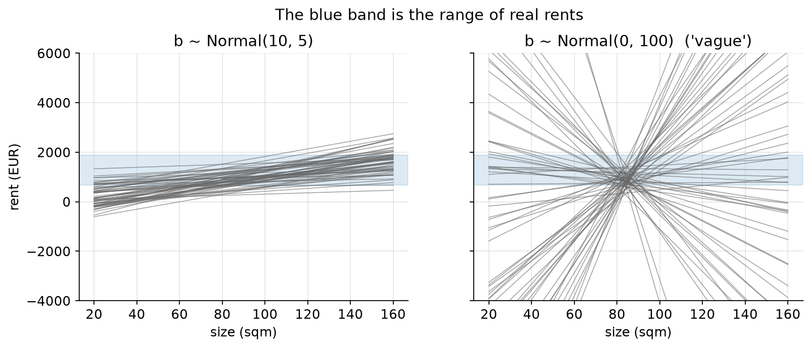
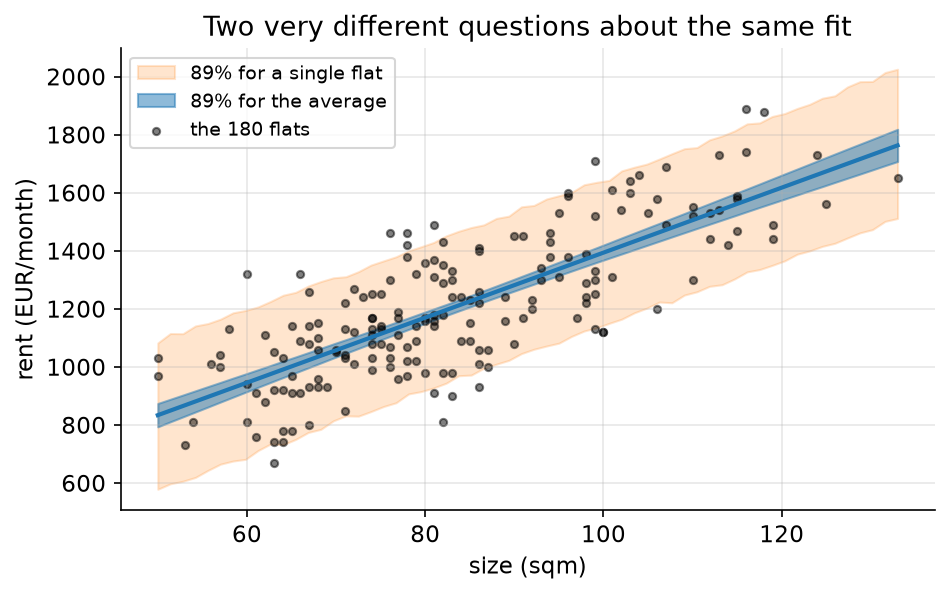

# 04. Lines with error bars

> **The problem.** You are flat-hunting. A 78 m² place in the ring district is listed at €1,250. Is that a fair price? And what is an extra 15 m² actually worth per month?
> **What you'll be able to do.** Fit a regression as a generative story, set priors in units you can argue about, and — the part almost everyone gets wrong — tell the difference between uncertainty about the trend and uncertainty about the next observation.
> **Where this sits on the loop.** Steps 2–5, with a first pass at 7.
> **Runtime.** ~20 s. **Prereqs.** Chapters 02–03.

Linear regression is the most-used statistical model in the world and the most
misread. This chapter fits one the long way, so that the two things it actually
produces — a posterior over lines, and a posterior over future observations —
never get confused again.

## 04.1 The data and the question

```python
# --- setup ---
from pathlib import Path
import numpy as np
import pandas as pd
import matplotlib
matplotlib.use("Agg")
import matplotlib.pyplot as plt
from scipy import stats

from bayeskit import quap, hdi, summarize

SLUG = "04-lines-with-error-bars"
FIG = Path("figures") / SLUG
FIG.mkdir(parents=True, exist_ok=True)
rng = np.random.default_rng(4)

plt.rcParams.update({
    "figure.figsize": (7, 4), "figure.dpi": 110, "savefig.dpi": 150,
    "savefig.bbox": "tight", "axes.grid": True, "grid.alpha": 0.3,
    "axes.spines.top": False, "axes.spines.right": False, "font.size": 11,
})

def save(fig, name):
    out = FIG / f"{name}.png"
    fig.savefig(out)
    plt.close(fig)
    print(f"[fig] {out}")
```

```python
rents = pd.read_csv("data/rents.csv")
print(rents.head(3).to_string(index=False))
print(f"\n{len(rents)} flats: rent {rents.rent.mean():.0f} +- {rents.rent.std():.0f} EUR, "
      f"size {rents.sqm.mean():.1f} +- {rents.sqm.std():.1f} sqm")

sqm_bar = rents.sqm.mean()
x = rents.sqm.values - sqm_bar          # centred: 0 means an average-sized flat
y = rents.rent.values.astype(float)
```

**Centre the predictor.** It changes nothing about the fit and everything about
whether you can think about the parameters. With raw square metres, the
intercept is the rent of a 0 m² flat — a quantity about which you have no
opinion whatsoever, which makes putting a prior on it impossible. Centred, the
intercept is the rent of an average-sized flat, about which you have plenty of
opinions. Centring also decorrelates the intercept from the slope, which makes
every fitting algorithm's life easier.

## 04.2 The story, as a model

**Step 2.** Each flat has a price determined by its size, plus everything else —
floor, view, landlord's mood, how long it has been listed. Everything else is
lumped into symmetric noise. **Step 3:**

```
rent_i ~ Normal(mu_i, sigma)
mu_i   = a + b * (sqm_i - 83.4)
a      ~ Normal(900, 300)      rent of an average-sized flat
b      ~ Normal(10, 5)         euros per month per extra square metre
sigma  ~ HalfNormal(200)       how much rent varies at a given size
```

Only the second line is new relative to chapter 03. `mu_i` is not a random
variable with a distribution to estimate — it is *defined*, deterministically,
by the parameters and the flat's size. That single "=" is the whole idea of
regression: the average outcome is a function of the predictors, and the
randomness lives in one place, in the first line.

Now look at the prior on `b`. It says: an extra square metre adds about €10 a
month, and I'd be surprised outside €0–20. That is a claim you can argue about
over coffee, which is the point of getting the units right.

## 04.3 Priors are lines

For a regression, the prior predictive check is not a histogram — it is a bunch
of lines. Draw parameter sets from the prior, plot the line each one implies,
and ask whether those are plausible rent-versus-size relationships.

```python
n_lines = 60
a_prior = rng.normal(900, 300, n_lines)
b_prior = rng.normal(10, 5, n_lines)
b_flat = rng.normal(0, 100, n_lines)         # a "vague" alternative

print(f"considered prior on b: {np.mean(b_prior < 0):.3f} of lines slope downward")
print(f"flat prior N(0,100^2): {np.mean(b_flat < 0):.3f} slope downward, and "
      f"50 extra sqm changes rent by {b_flat.min()*50:.0f} to {b_flat.max()*50:.0f} EUR")
```

The considered prior produces `0.000` downward-sloping lines — bigger flats cost
more, and I am willing to assert that before seeing data. The "vague" prior has
`0.433` of its lines sloping downward and implies that 50 extra square metres
might change the rent by anywhere from `-14872` to `11289` euros a month.



```python
xs = np.linspace(20, 160, 50)
fig, axes = plt.subplots(1, 2, figsize=(11, 3.8), sharey=True)
for ax, bs, title in [(axes[0], b_prior, "b ~ Normal(10, 5)"),
                      (axes[1], b_flat, "b ~ Normal(0, 100)  ('vague')")]:
    for a_i, b_i in zip(a_prior, bs):
        ax.plot(xs, a_i + b_i * (xs - sqm_bar), color="0.4", lw=0.7, alpha=0.6)
    ax.axhspan(rents.rent.min(), rents.rent.max(), color="C0", alpha=0.15)
    ax.set_xlabel("size (sqm)"); ax.set_title(title)
axes[0].set_ylim(-4000, 6000); axes[0].set_ylabel("rent (EUR)")
fig.suptitle("The blue band is the range of real rents", y=1.02)
save(fig, "prior-lines")
```

## 04.4 Fitting: find the peak, measure the curvature

Three unknowns is past comfortable grid territory. The next tool up is the
**quadratic approximation**: find the peak of the posterior, measure how sharply
it curves away in each direction, and approximate the whole thing with the
Gaussian that has that peak and that curvature. McElreath calls it `quap`; the
rest of the literature calls it the Laplace approximation; either way it is
twenty lines of scipy, and `bayeskit.quap` is those twenty lines.

Two practical notes on the code. First, we hand the optimiser `log_sigma`
instead of `sigma`, because an optimiser exploring an unconstrained axis cannot
wander into negative standard deviations, and because the posterior for a scale
parameter is much closer to Gaussian on the log scale. Second, changing
variables costs a Jacobian term — the `+ log_sigma` at the end — which is the
price of the substitution and is easy to forget.

```python
def neg_log_post(v):
    a, b, log_sigma = v
    sigma = np.exp(log_sigma)
    mu = a + b * x                                       # the deterministic line
    loglik = stats.norm.logpdf(y, mu, sigma).sum()
    logprior = (stats.norm.logpdf(a, 900, 300)
                + stats.norm.logpdf(b, 10, 5)
                + stats.halfnorm.logpdf(sigma, scale=200)
                + log_sigma)                             # Jacobian of sigma = exp(log_sigma)
    return -(loglik + logprior)

fit = quap(neg_log_post, {"a": 900.0, "b": 10.0, "log_sigma": np.log(150.0)})
post = fit.sample(4000, rng)
post["sigma"] = np.exp(post.pop("log_sigma"))
print(summarize(post).round(3).to_string())
```

An extra square metre is worth `11.196` euros a month, with an 89% interval from
`10.159` to `12.265`. Rents at a given size scatter with a standard deviation of
about `156.653` euros — which is a large number, and §04.5 is about what it
means.

Before going on, a sanity check that is also a lesson:

```python
X = np.column_stack([np.ones_like(x), x])
beta_ols = np.linalg.lstsq(X, y, rcond=None)[0]
resid_sd = np.sqrt(((y - X @ beta_ols) ** 2).sum() / (len(y) - 2))
print(f"least squares: intercept {beta_ols[0]:.3f}, slope {beta_ols[1]:.3f}, "
      f"residual sd {resid_sd:.2f}")
```

Least squares gives a slope of `11.244` against the posterior's `11.196`. They
agree to within a rounding error, and they will, whenever the priors are weak
relative to the data. Ordinary regression is not a rival method that we are
replacing; it is *this* calculation with flat priors and only the peak reported.
What the Bayesian version adds is everything that isn't the peak: the whole
posterior, the ability to state P(b > 12), and — next section — a principled
predictive distribution.

## 04.5 The two intervals nobody separates

You are looking at a 78 m² flat. Two different questions:

1. What is the **average** rent of 78 m² flats?
2. What will **this** flat cost?

**Predict before running.** The 89% interval for question 1 will have some
width. How much wider is the interval for question 2 — 1.5 times? Three times?
Write it down now.

```python
x_new = 78 - sqm_bar

mu_new = post["a"] + post["b"] * x_new                 # uncertainty about the LINE
y_new = rng.normal(mu_new, post["sigma"])              # ...plus the scatter around it

for label, s in [("average 78 sqm flat", mu_new), ("one specific flat", y_new)]:
    lo, hi = hdi(s, 0.89)
    print(f"{label:20s}: {s.mean():6.0f} EUR   89% [{lo:.0f}, {hi:.0f}]   "
          f"width {hi-lo:.0f}")
```

The average is pinned down to a `40`-euro window. A specific flat lives in a
`508`-euro window — **12.7 times wider**. Almost nobody guesses that high.

The reason is structural and worth saying slowly. The interval for the average
shrinks as you collect data, because it reflects only your ignorance about the
parameters, and that ignorance goes away at rate 1/√n. The interval for a single
flat contains that same parameter uncertainty *plus* sigma, the irreducible
spread of flats around the trend — and sigma does not shrink with more data. It
is a fact about flats, not about your knowledge. With 180 observations the
parameter part is already negligible and the predictive interval is essentially
±1.6 sigma.

This is the distinction between **epistemic** uncertainty (about parameters,
reducible by data) and **aleatoric** uncertainty (about outcomes, irreducible).
Every confident-sounding prediction that blows up in production confuses them.
"Our model predicts revenue of €4.2M ± 0.1M" is almost always the width of the
first interval quoted as if it were the second.

So: is €1,250 a fair price for that 78 m² flat? The model says a typical such
flat rents for about €1,148, and that 89% of them fall between €890 and €1,398.
€1,250 is unremarkable — on the high side of typical, nowhere near evidence of
a bad deal. If you want a sharper answer, you need a better model, which is the
next section.



```python
grid_x = np.linspace(rents.sqm.min(), rents.sqm.max(), 60) - sqm_bar
mu_curve = post["a"][:, None] + post["b"][:, None] * grid_x[None, :]
y_curve = rng.normal(mu_curve, post["sigma"][:, None])

mu_lo, mu_hi = np.quantile(mu_curve, [0.055, 0.945], axis=0)
y_lo, y_hi = np.quantile(y_curve, [0.055, 0.945], axis=0)

fig, ax = plt.subplots()
ax.fill_between(grid_x + sqm_bar, y_lo, y_hi, color="C1", alpha=0.2,
                label="89% for a single flat")
ax.fill_between(grid_x + sqm_bar, mu_lo, mu_hi, color="C0", alpha=0.5,
                label="89% for the average")
ax.plot(grid_x + sqm_bar, mu_curve.mean(axis=0), color="C0", lw=2)
ax.scatter(rents.sqm, rents.rent, s=12, color="k", alpha=0.5, label="the 180 flats")
ax.set_xlabel("size (sqm)"); ax.set_ylabel("rent (EUR/month)")
ax.set_title("Two very different questions about the same fit")
ax.legend(fontsize=9)
save(fig, "trumpet")
```

## 04.6 Adding what you already know

That €508 window is embarrassing, and the reason is obvious to anyone who has
looked for a flat: location. The model does not know about districts, so all of
the district-to-district variation is sitting inside sigma, being reported as
noise.

The fix is an **index variable**: one intercept per district, rather than a
"dummy variable" per district minus one. Index coding is cleaner in every way —
each parameter is directly interpretable as that district's level, you can put
the same prior on each, and nothing is arbitrarily designated the baseline.

```python
district = pd.Categorical(rents.district, categories=["centre", "ring", "outer"])
d_idx = district.codes

def neg_log_post2(v):
    a, b, log_sigma = v[:3], v[3], v[4]
    sigma = np.exp(log_sigma)
    mu = a[d_idx] + b * x                      # one intercept per district
    loglik = stats.norm.logpdf(y, mu, sigma).sum()
    logprior = (stats.norm.logpdf(a, 900, 300).sum()
                + stats.norm.logpdf(b, 10, 5)
                + stats.halfnorm.logpdf(sigma, scale=200) + log_sigma)
    return -(loglik + logprior)

fit2 = quap(neg_log_post2, {"a_centre": 900.0, "a_ring": 900.0, "a_outer": 900.0,
                            "b": 10.0, "log_sigma": np.log(120.0)})
post2 = fit2.sample(4000, rng)
post2["sigma"] = np.exp(post2.pop("log_sigma"))
print(summarize(post2).round(2).to_string())

gap = post2["a_centre"] - post2["a_outer"]
lo, hi = hdi(gap, 0.89)
print(f"\ncentre minus outer, same size: {gap.mean():.1f} EUR  89% [{lo:.1f}, {hi:.1f}]")
```

Sigma collapses from `156.653` to `91.47`. Location was worth as much as
`339.6` euros a month (centre versus outer, 89% interval `309.2` to `369.7`),
and until now all of that was being called noise.

```python
y_ring = rng.normal(post2["a_ring"] + post2["b"] * x_new, post2["sigma"])
lo, hi = hdi(y_ring, 0.89)
print(f"78 sqm in the ring: one flat {y_ring.mean():.0f} EUR, "
      f"89% [{lo:.0f}, {hi:.0f}], width {hi-lo:.0f}")
```

The predictive window for the specific flat shrinks from 508 to `289` euros, and
the expectation moves to about `1108`. Now €1,250 looks like a genuinely high
asking price — still inside the range, but in the upper third.

**This is what modelling buys.** Not a better point estimate — the slope barely
moved, from 11.196 to `10.94` — but a much sharper predictive distribution,
because a chunk of what was noise turned out to be signal you already had in the
file. Whenever a predictive interval is uselessly wide, the question to ask is
not "which algorithm is better" but "what do I know about these units that the
model doesn't".

## 04.7 What this model still gets wrong

Being explicit about the remaining assumptions is part of the workflow, not an
apology for it.

- **The relationship is assumed straight.** Rent per square metre probably falls
  for very large flats. Chapter 12 covers how to tell whether adding curvature
  actually helps.
- **The noise is assumed symmetric and constant.** Rents are bounded below and
  skewed right, and expensive flats probably scatter more. Chapter 06 checks
  this with posterior predictive checks and finds it wanting.
- **The coefficients are not causal.** `b` is what rent is *associated with*
  size in this sample. If landlords set prices partly from features that also
  drive size, then knocking down a wall would not add €11/m². Chapter 08 is
  entirely about this distinction.
- **Every district is estimated separately.** With three big districts that is
  fine. With 40 neighbourhoods, half of them containing three flats, it falls
  apart — and chapter 09 fixes it.

## Pitfalls

- **Not centring.** Uninterpretable intercepts, meaningless priors, and
  correlated parameters that make samplers struggle. Centre, or standardise.
- **Reporting the interval for the mean as if it were for an observation.** The
  most common quantitative error in business reporting, and the most expensive.
  Ask: am I predicting an average or a thing?
- **Priors on raw-scale coefficients you haven't thought about.** "Normal(0,
  100)" for a euros-per-square-metre effect is not conservative, it is a claim
  that flats might get €5,000/month cheaper per square metre.
- **Trusting `quap` for skewed posteriors.** The quadratic approximation is a
  Gaussian by construction. For variance parameters, boundary-adjacent
  estimates, or small samples, it will report symmetric intervals for a posterior
  that isn't. Fit the scale on the log axis, and when in doubt use chapter 05's
  sampler and compare.
- **Adding predictors without asking why.** Adding district here sharpened
  predictions and was harmless. Adding a variable that sits *downstream* of the
  effect you care about will silently destroy the estimate — chapter 08 shows
  exactly how.

## Exercises

**Exercise 04.1 — The trumpet's waist.**
*Setup:* The interval for the average is narrowest at the mean size and widens
at both ends.
*Predict:* At 140 m² (far from the mean of 83), is the interval for the average
twice as wide as at the mean? Ten times? And what happens to the interval for a
single flat?
*Reason:* Extrapolation is harder than interpolation.
*Run:*
```python
for size in (83, 110, 140):
    xn = size - sqm_bar
    mu_s = post["a"] + post["b"] * xn
    y_s = rng.normal(mu_s, post["sigma"])
    print(f"{size:3d} sqm: mean-width {np.diff(hdi(mu_s, 0.89))[0]:6.1f}   "
          f"flat-width {np.diff(hdi(y_s, 0.89))[0]:6.1f}")
```
<details><summary>Reconcile</summary>

The width for the average goes `37.8` → `67.5` → `125.3` — it more than triples.
The width for a single flat goes `508.5` → `512.5` → `505.5`: essentially flat.

The parameter uncertainty really does grow as you extrapolate, exactly as the
trumpet shape suggests. But it grows from a small base, and it is swamped by
sigma, which doesn't care where you are. The practical consequence is
counter-intuitive: **for predicting individual outcomes, moderate extrapolation
costs you almost nothing** — the risk of extrapolation is not that the interval
is too narrow, it is that the *straight-line assumption* is wrong out there,
and no error bar on this model can tell you that.
</details>

**Exercise 04.2 — Does the slope survive?**
*Setup:* Adding district changed the slope from 11.196 to 10.94.
*Predict:* Is that a real change or noise? Compute the posterior probability
that the size effect exceeds €10/m² under each model.
*Reason:* The intervals overlap heavily.
*Run:*
```python
print(f"without district: P(b > 10) = {np.mean(post['b'] > 10):.4f}, "
      f"sd {post['b'].std(ddof=1):.3f}")
print(f"with district:    P(b > 10) = {np.mean(post2['b'] > 10):.4f}, "
      f"sd {post2['b'].std(ddof=1):.3f}")
```
<details><summary>Reconcile</summary>

Both models are confident the slope exceeds €10 (`0.9630` and `0.9908`), and
the second is *more* confident despite a slightly smaller estimate, because its
standard error shrank from `0.671` to `0.387`.

That is the mechanism worth taking away: adding a predictor that explains
outcome variance — even one uncorrelated with your predictor of interest —
reduces sigma and therefore sharpens *every* coefficient in the model. It is the
statistical analogue of blocking in experimental design, and it is why "control
for things that affect the outcome" is good advice while "control for
everything" is not (chapter 08).
</details>

**Exercise 04.3 — When quap lies.**
*Setup:* The quadratic approximation is a Gaussian. Fit the same model to only
the first 8 flats and compare quap's interval for sigma against a direct grid.
*Predict:* Will quap's interval for sigma be too wide, too narrow, or shifted?
*Reason:* With 8 observations the posterior for a scale parameter is strongly
right-skewed.
*Run:*
```python
xs8, ys8 = x[:8], y[:8]
def nlp8(v):
    a, b, ls = v
    return -(stats.norm.logpdf(ys8, a + b * xs8, np.exp(ls)).sum()
             + stats.norm.logpdf(a, 900, 300) + stats.norm.logpdf(b, 10, 5)
             + stats.halfnorm.logpdf(np.exp(ls), scale=200) + ls)

f8 = quap(nlp8, {"a": 900.0, "b": 10.0, "log_sigma": np.log(150.0)})
s8 = np.exp(f8.sample(20_000, rng)["log_sigma"])
print(f"quap sigma: mean {s8.mean():.1f}, 89% [{hdi(s8,0.89)[0]:.1f}, "
      f"{hdi(s8,0.89)[1]:.1f}]")
g = np.linspace(20, 600, 800)
lg = np.array([stats.norm.logpdf(ys8, f8.mode[0] + f8.mode[1]*xs8, s).sum()
               + stats.halfnorm.logpdf(s, scale=200) for s in g])
pg = np.exp(lg - lg.max()); pg /= pg.sum()
print(f"grid sigma: mean {(g*pg).sum():.1f}, 89% "
      f"[{g[np.searchsorted(np.cumsum(pg), 0.055)]:.1f}, "
      f"{g[np.searchsorted(np.cumsum(pg), 0.945)]:.1f}]")
```
<details><summary>Reconcile</summary>

quap puts sigma at `207.5` with an 89% interval of `126.6` to `286.4`; the grid
says `215.4` with `146.3` to `311.1`. The approximation is shifted low, and its
upper limit falls about 25 euros short — it cannot represent the long right tail
that a variance parameter has when estimated from 8 points, even after the log
transform.

The general rule: quadratic approximation is excellent for well-identified
location parameters with decent sample sizes and progressively worse for scale
parameters, small samples, hierarchical variances, and anything near a boundary.
Those are exactly the situations where chapter 05's sampler earns its runtime.
</details>

## Takeaways

- Regression is a story: one line saying the average is a deterministic function
  of predictors, one line saying the observations scatter around it.
- Centre your predictors so the parameters mean something and your priors can be
  argued about.
- Check priors by plotting the *lines* they imply, not the parameters.
- Least squares is this model with flat priors and only the peak reported. The
  posterior is the part that was missing.
- Uncertainty about the average and uncertainty about the next observation are
  different by an order of magnitude. Never quote one for the other.
- Adding a predictor that explains outcome variance shrinks sigma, which
  sharpens predictions and every other coefficient at once.

## Going deeper

- **Statistical Rethinking, chapter 4** (`curriculum_material/statistical_rethinking/ch04-geocentric-models.md`) builds the same model on human heights, including the prior-lines figure and the `link` / `sim` distinction that §04.5 is about.
- **Chapter 5** (`.../ch05-the-many-variables-the-spurious-waffles.md`) is the multiple-predictor version, and the source of the warning in §04.7 about what adding a variable really does.
- **The Bayesian Spine, module 14** (`curriculum/modules/14-bayesian-regression.md`) derives the trumpet decomposition exactly (Var = xᵀΣx + σ²) and proves the ridge-equals-Gaussian-prior identity to machine precision.
