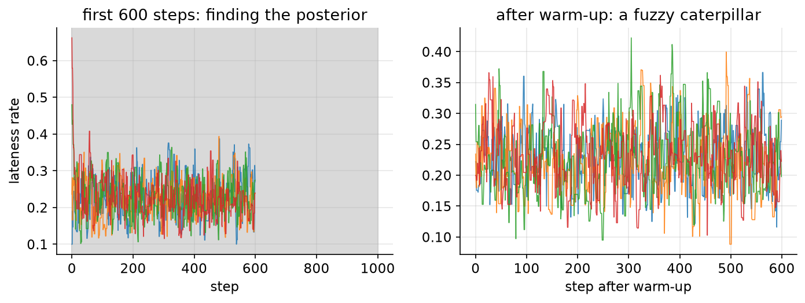
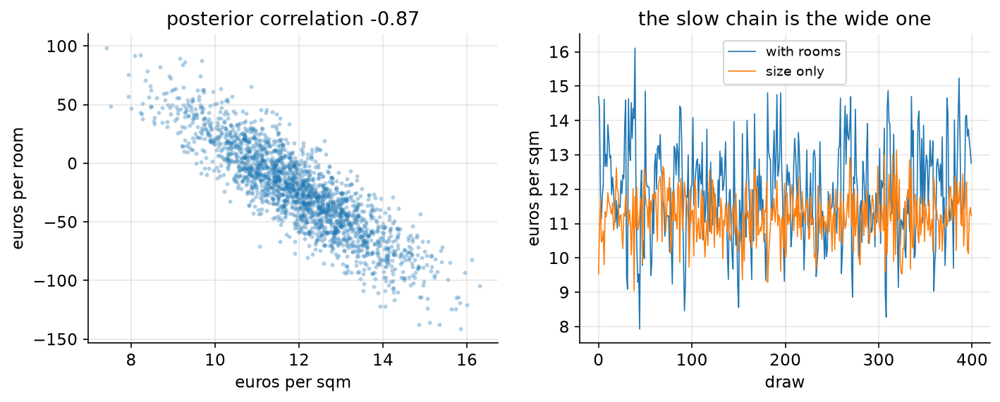

# 05. When the math runs out

> **The problem.** Your model has five parameters, or twenty. The grid is dead, the Gaussian approximation is lying about the tails, and there is no formula. What now?
> **What you'll be able to do.** Write a model in NumPyro, sample it with NUTS, and — more importantly — read the diagnostics well enough to know when the answer is garbage and what to do about it.
> **Where this sits on the loop.** Step 5, industrialised.
> **Runtime.** ~35 s. **Prereqs.** Chapters 03–04.

Markov chain Monte Carlo has a reputation for being the hard part. It isn't.
The hard part is knowing when it has failed, because when it fails it still
returns numbers, formatted exactly like the numbers it returns when it works.

## 05.1 Metropolis in fifteen lines

Start by building the whole idea yourself, so that "the sampler" stops being a
black box.

You want samples from a posterior you can only evaluate up to a constant. Take
a walk through parameter space with one rule: propose a small random step; if
the proposed point has higher posterior density, go; if lower, go anyway with
probability equal to the ratio. That's it. That's Metropolis.

The magic is in the ratio. `p(θ') / p(θ)` — the intractable normalising
constant, the integral you couldn't do, appears in both numerator and
denominator and cancels. You never need it.

```python
# --- setup ---
from pathlib import Path
import numpy as np
import pandas as pd
import matplotlib
matplotlib.use("Agg")
import matplotlib.pyplot as plt
from scipy import stats

import numpyro
numpyro.set_host_device_count(4)          # 4 chains in parallel; call before jax uses devices
import jax
import jax.numpy as jnp
import numpyro.distributions as dist
from numpyro.infer import MCMC, NUTS

from bayeskit import mcmc_summary, rhat, ess, hdi

SLUG = "05-when-the-math-runs-out"
FIG = Path("figures") / SLUG
FIG.mkdir(parents=True, exist_ok=True)
rng = np.random.default_rng(5)

plt.rcParams.update({
    "figure.figsize": (7, 4), "figure.dpi": 110, "savefig.dpi": 150,
    "savefig.bbox": "tight", "axes.grid": True, "grid.alpha": 0.3,
    "axes.spines.top": False, "axes.spines.right": False, "font.size": 11,
})

def save(fig, name):
    out = FIG / f"{name}.png"
    fig.savefig(out)
    plt.close(fig)
    print(f"[fig] {out}")
```

```python
def metropolis(log_target, start, n_steps, step, rng):
    """Random-walk Metropolis. log_target need only be correct up to a constant."""
    x = float(start)
    lp = log_target(x)
    out = np.empty(n_steps)
    accepted = 0
    for i in range(n_steps):
        proposal = x + rng.normal(0, step)
        lp_prop = log_target(proposal)
        if np.log(rng.random()) < lp_prop - lp:      # always accept if uphill
            x, lp = proposal, lp_prop
            accepted += 1
        out[i] = x
    return out, accepted / n_steps

# the commute-lateness posterior from chapter 02: 13 late days out of 60
def log_post(theta):
    if not 0 < theta < 1:
        return -np.inf                                # outside the support
    return stats.binom.logpmf(13, 60, theta)          # flat prior, so this is enough

chains = np.array([metropolis(log_post, s, 4000, 0.08, rng)[0]
                   for s in (0.1, 0.3, 0.5, 0.7)])    # four different starting points
_, acceptance = metropolis(log_post, 0.2, 4000, 0.08, rng)

burned = chains[:, 1000:]                              # discard the first 1000: warm-up
print(f"acceptance rate {acceptance:.3f}")
print(f"posterior mean {burned.mean():.4f}   (exact answer {(1+13)/(2+60):.4f})")
```

Four chains, started at 0.1, 0.3, 0.5 and 0.7, all wander to the same place, and
the average of the last 3,000 draws from each is `0.2240` against the exact
`0.2258`. Fifteen lines, no conjugacy, no integral.



```python
fig, axes = plt.subplots(1, 2, figsize=(11, 3.4))
for c in chains:
    axes[0].plot(c[:600], lw=0.8, alpha=0.85)
axes[0].axvspan(0, 1000, color="0.85")
axes[0].set_title("first 600 steps: finding the posterior")
axes[0].set_xlabel("step"); axes[0].set_ylabel("lateness rate")
for c in burned:
    axes[1].plot(c[:600], lw=0.8, alpha=0.85)
axes[1].set_title("after warm-up: a fuzzy caterpillar")
axes[1].set_xlabel("step after warm-up")
save(fig, "traces")
```

The right-hand panel is what a healthy trace looks like: a fuzzy caterpillar
with no trend, all chains overlapping, no long excursions. Learn that picture.
Everything that goes wrong looks visibly different from it.

## 05.2 The two numbers you must check

Eyeballing traces does not scale to a model with forty parameters. Two summaries
do.

**R-hat** asks: *do the chains agree with each other?* It compares the variance
between chains to the variance within them. If the chains have converged to the
same distribution, both estimate the same thing and the ratio is 1. Anything
above 1.01 means the chains are still telling different stories, and you must
not use the draws.

**ESS**, the effective sample size, asks: *how many independent draws is this
worth?* Consecutive MCMC draws are correlated — each step depends on the last —
so 12,000 draws might carry the information of only a few hundred. ESS is the
honest denominator for any Monte Carlo error bar.

```python
print(f"R-hat {rhat(burned):.4f}")
print(f"ESS   {ess(burned):.0f}  (from {burned.size} actual draws)")
print(f"so the Monte Carlo error on the mean is about "
      f"{burned.std(ddof=1)/np.sqrt(ess(burned)):.5f}")
```

R-hat `1.0025` — fine. ESS `2454` out of `12000` draws, so this sampler is about
20% efficient, and the Monte Carlo error on the posterior mean is `0.00105`,
two orders of magnitude below the posterior's own width. Good enough.

**Rules of thumb:** R-hat below 1.01 for every parameter, ESS above ~400 for
anything you intend to quote (more for tail quantiles, which need far more
draws than means). Report ESS, not the number of iterations — "I ran 100,000
samples" says nothing if they were worth 200.

## 05.3 The real tool: NUTS

Random-walk Metropolis degrades badly as dimensions grow: the fraction of
random directions that improve the posterior shrinks, so the step size must
shrink, so the walk crawls. Hamiltonian Monte Carlo fixes this by using the
*gradient* of the log posterior — it gives the parameter a momentum and
simulates it rolling along the posterior's contours, taking long, coherent
strides instead of a jittery walk. NUTS ("no-U-turn sampler") is HMC that tunes
its own step size and trajectory length.

You do not implement this. You write the model and let NumPyro do it, which is
the point at which model-writing becomes remarkably close to writing the
`~` lines from step 3 of the loop.

```python
rents = pd.read_csv("data/rents.csv")
sqm_c = rents.sqm.values - rents.sqm.mean()
rent = rents.rent.values.astype(float)

def rent_model(sqm_c, rent=None):
    a = numpyro.sample("a", dist.Normal(900, 300))
    b = numpyro.sample("b", dist.Normal(10, 5))
    sigma = numpyro.sample("sigma", dist.HalfNormal(200))
    mu = a + b * sqm_c
    numpyro.sample("rent", dist.Normal(mu, sigma), obs=rent)

def run(model, seed=0, warmup=500, samples=500, **kwargs):
    """Fit a model with 4 chains and return {name: (chains, draws)} plus divergences."""
    mcmc = MCMC(NUTS(model), num_warmup=warmup, num_samples=samples,
                num_chains=4, chain_method="parallel", progress_bar=False)
    mcmc.run(jax.random.PRNGKey(seed), extra_fields=("diverging",), **kwargs)
    draws = {k: np.asarray(v) for k, v in mcmc.get_samples(group_by_chain=True).items()}
    n_div = int(np.asarray(mcmc.get_extra_fields()["diverging"]).sum())
    return draws, n_div

post, n_div = run(rent_model, sqm_c=sqm_c, rent=rent)
print(f"divergences: {n_div}")
print(mcmc_summary(post).round(3).to_string())
```

Compare with chapter 04's quadratic approximation: the slope was 11.196 there
and `11.237` here, sigma 156.653 and `158.242`. For a well-behaved model both
methods are right and quap is faster. The reason to reach for NUTS is not this
model — it is the next one, where the posterior is skewed, or hierarchical, or
has forty parameters, and quap has no way to tell you it has stopped being a
good approximation.

Note the `obs=rent` keyword and the `rent=None` default. That one line makes the
model do double duty: pass data and it conditions (step 5); pass nothing and the
same code simulates data from the priors (step 4). One model, both directions.

## 05.4 Failure mode 1: chains that disagree

Here is a posterior with two separated modes — which happens in mixture models,
in models with symmetries, and any time two very different explanations fit the
data about equally well.

```python
def log_bimodal(theta):
    return np.logaddexp(stats.norm.logpdf(theta, -4, 0.6),
                        stats.norm.logpdf(theta, 4, 0.6))

stuck = np.array([metropolis(log_bimodal, s, 4000, 0.5, rng)[0]
                  for s in (-4, -4, 4, 4)])
print(f"small steps: R-hat {rhat(stuck):.3f}, ESS {ess(stuck):.1f}")
print(f"  chain means: {np.round(stuck.mean(axis=1), 2)}")

roaming = np.array([metropolis(log_bimodal, s, 4000, 6.0, rng)[0]
                    for s in (-4, -4, 4, 4)])
print(f"wider steps: R-hat {rhat(roaming):.3f}, ESS {ess(roaming):.0f}")
print(f"  chain means: {np.round(roaming.mean(axis=1), 2)}")
```

With a step size of 0.5 no chain ever crosses the valley between the modes.
Each one reports a beautifully clean, tight, *completely wrong* posterior. Two
chains say −4, two say +4. R-hat is `7.393` and ESS is `4.1`: the diagnostics
scream, exactly as they should.

Widen the proposal to 6.0 and the chains hop between modes; R-hat drops to
`1.003` and ESS rises to `839`.

**This is why you run four chains from different starting points.** A single
chain from a single start would have produced the clean, tight, wrong answer
with no warning at all — R-hat computed on one chain cannot detect a mode it
never visited. The cost of four chains is nothing; the cost of not running them
is a plausible number you will believe.

## 05.5 Failure mode 2: parameters that trade off

The other common failure is not a wrong answer but a slow one. Add a second
predictor that says nearly the same thing as the first: flat size and number of
rooms.

```python
rooms_c = rents.rooms.values.astype(float) - rents.rooms.mean()
print(f"correlation between sqm and rooms: "
      f"{np.corrcoef(rents.sqm, rents.rooms)[0, 1]:.4f}")

def two_predictors(sqm_c, rooms_c, rent=None):
    a = numpyro.sample("a", dist.Normal(900, 300))
    b_sqm = numpyro.sample("b_sqm", dist.Normal(10, 5))
    b_rooms = numpyro.sample("b_rooms", dist.Normal(0, 200))
    sigma = numpyro.sample("sigma", dist.HalfNormal(200))
    numpyro.sample("rent", dist.Normal(a + b_sqm * sqm_c + b_rooms * rooms_c, sigma),
                   obs=rent)

post2, n_div2 = run(two_predictors, sqm_c=sqm_c, rooms_c=rooms_c, rent=rent)
print(mcmc_summary(post2).round(3).to_string())
r = np.corrcoef(post2["b_sqm"].ravel(), post2["b_rooms"].ravel())[0, 1]
print(f"\nposterior correlation between the two slopes: {r:.4f}")
print(f"ESS for the size effect: {ess(post['b']):.0f} alone, "
      f"{ess(post2['b_sqm']):.0f} with rooms added")
```

The two predictors correlate at `0.8878`, and the *posterior* for their
coefficients correlates at `-0.8711`: the model cannot tell whether rent is
driven by square metres or by rooms, only that some combination of them works.
The consequences are visible in the table — the size effect's standard error
doubles from `0.693` to `1.412`, and the rooms coefficient (`-23.173`, interval
straddling zero) looks "insignificant" despite rooms obviously mattering to
renters. And the sampler's efficiency halves, from `2137` to `1038` effective
draws.



```python
fig, axes = plt.subplots(1, 2, figsize=(11, 3.8))
axes[0].scatter(post2["b_sqm"].ravel(), post2["b_rooms"].ravel(), s=4, alpha=0.25)
axes[0].set_xlabel("euros per sqm"); axes[0].set_ylabel("euros per room")
axes[0].set_title(f"posterior correlation {r:.2f}")
axes[1].plot(post2["b_sqm"][0][:400], lw=0.8, label="with rooms")
axes[1].plot(post["b"][0][:400], lw=0.8, label="size only")
axes[1].set_xlabel("draw"); axes[1].set_ylabel("euros per sqm")
axes[1].set_title("the slow chain is the wide one")
axes[1].legend(fontsize=9)
save(fig, "ridge")
```

What to do about it: drop one of the two, combine them into a single meaningful
predictor, or — if you genuinely need both — accept the wide intervals as the
truthful answer, because they are. The one thing you must not do is read
"rooms doesn't matter" out of that interval. The model is not saying rooms are
irrelevant; it is saying *given size*, rooms add nothing it can detect. Chapter
08 is about the difference, and the difference is where most bad conclusions
come from.

## 05.6 Failure mode 3: divergences

NUTS reports one diagnostic that Metropolis cannot: **divergences**. They mean
the simulated trajectory blew up, which happens where the posterior's geometry
has a region of extreme curvature that the step size cannot resolve. The
sampler notices and flags it. Divergences are not noise — they mean part of the
posterior was never explored, and the draws you have are biased.

The classic instance, which you will meet for real in chapter 09:

```python
def funnel():                                  # a scale and the things it scales
    v = numpyro.sample("v", dist.Normal(0, 3))
    numpyro.sample("x", dist.Normal(0, jnp.exp(v / 2)), sample_shape=(9,))

def funnel_reparam():                          # exactly the same model, rewritten
    v = numpyro.sample("v", dist.Normal(0, 3))
    z = numpyro.sample("z", dist.Normal(0, 1), sample_shape=(9,))
    numpyro.deterministic("x", z * jnp.exp(v / 2))

for name, model in [("as written", funnel), ("reparameterised", funnel_reparam)]:
    draws, nd = run(model)
    print(f"{name:16s} divergences {nd:4d}   v: ESS {ess(draws['v']):6.0f}  "
          f"R-hat {rhat(draws['v']):.3f}   lowest v reached {draws['v'].min():.2f}")
```

The model as written produces `6` divergences, an ESS of `15` for the scale
parameter, R-hat `1.206`, and never reaches below `-3.02` — the narrow neck of
the funnel is invisible to it. The reparameterised version, which describes the
*identical* distribution, gives `0` divergences, ESS `4703`, and explores down
to `-10.52`.

That is worth sitting with. Two mathematically identical models, wildly
different sampler behaviour. Geometry, not mathematics, is what MCMC cares
about, and "non-centring" — sampling a standard normal and multiplying by the
scale, rather than sampling directly from the scaled normal — is the single most
useful trick in the book.

## 05.7 The checklist

Run this every time, in this order. It takes ten seconds and saves days.

1. **Divergences: zero?** If not, do not interpret the fit. Try non-centring,
   tighter priors, or `NUTS(model, target_accept_prob=0.95)`.
2. **R-hat < 1.01 for every parameter?** If not, the chains disagree. Run
   longer, check for multimodality, check the model is identified.
3. **ESS > 400 for everything you quote?** If not, run longer or reparameterise.
   For tail quantiles, want several thousand.
4. **Look at the traces.** Fuzzy caterpillars, overlapping, no trend.
5. **Does the posterior make sense?** Parameters at implausible values usually
   mean a coding error, not a discovery.
6. **Then, and only then**, ask whether the model is any good — which is
   chapter 06, and a completely different question. A sampler running perfectly
   on a bad model is a fast route to a confident wrong answer.

## Pitfalls

- **One chain.** You cannot detect disagreement with one chain. Always four.
- **Judging a sampler by acceptance rate.** A 90% acceptance rate usually means
  the steps are too small and the chain is barely moving. ESS is the measure.
- **Quoting iteration counts.** "100,000 draws" impresses nobody who checks
  ESS.
- **Ignoring divergences because "it's only six".** Six divergences means a
  whole region of the posterior is unexplored. It is not a rounding error.
- **Reading a wide interval as evidence of no effect.** Under collinearity, wide
  intervals mean the data cannot separate two predictors, which is a different
  claim from "this predictor doesn't matter".
- **Skipping the prior predictive check because the sampler ran.** A model can
  sample beautifully and still be nonsense.

## Exercises

**Exercise 05.1 — Step size and efficiency.**
*Setup:* The Metropolis sampler above used a step size of 0.08 on a posterior
with standard deviation about 0.054.
*Predict:* Which step size gives the highest ESS — 0.01, 0.08, or 0.5? What
happens to the acceptance rate in each case?
*Reason:* Bigger steps explore faster.
*Run:*
```python
for step in (0.01, 0.08, 0.5):
    ch = np.array([metropolis(log_post, s, 4000, step, rng)[0]
                   for s in (0.15, 0.2, 0.25, 0.3)])[:, 1000:]
    _, acc = metropolis(log_post, 0.2, 4000, step, rng)
    print(f"step {step:5.2f}: acceptance {acc:.3f}, ESS {ess(ch):6.0f}, "
          f"R-hat {rhat(ch):.3f}")
```
<details><summary>Reconcile</summary>

Step 0.01 accepts `0.949` of proposals and yields ESS `115`; step 0.08 accepts
`0.579` for ESS `2270`; step 0.5 accepts `0.129` for ESS `994`.

There is an optimum in the middle, and the acceptance rate at that optimum is
neither near 1 nor near 0. For random-walk Metropolis the theoretical target is
about 0.234 in high dimensions and roughly 0.44 in one; too-small steps accept
everything and go nowhere, too-large steps propose nonsense and stand still.
This is exactly the tuning problem NUTS automates away, and it is why a tuned
gradient-based sampler beats a hand-tuned random walk by orders of magnitude in
anything above a few dimensions.
</details>

**Exercise 05.2 — What R-hat cannot see.**
*Setup:* Run four chains on the bimodal posterior, all started in the *same*
mode, with small steps.
*Predict:* What will R-hat say? Would you catch the problem?
*Reason:* R-hat compares chains to each other.
*Run:*
```python
same_start = np.array([metropolis(log_bimodal, 4.0, 4000, 0.5, rng)[0]
                       for _ in range(4)])[:, 1000:]
print(f"all four chains started at +4: R-hat {rhat(same_start):.4f}, "
      f"ESS {ess(same_start):.0f}, mean {same_start.mean():.3f}")
```
<details><summary>Reconcile</summary>

R-hat is `1.0026` and ESS is `1241`. Every diagnostic is green, and the answer
is wrong: half the posterior was never visited, and the reported mean of
`3.991` is a mode, not a mean.

R-hat is a *disagreement* detector. Chains that agree because they are all
trapped in the same place agree perfectly. Nothing internal to the sampler can
save you here; only over-dispersed starting points, domain knowledge about
possible multimodality, or a prior predictive check that made you expect two
explanations. This is the honest limit of MCMC diagnostics, and it is why
"the diagnostics were fine" is a weaker statement than most people think.
</details>

**Exercise 05.3 — How many draws for a tail?**
*Setup:* You want P(b > 12) from the rent model, and you want it stable to the
third decimal.
*Predict:* Is your ESS of about 2,000 enough?
*Reason:* It was plenty for the mean.
*Run:*
```python
b = post["b"].ravel()
p_hat = np.mean(b > 12)
se = np.sqrt(p_hat * (1 - p_hat) / ess(post["b"]))
print(f"P(b > 12) = {p_hat:.4f} +- {se:.4f} (Monte Carlo se)")
print(f"draws needed for se = 0.001: {p_hat*(1-p_hat)/0.001**2:.0f} effective")
```
<details><summary>Reconcile</summary>

`0.1360` with a Monte Carlo standard error of `0.0074` — the *second* decimal is
uncertain, let alone the third. Pinning it to ±0.001 needs about `117504`
effective draws, roughly sixty times what you have.

Tail probabilities are expensive because they are estimated from the small
fraction of draws that land in the tail. The practical response is usually not
to run sixty times longer; it is to notice that a decision which hinges on
whether a probability is 0.136 or 0.139 is a decision that does not actually
hinge on the data. Go back to chapter 00 and check where the threshold is.
</details>

## Takeaways

- Metropolis is fifteen lines: propose, compare densities, accept uphill always
  and downhill sometimes. The normalising constant cancels, which is the whole
  trick.
- Always four chains from different starting points. Always check R-hat (< 1.01)
  and ESS (> 400) before looking at any estimate.
- NUTS uses gradients to take long coherent strides, and tunes itself. Write the
  model; don't write the sampler.
- Divergences mean a region of the posterior was never explored. Fix the
  geometry — usually by non-centring — rather than ignoring the warning.
- Correlated predictors produce correlated posteriors: wide intervals, slow
  sampling, and coefficients that look "insignificant" individually while the
  model predicts fine.
- Every diagnostic in this chapter checks whether the *sampler* worked. None of
  them checks whether the *model* is any good.

## Going deeper

- **The Bayesian Spine, modules 09–12** (`curriculum/modules/`) are the full
  treatment: Monte Carlo error, Metropolis–Hastings with a proof of correctness,
  Gibbs sampling and data augmentation, and why HMC's geometry wins in high
  dimensions (the typical set: in 1,000 dimensions essentially all the
  probability mass lives in a thin shell at radius ≈ 31.6, and the mode holds
  none of it).
- **Module 15 of the Bayesian booklet** (`curriculum_material/bayesian_booklet/ch15-mcmc-difficulties.md`) catalogues MCMC pathologies from the source course.
- **Statistical Rethinking, chapter 9** covers the same ground with the same
  funnel example; it is not in this repository's transcription, which stops at
  chapter 8.
