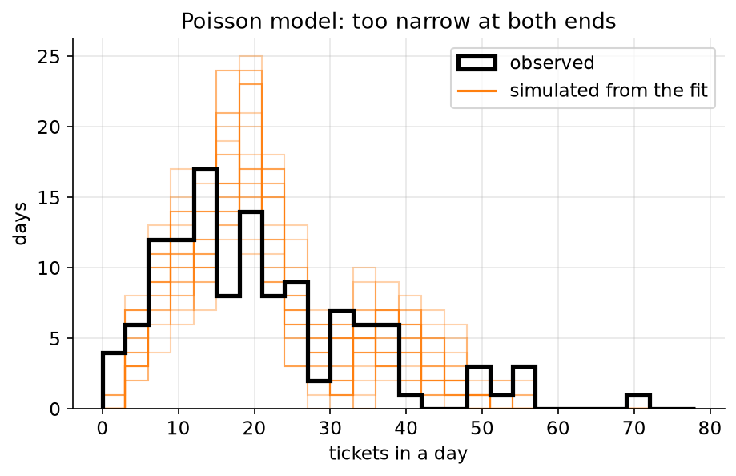
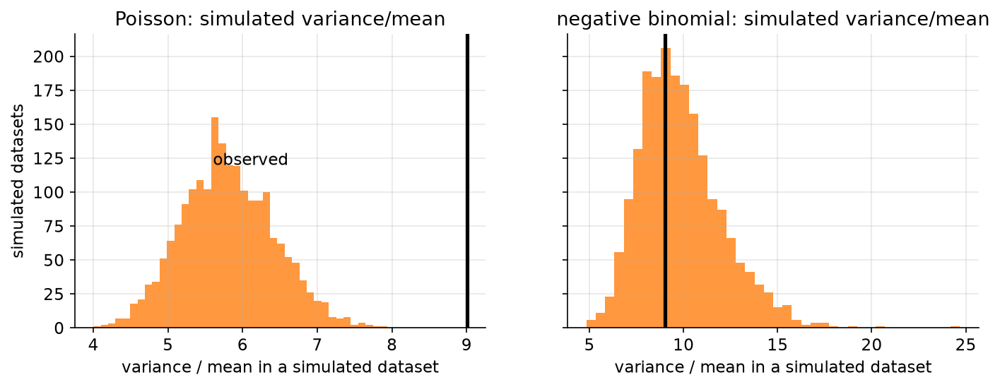

# 06. Does the golem fit?

> **The problem.** Your support queue got 120 days of tickets. How many people should be on shift next Tuesday, and what is the chance you get swamped anyway?
> **What you'll be able to do.** Check a fitted model by making it generate data and comparing that data to reality — and choose check statistics that can actually catch the failure you care about.
> **Where this sits on the loop.** Step 6, the one people skip.
> **Runtime.** ~45 s. **Prereqs.** Chapter 05.

A model that has been fitted is not a model that has been checked. Fitting finds
the best parameters *within* the model you wrote; it says nothing about whether
that model could have produced your data at all. The check is separate, it is
cheap, and it is the difference between a staffing plan that works and one that
fails on exactly the days you needed it.

## 06.1 The data and the obvious model

```python
# --- setup ---
from pathlib import Path
import numpy as np
import pandas as pd
import matplotlib
matplotlib.use("Agg")
import matplotlib.pyplot as plt

import numpyro
numpyro.set_host_device_count(4)
import jax
import jax.numpy as jnp
import numpyro.distributions as dist
from numpyro.infer import MCMC, NUTS, Predictive

from bayeskit import mcmc_summary, hdi

SLUG = "06-does-the-golem-fit"
FIG = Path("figures") / SLUG
FIG.mkdir(parents=True, exist_ok=True)
rng = np.random.default_rng(6)

plt.rcParams.update({
    "figure.figsize": (7, 4), "figure.dpi": 110, "savefig.dpi": 150,
    "savefig.bbox": "tight", "axes.grid": True, "grid.alpha": 0.3,
    "axes.spines.top": False, "axes.spines.right": False, "font.size": 11,
})

def save(fig, name):
    out = FIG / f"{name}.png"
    fig.savefig(out)
    plt.close(fig)
    print(f"[fig] {out}")
```

```python
tickets = pd.read_csv("data/tickets.csv")
y = tickets.tickets.values
weekend = tickets.weekend.values.astype(float)
release = tickets.release.values.astype(float)

print(f"{len(y)} days: mean {y.mean():.2f}, variance {y.var(ddof=1):.2f}, "
      f"range {y.min()} to {y.max()}")
print(f"variance / mean = {y.var(ddof=1)/y.mean():.2f}")
```

Counts of independent events arriving at a constant rate are Poisson, and the
Poisson is the default reach for anything you count. Tickets arrive from many
independent users; weekends are quieter; the week after a release is busier. So:

```
tickets_d ~ Poisson(mu_d)
log(mu_d) = a + b_weekend * weekend_d + b_release * release_d
```

The log is not decoration. Rates must be positive, and a linear predictor is
not; modelling the log means every coefficient is a *multiplier* on the rate,
which is also how people think about this ("releases roughly double the load").

```python
def poisson_model(weekend, release, tickets=None):
    a = numpyro.sample("a", dist.Normal(3.0, 0.5))            # log-rate ~ 20/day
    b_weekend = numpyro.sample("b_weekend", dist.Normal(0, 1))
    b_release = numpyro.sample("b_release", dist.Normal(0, 1))
    mu = jnp.exp(a + b_weekend * weekend + b_release * release)
    numpyro.sample("tickets", dist.Poisson(mu), obs=tickets)

def run(model, seed=0, **kwargs):
    mcmc = MCMC(NUTS(model), num_warmup=500, num_samples=500, num_chains=4,
                chain_method="parallel", progress_bar=False)
    mcmc.run(jax.random.PRNGKey(seed), **kwargs)
    return mcmc

fit_pois = run(poisson_model, weekend=weekend, release=release, tickets=y)
chains = {k: np.asarray(v) for k, v in fit_pois.get_samples(group_by_chain=True).items()}
print(mcmc_summary(chains).round(3).to_string())
```

Clean fit. R-hat 1.00, ESS in the thousands, tight intervals: weekends cut the
rate by a factor of exp(`-0.891`) ≈ 0.41, releases multiply it by exp(`0.690`)
≈ 2.0 — both correct, both usefully precise. Every diagnostic from chapter 05 is
green.

The model is nevertheless badly wrong, and nothing above could tell you.

## 06.2 Make the model generate data

**The posterior predictive check**: draw parameters from the posterior, simulate
a whole fake dataset from each draw, and compare the fake datasets with the
real one. Not on the quantities you fitted — on whatever feature matters to
your decision.

```python
def simulate(model, mcmc, **kwargs):
    """One simulated dataset per posterior draw."""
    pred = Predictive(model, posterior_samples=mcmc.get_samples())
    return np.asarray(pred(jax.random.PRNGKey(99), **kwargs)["tickets"])

yrep_pois = simulate(poisson_model, fit_pois, weekend=weekend, release=release)
print(f"{yrep_pois.shape[0]} simulated datasets of {yrep_pois.shape[1]} days each")
```



```python
fig, ax = plt.subplots()
bins = np.arange(0, 80, 3)
for i in range(20):
    ax.hist(yrep_pois[i], bins=bins, histtype="step", color="C1", alpha=0.35, lw=1)
ax.hist(y, bins=bins, histtype="step", color="k", lw=2.5, label="observed")
ax.plot([], [], color="C1", label="simulated from the fit")
ax.set_xlabel("tickets in a day"); ax.set_ylabel("days")
ax.set_title("Poisson model: too narrow at both ends")
ax.legend()
save(fig, "ppc-poisson")
```

Now put numbers on it. Pick summary statistics, compute each on the real data
and on every simulated dataset, and ask where the real value falls in the
simulated distribution.

```python
def check(name, yrep):
    tests = {
        "max in 120 days": (y.max(), yrep.max(axis=1)),
        "standard deviation": (y.std(ddof=1), yrep.std(axis=1, ddof=1)),
        "variance / mean": (y.var(ddof=1) / y.mean(),
                            yrep.var(axis=1, ddof=1) / yrep.mean(axis=1)),
        "days over 40": ((y > 40).sum(), (yrep > 40).sum(axis=1)),
    }
    print(f"\n{name}")
    for label, (observed, simulated) in tests.items():
        lo, hi = np.quantile(simulated, [0.055, 0.945])
        print(f"  {label:19s} observed {observed:7.2f}   simulated "
              f"{simulated.mean():6.2f} [{lo:5.1f}, {hi:5.1f}]   "
              f"p = {np.mean(simulated >= observed):.3f}")

check("POISSON MODEL", yrep_pois)
```

The verdict is brutal. The real data's worst day had `69` tickets; the model
thinks the worst day in 120 should be around `49.87`, and in `0.000` of two
thousand simulated histories did it produce a day as bad as the one you
actually had. The standard deviation is `13.46` observed against `10.79`
simulated. The variance-to-mean ratio is `9.00` observed against `5.80`
simulated.

Look closely at the last row, though, because it is the most important one:
**days over 40 passes**, at p = `0.332`. Observed 9, simulated 7.41, well inside
the interval. A team that had chosen only that statistic would have concluded
the model was fine.

**The check you choose determines what you can detect.** Posterior predictive
checking is not a single procedure with a pass/fail light; it is a habit of
asking "what would this model be unable to reproduce?" and then measuring
exactly that. Choose statistics that (a) matter for your decision and (b) were
not the thing you fitted. Fitting a mean and then checking the mean tells you
nothing at all.

## 06.3 Fix the story, not the priors

The failure is *overdispersion*: real counts vary more than a Poisson can. The
Poisson has exactly one parameter, so its variance is forced to equal its mean;
any extra variation is a contradiction.

The cause is not statistical, it is factual: ticket arrivals are not
independent. One outage generates thirty tickets. One confusing release note
generates a hundred. The rate itself fluctuates day to day for reasons not in
your two predictors.

Model that directly: let the rate wobble. If the daily rate is Gamma-distributed
around the predicted mean, the counts come out negative binomial — the standard
"Poisson with a knob for extra variance", with a dispersion parameter phi that
recovers the Poisson as phi → ∞.

```python
def negbin_model(weekend, release, tickets=None):
    a = numpyro.sample("a", dist.Normal(3.0, 0.5))
    b_weekend = numpyro.sample("b_weekend", dist.Normal(0, 1))
    b_release = numpyro.sample("b_release", dist.Normal(0, 1))
    phi = numpyro.sample("phi", dist.Exponential(0.1))        # extra-Poisson spread
    mu = jnp.exp(a + b_weekend * weekend + b_release * release)
    numpyro.sample("tickets", dist.NegativeBinomial2(mu, phi), obs=tickets)

fit_nb = run(negbin_model, weekend=weekend, release=release, tickets=y)
chains_nb = {k: np.asarray(v) for k, v in fit_nb.get_samples(group_by_chain=True).items()}
print(mcmc_summary(chains_nb).round(3).to_string())

yrep_nb = simulate(negbin_model, fit_nb, weekend=weekend, release=release)
check("NEGATIVE BINOMIAL MODEL", yrep_nb)
```

Every check now passes: max `75.54` simulated against `69` observed (p =
`0.661`), variance/mean `9.85` against `9.00` (p = `0.614`). The dispersion
parameter lands at `6.427`, comfortably far from infinity, which is the model
saying *out loud* that the Poisson assumption was wrong.



```python
fig, axes = plt.subplots(1, 2, figsize=(11, 3.6), sharey=True)
for ax, rep, title in [(axes[0], yrep_pois, "Poisson"),
                       (axes[1], yrep_nb, "negative binomial")]:
    stat = rep.var(axis=1, ddof=1) / rep.mean(axis=1)
    ax.hist(stat, bins=40, color="C1", alpha=0.8)
    ax.axvline(y.var(ddof=1) / y.mean(), color="k", lw=2.5)
    ax.set_title(f"{title}: simulated variance/mean")
    ax.set_xlabel("variance / mean in a simulated dataset")
axes[0].set_ylabel("simulated datasets")
axes[0].annotate("observed", (y.var(ddof=1)/y.mean() - 3.4, 120))
save(fig, "ppc-stat")
```

Notice what did *not* change: the coefficients. Weekend and release effects are
the same to two decimals in both fits (`-0.888` and `0.689`). What changed is
their uncertainty — the standard error on the release effect goes from `0.040`
to `0.091`, more than doubling — and the whole predictive distribution.

That pattern is worth memorising. **Overdispersion rarely biases your point
estimates and always destroys your uncertainty.** A Poisson fit to
overdispersed data reports coefficients you can mostly trust and intervals that
are fiction. If your workflow ends at the coefficient table, you will never
notice.

## 06.4 What it costs: the staffing decision

Back to the actual question. You want to staff a normal weekday so you get
overwhelmed at most 10% of the time. That is a quantile of the posterior
predictive.

```python
normal_day = (weekend == 0) & (release == 0)
observed_normal = y[normal_day]

for name, rep in [("Poisson", yrep_pois), ("negative binomial", rep := yrep_nb)]:
    capacity = np.quantile(rep[:, normal_day].ravel(), 0.90)
    overrun = np.mean(observed_normal > capacity)
    print(f"{name:20s}: staff for {capacity:.0f} tickets  -> historically "
          f"overrun on {overrun*100:.1f}% of such days")

print(f"\nobserved on normal weekdays (n={normal_day.sum()}): "
      f"90th percentile {np.quantile(observed_normal, 0.9):.0f}, "
      f"max {observed_normal.max()}")
```

The Poisson model says staff for `24` and promises you will be swamped 10% of
the time. In the historical record, 24 was exceeded on `23.0`% of normal
weekdays — more than twice the promised rate. The negative binomial says `30`,
and 30 was exceeded on `14.8`% of days: still a little optimistic, but that
gap is within what you'd expect from estimating a 90th percentile from
`61` days.

Two people's worth of staffing, and the difference between a plan that fails
one day in ten and one that fails almost one day in four. Nothing in the fit
diagnostics, the coefficient table, or the R-hat column would have told you.

## 06.5 What checking does and does not prove

- **A failed check is decisive.** If the model cannot generate data like yours,
  it cannot predict data like yours. Fix the story.
- **A passed check proves very little.** It says the model is not obviously
  self-contradictory on the statistics you happened to try. The negative
  binomial passed everything here and is still wrong in ways this data cannot
  reveal — it assumes days are independent given the predictors, and outages
  cluster.
- **These "p-values" are not tests.** The data was used to fit the model and
  then to check it, so they are not calibrated, and a value of 0.3 does not mean
  what a frequentist p-value of 0.3 means. Treat them as a rough location
  indicator: near 0 or 1 is a red flag, in the middle is unremarkable.
- **Checking a statistic you fitted is worthless.** The model was fitted to
  reproduce means. Of course it reproduces means.
- **Chapter 12 answers a different question.** Model checking asks "can this
  model produce my data". Model comparison asks "which of these models predicts
  best". Both are needed; neither substitutes for the other.

## Pitfalls

- **Skipping the check because the sampler was clean.** Convergence diagnostics
  test the sampler, not the model. Both fits here were flawless.
- **Checking only the mean.** Means fit by construction. Check spread, extremes,
  zeros, clusters — whatever your decision depends on.
- **Only plotting.** Density overlays are fast and catch gross errors; explicit
  test statistics catch what your eye smooths over.
- **Using a Poisson because counts.** The variance-to-mean ratio takes one line
  to compute. If it is much above 1, you need a negative binomial (or a
  hierarchical model, chapter 09 — same fix seen from a different angle).
- **Treating the fix as a modelling detail.** The Poisson-versus-negative
  binomial choice barely moved the coefficients and changed the staffing answer
  by 25%. Predictive intervals are where model errors surface.

## Exercises

**Exercise 06.1 — The check that catches nothing.**
*Setup:* You want a check that would have caught the Poisson's failure with 120
days of data, and you're deciding between "the mean", "the number of days over
30" and "the largest single day".
*Predict:* Rank them by how clearly each separates the two models.
*Reason:* All three are simple summaries of the same data.
*Run:*
```python
for label, f in [("mean", lambda d: d.mean(axis=1)),
                 ("days over 30", lambda d: (d > 30).sum(axis=1)),
                 ("max", lambda d: d.max(axis=1))]:
    obs = f(y[None, :])[0]
    print(f"{label:14s} observed {obs:7.2f}  Poisson p={np.mean(f(yrep_pois) >= obs):.3f}"
          f"  NegBin p={np.mean(f(yrep_nb) >= obs):.3f}")
```
<details><summary>Reconcile</summary>

The mean gives Poisson p = `0.484` — completely uninformative, because the mean
is what both models were fitted to reproduce. "Days over 30" gives `0.001` and
the max gives `0.000`: both decisive, the max more so.

The ranking is by how far into the tail the statistic looks. Model failures
almost always show up in the tails and almost never in the centre, because
fitting is a centre-matching operation. Note also that "days over 30" gives the
negative binomial its worst score (`0.080`) — the honest reading is that this
statistic is the one place the better model is also under mild strain, and with
more data it is where it would fail first. When you design a check, ask what the
fitting procedure was *not* trying to get right, and measure that.
</details>

**Exercise 06.2 — Would you have caught it with less data?**
*Setup:* You only have the first 30 days.
*Predict:* Does the Poisson still fail its check clearly, or does small data
hide the problem?
*Reason:* Fewer days means fewer chances to see an extreme day.
*Run:*
```python
y30, w30, r30 = y[:30], weekend[:30], release[:30]
fit30 = run(poisson_model, weekend=w30, release=r30, tickets=y30)
rep30 = simulate(poisson_model, fit30, weekend=w30, release=r30)
print(f"30 days: observed var/mean {y30.var(ddof=1)/y30.mean():.2f}, "
      f"p = {np.mean(rep30.var(axis=1,ddof=1)/rep30.mean(axis=1) >= y30.var(ddof=1)/y30.mean()):.3f}")
print(f"30 days: observed max {y30.max()}, "
      f"p = {np.mean(rep30.max(axis=1) >= y30.max()):.3f}")
```
<details><summary>Reconcile</summary>

Even with 30 days the variance/mean check returns p = `0.007` and the max check
p = `0.007`. The failure is so severe that a month of data is plenty.

That is the encouraging half of the message: gross model failures are usually
easy to detect, and the check costs nothing. The discouraging half is that
*subtle* failures — a slightly wrong tail shape, mild dependence between days —
need far more data to detect and can still ruin a decision that depends on a
tail. Which is why §06.5's "a passed check proves very little" is not false
modesty.
</details>

**Exercise 06.3 — Dispersion in a model you know.**
*Setup:* A machine-learning connection. Your classifier reports 0.30 for every
customer in a bucket of 200, and it is right on average — but the bucket
actually contains 100 easy cases (true probability 0.05) and 100 hard ones
(0.55). You count positives in the bucket every week.
*Predict:* Will the week-to-week counts be more variable than the binomial the
model implies, less variable, or the same?
*Reason:* Unmodelled variation increased the variance in the ticket data, so it
should here too.
*Run:*
```python
p_case = np.repeat([0.05, 0.55], 100)          # the truth: two kinds of customer
counts_real = rng.binomial(1, p_case, size=(4000, 200)).sum(axis=1)
counts_model = rng.binomial(200, 0.30, size=4000)     # what the model claims
print(f"model claims sd {counts_model.std(ddof=1):.2f}, reality gives "
      f"{counts_real.std(ddof=1):.2f}")
print(f"theory: sqrt(n*p*(1-p)) = {np.sqrt(200*0.3*0.7):.2f} vs "
      f"sqrt(sum p_i(1-p_i)) = {np.sqrt(np.sum(p_case*(1-p_case))):.2f}")
```
<details><summary>Reconcile</summary>

The model claims a standard deviation of `6.40` and reality delivers `5.46` —
*under*-dispersed, the opposite of the tickets.

The reason is that a Bernoulli's variance p(1−p) is largest at p = 0.5, so
spreading probabilities away from the centre *lowers* the average variance:
`6.48` in theory for a homogeneous bucket versus `5.43` for this split one.
Unmodelled heterogeneity inflates variance for counts with a fluctuating rate
and deflates it for binary outcomes with fluctuating probabilities. Easy to get
backwards, and worth checking rather than assuming.

The practical version: if your classifier's calibration bins come out *tighter*
than binomial, that is a symptom of heterogeneity it is averaging over, not
evidence that it is well calibrated. Chapter 13 measures calibration properly.
</details>

## Takeaways

- Fitting and checking are different steps. A model can converge perfectly and
  be unable to produce data like yours.
- The check: simulate datasets from the fitted model, compare summary statistics
  to the real ones. Six lines.
- Choose statistics that matter for the decision and that the fit was not trying
  to match. The same broken model passed one check and failed three.
- Counts almost always need a dispersion parameter. Compute variance/mean before
  you reach for a Poisson.
- Overdispersion barely moves coefficients and wrecks predictive intervals —
  which is exactly the part staffing, capacity and risk decisions depend on.
- A failed check is decisive; a passed check is weak evidence. Report both
  honestly.

## Going deeper

- **Statistical Rethinking, chapter 7** (`curriculum_material/statistical_rethinking/ch07-ulysses-compass.md`) frames model criticism and the difference between fit and prediction; the negative-binomial machinery appears in its chapter 12.
- **The Bayesian Spine, module 17** (`curriculum/modules/17-model-checking.md`) does this Poisson-to-negative-binomial check with the same statistics, then adds the marginal likelihood and its automatic Occam factor.
- **Module 18** (`curriculum/modules/18-scale-and-misspecification.md`) is what to do when you know the model is wrong and are keeping it anyway: sandwich audits and how much to widen your intervals.
