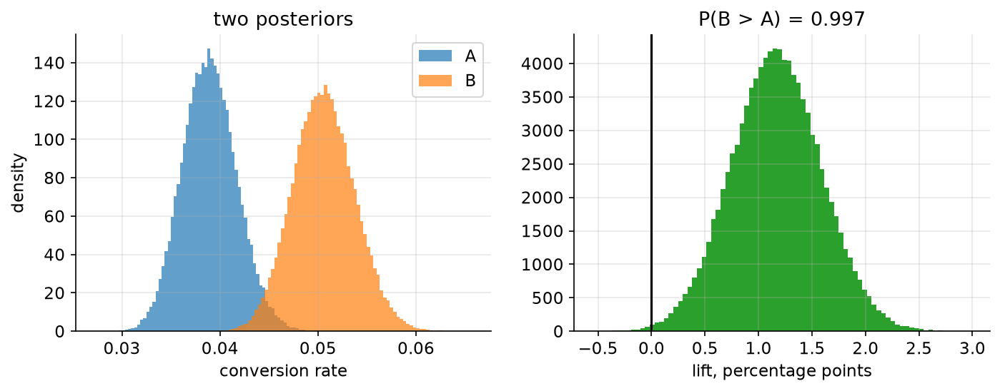

# 07. The A/B test you can act on

> **The problem.** You ran a checkout redesign against the old one, 4,800 visitors each. B converted better. Do you ship it — and could you have stopped the test three weeks ago?
> **What you'll be able to do.** Turn an experiment into a euro-denominated decision, and understand exactly what peeking does and does not break.
> **Where this sits on the loop.** Steps 5 and 7, with the emphasis on 7.
> **Runtime.** ~15 s. **Prereqs.** Chapters 02, 06.

Most of the pain around A/B testing comes from asking the wrong question. "Is B
better than A?" has no answer that anyone can act on: B is *always* at least
slightly better or worse, and with enough traffic you will detect a lift of
0.001% that is worth nothing. The question is "should we ship it", and that
question needs a number that no test statistic contains: what shipping costs.

## 07.1 Two lines of fitting

```python
# --- setup ---
from pathlib import Path
import numpy as np
import pandas as pd
import matplotlib
matplotlib.use("Agg")
import matplotlib.pyplot as plt
from scipy.stats import norm

from bayeskit import hdi

SLUG = "07-the-ab-test-you-can-act-on"
FIG = Path("figures") / SLUG
FIG.mkdir(parents=True, exist_ok=True)
rng = np.random.default_rng(7)

plt.rcParams.update({
    "figure.figsize": (7, 4), "figure.dpi": 110, "savefig.dpi": 150,
    "savefig.bbox": "tight", "axes.grid": True, "grid.alpha": 0.3,
    "axes.spines.top": False, "axes.spines.right": False, "font.size": 11,
})

def save(fig, name):
    out = FIG / f"{name}.png"
    fig.savefig(out)
    plt.close(fig)
    print(f"[fig] {out}")
```

```python
ab = pd.read_csv("data/ab_test.csv")
summary = ab.groupby("variant").agg(visitors=("converted", "size"),
                                    conversions=("converted", "sum"))
print(summary.to_string())

nA, cA = int(summary.loc["A", "visitors"]), int(summary.loc["A", "conversions"])
nB, cB = int(summary.loc["B", "visitors"]), int(summary.loc["B", "conversions"])

S = 100_000
p_A = rng.beta(1 + cA, 1 + nA - cA, S)        # chapter 01's update, twice
p_B = rng.beta(1 + cB, 1 + nB - cB, S)
print(f"A: {cA}/{nA} = {cA/nA:.4f}      B: {cB}/{nB} = {cB/nB:.4f}")
```

That is the entire fitting step. Two independent Beta posteriors, one per arm,
from the counting argument of chapter 01. No test, no formula lookup, no
assumption about equal variances.

## 07.2 The questions everyone asks

```python
lift_abs = p_B - p_A
lift_rel = (p_B - p_A) / p_A

print(f"P(B better than A)       = {np.mean(p_B > p_A):.4f}")
lo, hi = hdi(lift_abs, 0.89)
print(f"absolute lift            = {lift_abs.mean():.5f}  89% [{lo:.5f}, {hi:.5f}]")
lo, hi = hdi(lift_rel, 0.89)
print(f"relative lift            = {lift_rel.mean():.3f}   89% [{lo:.3f}, {hi:.3f}]")
print(f"P(relative lift > 10%)   = {np.mean(lift_rel > 0.10):.4f}")

se = np.sqrt(cA/nA*(1-cA/nA)/nA + cB/nB*(1-cB/nB)/nB)     # the classical version
z = (cB/nB - cA/nA) / se
print(f"\nclassical two-proportion test: z = {z:.3f}, p = {2*(1-norm.cdf(abs(z))):.5f}")
```

`0.9973` that B is better; a relative lift of `0.306` with an 89% interval from
`0.108` to `0.503`; a `0.9609` chance the lift exceeds 10%. The classical test
agrees, as it will whenever the priors are weak and the counts are decent: p =
`0.00560`.

Two things to notice. First, the Bayesian and frequentist numbers here are
*saying the same thing about the same data* — this is not a paradigm fight, and
anyone who tells you the choice of framework changes A/B test conclusions at
n = 4,800 is selling something. Second, and more importantly: **neither of
these numbers tells you whether to ship.** They quantify evidence. Shipping is a
decision, and decisions need costs.



```python
fig, axes = plt.subplots(1, 2, figsize=(11, 3.6))
axes[0].hist(p_A, bins=80, alpha=0.7, label="A", density=True)
axes[0].hist(p_B, bins=80, alpha=0.7, label="B", density=True)
axes[0].set_xlabel("conversion rate"); axes[0].set_ylabel("density")
axes[0].set_title("two posteriors"); axes[0].legend()
axes[1].hist(lift_abs * 100, bins=80, color="C2")
axes[1].axvline(0, color="k", lw=1.5)
axes[1].set_xlabel("lift, percentage points")
axes[1].set_title(f"P(B > A) = {np.mean(p_B > p_A):.3f}")
save(fig, "lift")
```

## 07.3 Now put money on it

Your checkout sees 30,000 visitors a month, the average order is about €62, and
you will live with this decision for a year. Rolling out the redesign properly —
engineering, QA, a migration — costs €15,000.

```python
AOV, VISITORS_PER_MONTH, HORIZON = 62.0, 30_000, 12
VALUE_PER_POINT = AOV * VISITORS_PER_MONTH * HORIZON      # value of +1.00pp for a year
print(f"one percentage point of conversion is worth "
      f"{VALUE_PER_POINT * 0.01:,.0f} EUR over the horizon")

gain = lift_abs * VALUE_PER_POINT
lo, hi = hdi(gain, 0.89)
print(f"12-month gain from shipping B: {gain.mean():,.0f} EUR  89% [{lo:,.0f}, {hi:,.0f}]")
```

A percentage point is worth `223,200` euros a year, and the posterior says
shipping B is worth `260,187` with an 89% interval from `111,351` to `412,252`.
That is the number to bring to the meeting; "p = 0.0056" is not.

Now the decision itself, exactly as in chapter 00: compute the expected loss of
each action, where "loss" means *what you give up relative to having chosen
correctly*.

```python
COST = 15_000

loss_ship = np.mean(np.maximum(COST - gain, 0))    # we paid COST and the gain was less
loss_keep = np.mean(np.maximum(gain - COST, 0))    # we passed up a net gain

print(f"expected loss of shipping B : {loss_ship:>10,.0f} EUR")
print(f"expected loss of keeping A  : {loss_keep:>10,.0f} EUR")
print(f"P(gain exceeds the cost)    : {np.mean(gain > COST):.4f}")
```

Ship. The expected regret of shipping is `127` euros; the expected regret of not
shipping is `245,315`. The ratio is nearly two thousand to one.

That second number is the one to internalise. Everyone runs A/B tests worrying
about the risk of shipping a change that doesn't work. Almost nobody computes
the risk of *not* shipping a change that does, and in a business with this shape
— cheap rollout, large traffic — that risk is overwhelmingly the bigger one.
The conventional 95% significance bar is calibrated for a world where false
positives are expensive. Check whether you live in that world.

## 07.4 The same decision on a quarter of the data

Suppose you had stopped after 1,200 visitors per arm — a week instead of a
month.

```python
small = ab.groupby("variant").head(1200)
s = small.groupby("variant").converted.agg(["size", "sum"])
mA, kA = int(s.loc["A", "size"]), int(s.loc["A", "sum"])
mB, kB = int(s.loc["B", "size"]), int(s.loc["B", "sum"])

qA = rng.beta(1 + kA, 1 + mA - kA, S)
qB = rng.beta(1 + kB, 1 + mB - kB, S)
gain_small = (qB - qA) * VALUE_PER_POINT
print(f"A {kA}/{mA} = {kA/mA:.4f}   B {kB}/{mB} = {kB/mB:.4f}   "
      f"P(B>A) = {np.mean(qB > qA):.4f}")

for cost in (15_000, 300_000, 600_000):
    ls = np.mean(np.maximum(cost - gain_small, 0))
    lk = np.mean(np.maximum(gain_small - cost, 0))
    print(f"  rollout cost {cost:>7,}: E[loss ship] {ls:>9,.0f}  "
          f"E[loss keep] {lk:>9,.0f}  ->  {'SHIP' if ls < lk else 'KEEP A'}")
```

With a quarter of the data, P(B > A) drops to `0.9721` — under the traditional
95% bar in one-sided terms, over it in others, which is exactly the kind of
argument that wastes an afternoon. The decision, though, is unambiguous at a
€15,000 rollout cost (`2,535` expected regret against `359,712`) and stays
unambiguous at €300,000. It only flips at €600,000, where shipping risks
`239,765` against `11,942` for waiting.

**The evidence threshold that matters is set by the costs, not by convention.**
The same posterior says ship, ship, and don't ship, depending on a number that
lives in a finance spreadsheet rather than in the experiment.

## 07.5 What peeking actually breaks

The classical rule against looking at your data early is real: repeated testing
inflates false positives. The claim that Bayesian methods make peeking harmless
is usually overstated. Simulate all of it.

Two arms with *identical* true conversion rates, checked every 600 visitors up
to 9,600 per arm — sixteen looks — and record how often each rule ever fires.

```python
def peeking(true_A, true_B, reps=2000, look_every=600, max_n=9600, seed=0):
    r = np.random.default_rng(seed)
    a = r.binomial(1, true_A, size=(reps, max_n))
    b = r.binomial(1, true_B, size=(reps, max_n))
    rules = {"p < 0.05": np.zeros(reps, bool), "P(B>A) > 0.95": np.zeros(reps, bool),
             "loss rule, 15k cost": np.zeros(reps, bool),
             "loss rule, 900k cost": np.zeros(reps, bool),
             "loss rule, 15k + skeptical prior": np.zeros(reps, bool)}
    tau = 0.002                       # typical true lifts are about 0.2 percentage points
    for n in range(look_every, max_n + 1, look_every):
        pa, pb = a[:, :n].mean(1), b[:, :n].mean(1)
        se = np.sqrt(np.clip(pa*(1-pa)/n + pb*(1-pb)/n, 1e-12, None))
        d = pb - pa
        rules["p < 0.05"] |= (2 * (1 - norm.cdf(np.abs(d / se))) < 0.05) & (d > 0)
        rules["P(B>A) > 0.95"] |= (1 - norm.cdf(0, loc=d, scale=se)) > 0.95
        rules["loss rule, 15k cost"] |= d * VALUE_PER_POINT > 15_000
        rules["loss rule, 900k cost"] |= d * VALUE_PER_POINT > 900_000
        shrunk = d * tau**2 / (tau**2 + se**2)            # skeptical prior on the lift
        rules["loss rule, 15k + skeptical prior"] |= shrunk * VALUE_PER_POINT > 15_000
    return {k: v.mean() for k, v in rules.items()}

print("BOTH ARMS IDENTICAL (4.1%), sixteen looks — how often does each rule fire?")
for name, rate in peeking(0.041, 0.041).items():
    print(f"  {name:34s} {rate:.3f}")

print("\nB GENUINELY 30% BETTER (4.1% vs 5.3%)")
for name, rate in peeking(0.041, 0.053, seed=2).items():
    print(f"  {name:34s} {rate:.3f}")
```

Read that table carefully, because it contains four separate lessons.

**Peeking really does inflate the p-value rule**, from a nominal one-sided 2.5%
to `0.116`. Everyone knows this.

**The naive Bayesian rule is not immune** — "stop when P(B > A) > 0.95" fires
`0.216` of the time under the null, worse than the p-value rule. With flat
priors, P(B > A) > 0.95 is arithmetically almost the same statement as a
one-sided p < 0.05, so of course it behaves the same way. What *is* true is
that the posterior itself remains a correct summary of the data you have,
regardless of why you stopped: nothing about the stopping rule enters the
likelihood. Peeking corrupts the *frequency properties of a threshold rule*, not
the posterior.

**The loss rule at a €15,000 cost fires `0.829` of the time under the null —
and that is the right behaviour, not a failure.** Shipping a neutral variant
costs €15,000. Missing a real 1-point lift costs €223,200. When the downside is
1.5% of the upside, you *should* ship on flimsy evidence. A rule that demanded
95% confidence here would be leaving enormous amounts of money on the table in
exchange for avoiding a rounding error.

**Change the cost and the rule changes character.** At a €900,000 rollout the
loss rule never fires under the null (`0.000`) — and, correctly, almost never
fires even when B is genuinely 30% better (`0.010`), because a 1.2-point lift is
worth €268,000, which does not pay for a €900,000 migration. The evidence was
fine. The project was not.

A skeptical prior — encoding that most tested changes have small true effects —
shrinks the estimated lift and lowers the firing rate to `0.470`. That is the
right general tool for a team running hundreds of experiments, where the flat
prior's implicit claim that 30% lifts are commonplace is wildly wrong. Chapter
09 is how to estimate that prior from your own experiment history rather than
guessing it.

## 07.6 What to do on Monday

1. **Write down the cost of shipping and the value of a point of lift** before
   the experiment starts. If you cannot, you are not going to be able to act on
   the result either.
2. **Report the posterior in money**, with an interval. "Worth €260k a year,
   89% interval €111k–€412k" is a sentence a business person can act on.
3. **Decide by expected loss**, not by a threshold on evidence. Report the
   expected regret of the action you chose — here, €127 — as the honest
   statement of what the decision risks.
4. **Peek freely, but decide by the rule you wrote down in advance.** Looking at
   the data does not corrupt the posterior. What corrupts a decision is choosing
   the stopping rule after seeing which stopping rule gives the answer you want.
5. **Use a skeptical prior if you run many tests**, because most tested changes
   do very little, and a flat prior does not know that.
6. **Check the arms are comparable** before anything else: a randomisation bug,
   a bot filter that treats variants differently, or unequal traffic split by
   device will wreck the analysis in ways no amount of correct arithmetic
   recovers.

## Pitfalls

- **Reporting relative lift without absolute.** "30% better!" on a base of 3.9%
  is 1.2 percentage points. Both numbers, always.
- **Ignoring the value per unit.** A significant lift in a metric worth nothing
  is worth nothing. Chapter 10 handles the case where the metric you can measure
  is not the metric you care about.
- **Testing conversion when you sell things.** A variant that raises conversion
  and lowers order value can lose money. Model revenue per visitor directly if
  the order value could plausibly shift.
- **Stopping when it looks good, continuing when it doesn't.** That is not
  peeking, it is choosing the stopping rule from the data, and no framework
  survives it.
- **Assuming the effect persists.** Novelty effects decay; the twelve-month
  horizon in §07.3 quietly assumes it doesn't. Sensitivity-check that
  assumption — it is doing more work than the priors.

## Exercises

**Exercise 07.1 — Revenue, not conversion.**
*Setup:* B converts better. Does it make more money per visitor? Order values
are in the data.
*Predict:* Will the revenue-per-visitor comparison be more or less decisive than
the conversion comparison?
*Reason:* More money is being measured, so more information.
*Run:*
```python
rev = ab.groupby("variant").order_value
mA_, sA_ = rev.get_group("A").mean(), rev.get_group("A").std(ddof=1)
mB_, sB_ = rev.get_group("B").mean(), rev.get_group("B").std(ddof=1)
# posterior for each mean revenue per visitor, normal approximation (n is large)
rA = rng.normal(mA_, sA_ / np.sqrt(nA), S)
rB = rng.normal(mB_, sB_ / np.sqrt(nB), S)
print(f"revenue/visitor  A {mA_:.3f}  B {mB_:.3f}  P(B > A) = {np.mean(rB > rA):.4f}")
print(f"conversion       P(B > A) = {np.mean(p_B > p_A):.4f}")
```
<details><summary>Reconcile</summary>

Revenue per visitor gives P(B > A) = `0.9977` against the conversion
comparison's `0.9973` — indistinguishable, despite revenue using strictly more
information.

The reason is variance. Conversion is a clean 0/1 outcome. Revenue per visitor
is mostly zeros with occasional values around €62, so its variance is dominated
by the spread of order sizes, and that extra noise almost exactly cancels the
extra signal. Adding a noisy second dimension to your outcome buys much less
precision than the extra data volume suggests, and can buy none at all.

The practical answer is not to pick one but to model both: conversion and order
value as separate parameters, combined into revenue at the end. That way you get
the precision of the conversion estimate and the relevance of the revenue
question, and you can see which one is driving the result.
</details>

**Exercise 07.2 — How long should the test run?**
*Setup:* You are at 1,200 visitors per arm with expected regret of €2,535 from
shipping now.
*Predict:* Running to 4,800 per arm costs three more weeks. Can it possibly be
worth it, given a €15,000 rollout cost?
*Reason:* More data always improves decisions.
*Run:*
```python
# the most that data could ever be worth: the regret you would avoid with perfect knowledge
evpi_small = np.mean(np.maximum(15_000 - gain_small, 0))
evpi_full = np.mean(np.maximum(15_000 - gain, 0))
print(f"expected regret now (1,200/arm): {evpi_small:,.0f} EUR")
print(f"expected regret at 4,800/arm:    {evpi_full:,.0f} EUR")
print(f"most that three more weeks could save you: {evpi_small - evpi_full:,.0f} EUR")
```
<details><summary>Reconcile</summary>

The expected regret from deciding now is `2,535` euros, and with four times the
data it would fall to `127`. So three more weeks of testing can save you at most
`2,408` euros — and that is an upper bound, achieved only if the extra data
resolved the question perfectly.

Three weeks of delayed rollout on a change worth €260,000 a year costs about
€15,000 in forgone gains. The experiment is not worth continuing; it was
arguably already over at 1,200 visitors. This is the value-of-information
calculation, and chapter 10 does it properly. The habit it should install:
before extending a test, ask what the *maximum* possible value of the extra data
is. Very often it is less than the cost of waiting.
</details>

**Exercise 07.3 — The skeptical prior's real job.**
*Setup:* Your team ran 200 experiments last year. Their true lifts are mostly
tiny: say Normal(0, 0.002) in absolute conversion terms. You test one and
observe a 1.2-point lift with a standard error of 0.3 points.
*Predict:* What does the posterior say the true lift is — about 1.2 points, or
noticeably less?
*Reason:* The observation is four standard errors from zero.
*Run:*
```python
observed, se_obs, tau = 0.012, 0.003, 0.002
shrunk = observed * tau**2 / (tau**2 + se_obs**2)
print(f"observed lift {observed*100:.2f}pp -> posterior mean {shrunk*100:.3f}pp "
      f"(shrunk to {tau**2/(tau**2+se_obs**2):.3f} of the raw estimate)")
print(f"in money: {observed*VALUE_PER_POINT:,.0f} raw vs {shrunk*VALUE_PER_POINT:,.0f} shrunk")
```
<details><summary>Reconcile</summary>

The posterior mean is `0.369` percentage points, about three-tenths of the
observed 1.2 — worth `82,412` euros instead of `267,840`.

That factor is not pessimism, it is arithmetic: if genuinely large lifts are
rare and measurement noise is comparable in size to typical true effects, then a
large *observed* lift is much more often a modest true effect plus luck than a
genuinely large one. This is the winner's curse, and it is why the impressive
result from your experimentation platform's leaderboard reliably fails to
replicate at full rollout.

Chapter 09 estimates tau from your own history instead of assuming it, which
turns this from a judgement call into a measurement.
</details>

## Takeaways

- Fit an A/B test with two Beta posteriors. The evidence step is two lines and
  agrees with the classical test whenever both are appropriate.
- Convert the lift into money before deciding anything. A percentage point has a
  price; find it.
- Decide by comparing the expected loss of shipping against the expected loss of
  not shipping, and report the regret of the action you chose.
- The right evidence threshold comes from the cost ratio. With cheap rollouts and
  large traffic, shipping on 90% confidence is often correct; with expensive
  migrations, 99% may not be enough.
- Peeking inflates the false-positive rate of *any* threshold rule, Bayesian
  labels included. It does not corrupt the posterior.
- Run many experiments and you need a skeptical prior, because most changes do
  almost nothing and flat priors do not know that.

## Going deeper

- **The Bayesian Spine, module 22** (`curriculum/modules/22-decisions-bandits.md`) takes this to sequential decisions: Thompson sampling, which allocates traffic to arms as it learns, in five lines.
- **Module 23** (`curriculum/modules/23-experimental-design.md`) separates the four distinct truths about optional stopping — posterior invariance, prior-averaged coverage, frequentist type-I inflation, and selective reporting — each verified numerically.
- **Module 18** (`curriculum/modules/18-scale-and-misspecification.md`) is the winner's curse at scale, and the empirical-Bayes de-biasing that exercise 07.3 sketches.
