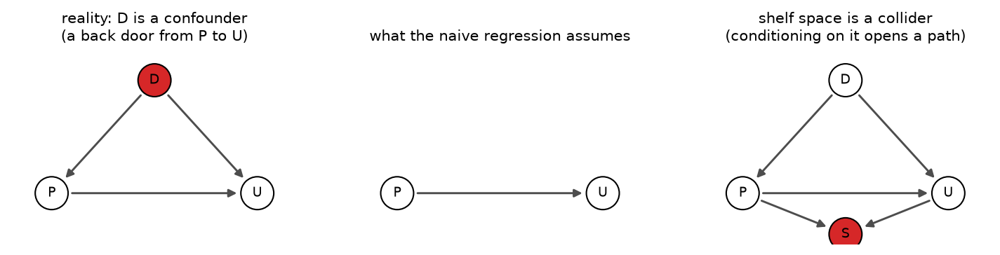

# 08. Prices and causes

> **The problem.** Three years of weekly data: price and units sold. Your regression says raising the price *increases* sales. Should you raise prices?
> **What you'll be able to do.** Recognise when a coefficient answers a different question from the one you asked, and know the three things — and only three things — that fix it.
> **Where this sits on the loop.** Step 2. This entire chapter is about the story, and no amount of steps 3–7 can compensate for getting it wrong.
> **Runtime.** ~25 s. **Prereqs.** Chapters 04–05.

Everything so far has been about association: how does the outcome vary with the
predictor, in data like this. Most questions people actually pay for are
different: what happens *if we change something*. Those two questions have
different answers, they are computed from the same data by identical arithmetic,
and nothing in the fit tells you which one you got.

## 08.1 A model of how the data came to be

We will simulate the data so that the true answer is known — the only way to
check whether a method works. The generating process is the one every pricing
analyst lives inside:

```
demand shock (weather, marketing, season)  →  units sold
demand shock                               →  price   (managers raise prices in busy weeks)
price                                      →  units sold   (the thing we want: elasticity −1.5)
ingredient cost                            →  price
```

The demand shock is real, it drives everything, and — crucially — **it is not
in your dataset**. Nobody logs "unusually good weather plus a Instagram post".

```python
# --- setup ---
from pathlib import Path
import numpy as np
import matplotlib
matplotlib.use("Agg")
import matplotlib.pyplot as plt

import numpyro
numpyro.set_host_device_count(4)
import jax
import numpyro.distributions as dist
from numpyro.infer import MCMC, NUTS

from bayeskit import mcmc_summary, hdi

SLUG = "08-prices-and-causes"
FIG = Path("figures") / SLUG
FIG.mkdir(parents=True, exist_ok=True)
rng = np.random.default_rng(8)

plt.rcParams.update({
    "figure.figsize": (7, 4), "figure.dpi": 110, "savefig.dpi": 150,
    "savefig.bbox": "tight", "axes.grid": True, "grid.alpha": 0.3,
    "axes.spines.top": False, "axes.spines.right": False, "font.size": 11,
})

def save(fig, name):
    out = FIG / f"{name}.png"
    fig.savefig(out)
    plt.close(fig)
    print(f"[fig] {out}")
```

```python
TRUE_ELASTICITY = -1.5          # a 1% price rise moves units by -1.5%

def simulate(n=156, instrument_strength=0.30, randomised=False, seed=8):
    r = np.random.default_rng(seed)
    demand = r.normal(0, 1, n)                    # NOT recorded anywhere
    cost = r.normal(0, 1, n)                      # ingredient cost index: recorded
    if randomised:
        log_price = 0.25 * r.normal(0, 1, n)      # prices set by coin flip
    else:
        log_price = (0.50 * demand                # managers price up in busy weeks
                     + instrument_strength * cost # and pass on ingredient costs
                     + 0.15 * r.normal(0, 1, n))
    log_units = (6.0 + TRUE_ELASTICITY * log_price
                 + 1.4 * demand + 0.2 * r.normal(0, 1, n))
    # shelf space is assigned after the fact, based on both price and sales
    shelf = 0.6 * log_price + 0.6 * (log_units - 6.0) + 0.3 * r.normal(0, 1, n)
    return dict(demand=demand, cost=cost, log_price=log_price,
                log_units=log_units, shelf=shelf)

d = simulate()

def ols(y, *predictors):
    """Least squares, returning coefficients and R-squared."""
    X = np.column_stack([np.ones_like(y)] + list(predictors))
    beta = np.linalg.lstsq(X, y, rcond=None)[0]
    resid = y - X @ beta
    return beta, 1 - resid.var() / y.var()
```

## 08.2 Four regressions, four answers

```python
fits = {
    "price only (naive)":        (d["log_price"],),
    "+ demand shock":            (d["log_price"], d["demand"]),
    "+ shelf space":             (d["log_price"], d["shelf"]),
    "+ demand + shelf":          (d["log_price"], d["demand"], d["shelf"]),
}
print(f"{'model':22s} {'elasticity':>11s} {'R-squared':>10s}")
for name, preds in fits.items():
    beta, r2 = ols(d["log_units"], *preds)
    print(f"{name:22s} {beta[1]:11.3f} {r2:10.4f}")
print(f"{'the truth':22s} {TRUE_ELASTICITY:11.3f}")
```

The naive regression says `0.388`: **a 1% price increase raises sales by 0.4%.**
It is not a rounding error or a weak result — it is confidently the wrong sign,
and it is what your data honestly says about the association between price and
sales. In weeks when demand was high, managers charged more *and* sold more.

Add the demand shock and the elasticity snaps to `-1.454`, close to the true
−1.5. Add shelf space instead and you get `-0.534`, wrong by a factor of three.
Add both and you get `-1.389` — worse than demand alone.

Now the part that should genuinely alarm you:

**The model with the best R-squared (`0.9558`) is not the model with the best
causal estimate.** The four models rank by fit in an order that has nothing to
do with the order that matters. Cross-validation would not save you either;
neither would WAIC, AIC, LOO or any other predictive score, because all of them
measure prediction and none of them measures intervention. Chapter 12's model
comparison tools are for a different job, and using them here will get you a
confident wrong answer faster.

## 08.3 The picture that decides which variables to include

Draw the arrows. That is the entire technique, and it is not optional — the
choice of what to control for cannot be read off the data, only off your beliefs
about the mechanism.



```python
def draw_dag(ax, nodes, edges, title, highlight=()):
    for name, (x, y) in nodes.items():
        colour = "C3" if name in highlight else "white"
        ax.add_patch(plt.Circle((x, y), 0.16, fc=colour, ec="k", zorder=3))
        ax.text(x, y, name, ha="center", va="center", zorder=4, fontsize=9)
    for a, b in edges:
        (x0, y0), (x1, y1) = nodes[a], nodes[b]
        dx, dy = x1 - x0, y1 - y0
        L = np.hypot(dx, dy)
        ax.annotate("", xy=(x1 - 0.17*dx/L, y1 - 0.17*dy/L),
                    xytext=(x0 + 0.17*dx/L, y0 + 0.17*dy/L),
                    arrowprops=dict(arrowstyle="-|>", lw=1.4, color="0.3"))
    ax.set_xlim(-0.4, 2.4); ax.set_ylim(-0.5, 1.4)
    ax.set_aspect("equal"); ax.axis("off"); ax.set_title(title, fontsize=10)

fig, axes = plt.subplots(1, 3, figsize=(12, 3.2))
base = {"D": (1.0, 1.1), "P": (0.0, 0.0), "U": (2.0, 0.0)}
draw_dag(axes[0], base, [("D", "P"), ("D", "U"), ("P", "U")],
         "reality: D is a confounder\n(a back door from P to U)", highlight=("D",))
draw_dag(axes[1], {"P": (0.0, 0.0), "U": (2.0, 0.0)}, [("P", "U")],
         "what the naive regression assumes")
draw_dag(axes[2], {**base, "S": (1.0, -0.4)},
         [("D", "P"), ("D", "U"), ("P", "U"), ("P", "S"), ("U", "S")],
         "shelf space is a collider\n(conditioning on it opens a path)",
         highlight=("S",))
save(fig, "dags")
```

Three rules cover almost everything you will meet:

- **A confounder** is a common cause of both the treatment and the outcome
  (demand → price, demand → units). It creates a "back door" path that makes
  association differ from causation. **Control for it** — include it in the
  regression, or block the path some other way.
- **A collider** is a common *effect* of two variables (price → shelf ← units).
  Conditioning on a collider *creates* a spurious association between its
  causes, where none existed. **Do not control for it.** This is the
  counter-intuitive one: adding a variable made the answer worse.
- **A mediator** sits on the causal path itself (price → perceived quality →
  units). Controlling for it removes exactly the part of the effect you were
  trying to measure. **Do not control for it** if you want the total effect.

"Control for everything you have" is therefore not conservative — it is
actively wrong, and the more variables you have, the more ways it is wrong. The
graph decides, and the graph comes from you.

## 08.4 The three things that actually work

**One: measure the confounder and adjust for it.** This is what the second
regression did, and it recovered the answer. Its weakness is fatal in practice:
you must have measured *all* the confounders. There is no test for whether you
did, and the fit statistics will look identical either way.

**Two: randomise.** Assign prices by a rule that has nothing to do with demand,
and the back-door path is gone by construction — there is no arrow into price
any more.

```python
d_rand = simulate(randomised=True, seed=18)
beta, r2 = ols(d_rand["log_units"], d_rand["log_price"])
print(f"randomised prices: elasticity {beta[1]:.3f} (R-squared {r2:.4f}, "
      f"and it does not matter)")
```

`-1.221` from the *naive* regression, with no confounder adjustment at all and
an R-squared of `0.0577`. Randomisation buys with design what no amount of
modelling can buy afterwards. Note especially that the low R-squared is
irrelevant: the randomised experiment explains almost none of the variation in
sales and estimates the causal effect anyway. **Explaining variance and
identifying an effect are unrelated goals.**

**Three: find an instrument.** When you cannot randomise and cannot measure the
confounder, look for something that shifts the treatment but has no other route
to the outcome. Ingredient costs shift prices. They do not directly change how
much customers want your product.

The cleanest way to see instrumental variables is as a ratio. Run two ordinary
regressions on the instrument — one for price, one for units — and divide:

```python
def iv_model(cost, log_price=None, log_units=None):
    # first stage: how much does a cost shock move price?
    g0 = numpyro.sample("g0", dist.Normal(0, 1))
    g1 = numpyro.sample("g1", dist.Normal(0, 1))
    s_price = numpyro.sample("s_price", dist.HalfNormal(1))
    numpyro.sample("price", dist.Normal(g0 + g1 * cost, s_price), obs=log_price)

    # reduced form: how much does a cost shock move units?
    p0 = numpyro.sample("p0", dist.Normal(6, 2))
    p1 = numpyro.sample("p1", dist.Normal(0, 2))
    s_units = numpyro.sample("s_units", dist.HalfNormal(2))
    numpyro.sample("units", dist.Normal(p0 + p1 * cost, s_units), obs=log_units)

def run_iv(data):
    mcmc = MCMC(NUTS(iv_model), num_warmup=600, num_samples=600, num_chains=4,
                chain_method="parallel", progress_bar=False)
    mcmc.run(jax.random.PRNGKey(0), cost=data["cost"],
             log_price=data["log_price"], log_units=data["log_units"])
    s = {k: np.asarray(v) for k, v in mcmc.get_samples(group_by_chain=True).items()}
    return s, (s["p1"] / s["g1"]).ravel()          # the elasticity, draw by draw

post, elasticity = run_iv(d)
print(mcmc_summary({k: post[k] for k in ("g1", "p1")}).round(3).to_string())
print(f"\nelasticity = p1/g1: median {np.median(elasticity):.3f}  "
      f"89% [{np.quantile(elasticity, 0.055):.2f}, {np.quantile(elasticity, 0.945):.2f}]")
```

Median `-1.332`, with an 89% interval of `-1.83` to `-0.99` covering the true
−1.5. Cost shocks move price by `0.322` per unit and move units by `-0.430`;
the ratio is the elasticity, because the only route from cost to units is
through price. That "only route" is an assumption, not a finding — if
ingredient costs also correlate with something else that affects demand, the
instrument is invalid and no diagnostic will tell you.

Dividing two posteriors also makes a famous problem visible instead of
theoretical. Weaken the instrument and watch:

```python
d_weak = simulate(instrument_strength=0.05)
post_w, elasticity_w = run_iv(d_weak)
print(f"weak instrument: first stage {post_w['g1'].mean():.3f} "
      f"(vs {post['g1'].mean():.3f})")
print(f"  elasticity median {np.median(elasticity_w):.3f}  "
      f"89% [{np.quantile(elasticity_w, 0.055):.2f}, "
      f"{np.quantile(elasticity_w, 0.945):.2f}]")
print(f"  P(elasticity < -1): strong {np.mean(elasticity < -1):.3f}, "
      f"weak {np.mean(elasticity_w < -1):.3f}")
```

When the first stage is `0.072` instead of `0.322`, the denominator of the ratio
approaches zero and the posterior explodes: an 89% interval from `-4.22` to
`1.36`, spanning "prices barely matter" and "cutting prices quadruples sales".
That heavy tail is the correct answer — a weak instrument genuinely tells you
almost nothing — and a Bayesian posterior shows it to you as a shape, where the
classical two-stage estimator would have reported a point estimate and a
misleadingly tidy standard error.

## 08.5 What it costs to get this wrong

The question was never the coefficient. It was whether to raise prices 10%.

```python
naive_elasticity = ols(d["log_units"], d["log_price"])[0][1]

print("effect of a 10% price rise on revenue:")
for name, e in [("naive regression", np.full(2000, naive_elasticity)),
                ("instrument", elasticity)]:
    revenue_change = 1.10 * (1.10 ** e) - 1.0        # price up 10%, units move by e%
    print(f"  {name:18s} elasticity {e.mean():6.2f}  ->  revenue "
          f"{revenue_change.mean() * 100:+6.2f}%   "
          f"P(revenue rises) {np.mean(revenue_change > 0):.3f}")
```

The naive model recommends the price rise and forecasts `+14.14`% more revenue.
The instrument says the same action loses money — `-3.35`% — with only a `0.065`
chance of increasing revenue at all. The two analyses used the same data, the same
software and the same amount of arithmetic. One of them will cost you a
quarter of your revenue.

## Pitfalls

- **"Control for everything."** Adding a collider or a mediator makes things
  worse, and you cannot tell which is which from the data. Draw the graph.
- **Using fit to choose a causal model.** The highest-R² model here was among
  the worst. Predictive scoring answers a different question.
- **Believing you have measured the confounders.** Say out loud what the
  unmeasured ones might be, and how big they would need to be to overturn your
  conclusion. That last question is called sensitivity analysis and it is worth
  more than another decimal place.
- **Interpreting all coefficients in a model causally.** In the "+ demand"
  regression, the price coefficient is causal *and the demand coefficient is
  not*, because nothing was done to block demand's own confounders. A regression
  gives you at most one causal coefficient — the "Table 2 fallacy".
- **Assuming a weak instrument is better than no instrument.** It can be worse:
  the ratio's tails swamp any signal, and the classical version hides this
  behind a small standard error.
- **Forgetting that the elasticity might not be constant.** These models assume
  one number describes the response at every price. Test that before you
  extrapolate to a 30% rise.

## Exercises

**Exercise 08.1 — How bad does the confounder have to be?**
*Setup:* Your colleague accepts that demand shocks exist but argues they are
small — "maybe a 0.1 effect on price, not 0.5".
*Predict:* At what confounder strength does the naive estimate get within 0.2 of
the truth?
*Reason:* Bias should scale smoothly with the confounder's strength.
*Run:*
```python
for strength in (0.0, 0.05, 0.1, 0.2, 0.5):
    r = np.random.default_rng(42)
    dem = r.normal(0, 1, 3000)
    lp = strength * dem + 0.3 * r.normal(0, 1, 3000)
    lu = 6.0 + TRUE_ELASTICITY * lp + 1.4 * dem + 0.2 * r.normal(0, 1, 3000)
    print(f"confounder strength {strength:.2f}: naive elasticity "
          f"{ols(lu, lp)[0][1]:7.3f}")
```
<details><summary>Reconcile</summary>

At a confounder strength of 0.05 the naive estimate is already `-0.760` — half
the true effect. At 0.1 it is `-0.101`, and at 0.2 it has flipped sign to
`0.671`. Even a confounder a *tenth* as strong as the one we simulated destroys
the estimate; with none at all it recovers `-1.533`.

The lesson is that confounding bias does not need a strong confounder, it needs
a confounder with a strong effect on the *outcome*. Here demand's effect on
units is 1.4, so even a small demand-to-price link is multiplied up. The general
form of the bias is (confounder→treatment) × (confounder→outcome) / var(treatment),
and people consistently underestimate it because they think about only one of
the two arrows.
</details>

**Exercise 08.2 — The collider, from scratch.**
*Setup:* Two completely unrelated things — a restaurant's food quality and its
location convenience, independent in the population. It stays in business if the
sum is high enough.
*Predict:* Among *surviving* restaurants, will food and location be positively
correlated, uncorrelated, or negatively correlated?
*Reason:* Neither causes the other.
*Run:*
```python
food = rng.normal(0, 1, 20_000)
location = rng.normal(0, 1, 20_000)
survives = (food + location) > 1.0
print(f"correlation in the population: {np.corrcoef(food, location)[0,1]:+.4f}")
print(f"correlation among survivors:   "
      f"{np.corrcoef(food[survives], location[survives])[0,1]:+.4f}")
```
<details><summary>Reconcile</summary>

`-0.0125` in the population and `-0.6091` among survivors. A strong negative
association appeared out of nothing, purely because you looked at a
*conditioned* sample: a restaurant that survived despite terrible food must have
a great location.

This is the collider from §08.3 in its most common disguise — **selection**. You
almost never "control for survival" deliberately; you just analyse the data you
have, which is the restaurants that are still open, the customers who did not
churn, the papers that got published, the trials that finished. Every one of
those datasets has a collider baked into its existence.

The practical habit: before interpreting any correlation, ask what determined
whether a row is in the file at all.
</details>

**Exercise 08.3 — The randomised experiment you can afford.**
*Setup:* You cannot randomise prices for three years, but you could randomise
for eight weeks across a subset of stores.
*Predict:* With 40 randomised observations, is the causal estimate more or less
useful than the 156-week confounded one?
*Reason:* 40 is a quarter of the data.
*Run:*
```python
small_rand = simulate(n=40, randomised=True, seed=99)
beta_small, _ = ols(small_rand["log_units"], small_rand["log_price"])
X = np.column_stack([np.ones(40), small_rand["log_price"]])
resid = small_rand["log_units"] - X @ beta_small
se = np.sqrt(np.diag(np.linalg.inv(X.T @ X)) * resid.var(ddof=2))
print(f"40 randomised weeks: elasticity {beta_small[1]:.3f} +- {se[1]:.3f}  "
      f"(truth is {abs(beta_small[1]-TRUE_ELASTICITY)/se[1]:.1f} se away)")

Xc = np.column_stack([np.ones(156), d["log_price"]])
rc = d["log_units"] - Xc @ ols(d["log_units"], d["log_price"])[0]
se_c = np.sqrt(np.diag(np.linalg.inv(Xc.T @ Xc)) * rc.var(ddof=2))[1]
print(f"156 confounded weeks: elasticity {naive_elasticity:.3f} +- {se_c:.3f}  "
      f"(truth is {abs(naive_elasticity-TRUE_ELASTICITY)/se_c:.1f} se away)")
```
<details><summary>Reconcile</summary>

Forty randomised weeks give `-2.619` ± `0.834` — noisy, with the truth `1.3`
standard errors away, which is exactly what an unbiased estimator with a small
sample looks like. A hundred and fifty-six confounded weeks give `0.388` ±
`0.099`, putting the truth `19.0` standard errors away.

More data reduces variance. It does nothing whatsoever about bias. A biased
estimator with a million observations converges beautifully to the wrong answer,
and its shrinking standard error makes the wrongness look increasingly
authoritative. The small randomised experiment is worth more than the large
observational dataset, and this is the single most important cost-benefit fact
in applied work: *design beats sample size*.
</details>

## Takeaways

- Association and causation are computed identically from data. Only the story
  distinguishes them, and the story comes from you.
- Confounders create back-door paths: control for them. Colliders and mediators
  do not: controlling for them makes the answer worse.
- Model fit — R², cross-validation, LOO — cannot select the causal model. The
  best-fitting model here had among the worst estimates.
- Three fixes, in order of reliability: randomise; measure and adjust for every
  confounder; find an instrument.
- An instrument's estimate is a ratio of two effects. When the first stage is
  weak the ratio's posterior explodes, which is the correct answer and one the
  Bayesian version shows you directly.
- More data shrinks variance and never touches bias. Design beats sample size.

## Going deeper

- **Statistical Rethinking, chapters 5 and 6** (`curriculum_material/statistical_rethinking/ch05-*.md`, `ch06-*.md`) are the definitive gentle treatment: the spurious-waffles example, the four elemental confounds (fork, pipe, collider, descendant), and Berkson's paradox.
- **The Bayesian Spine, module 24** (`curriculum/modules/24-causal.md`) formalises this: potential outcomes as a missing-data problem, the back-door criterion, the g-formula, and inverse-probability weighting — including a construction where two different causal worlds imply *exactly* the same observed joint distribution, so no amount of data can distinguish them.
- **Module 23** (`curriculum/modules/23-experimental-design.md`) is the design side: what randomisation buys, and how to size an experiment before running it.
