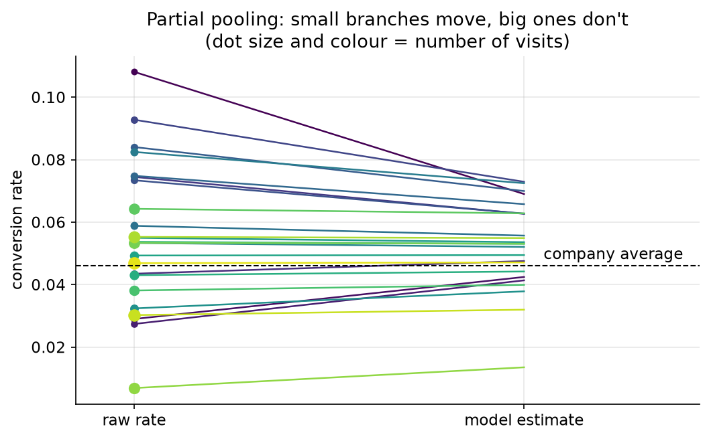
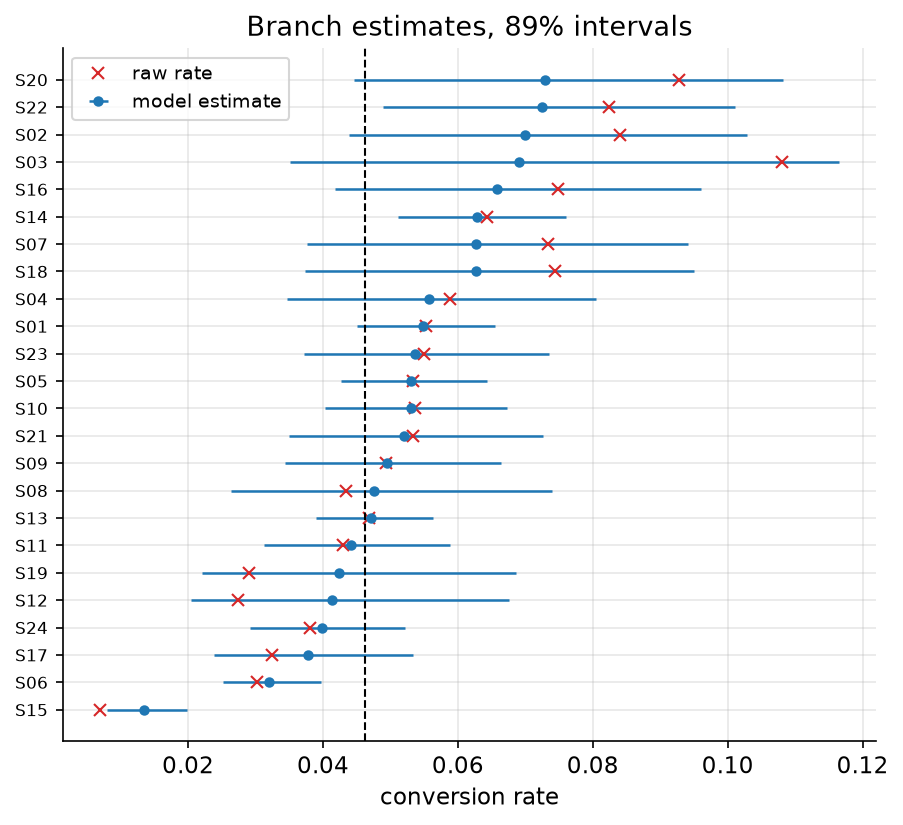

# 09. Many small units

> **The problem.** Twenty-four branches, wildly different sizes. The league table says S03 converts at 10.8%, more than double the company average. Do you fly out and copy what they're doing?
> **What you'll be able to do.** Estimate many related quantities at once, so that small samples borrow strength from the group instead of producing nonsense — and know why the top of every raw league table is a lie.
> **Where this sits on the loop.** Steps 2 and 3: the story now has structure, and the structure is what gets estimated.
> **Runtime.** ~40 s. **Prereqs.** Chapters 05–07.

You have this problem constantly and probably do not think of it as a modelling
problem. Twenty-four stores, forty salespeople, a dozen ad campaigns, three
hundred SKUs, eight hospitals, fifty A/B tests from last year. Each unit has a
little data. Ranking them by their raw averages is the obvious move, and it is
reliably wrong in a specific, predictable, quantifiable direction.

## 09.1 The league table

```python
# --- setup ---
from pathlib import Path
import numpy as np
import pandas as pd
import matplotlib
matplotlib.use("Agg")
import matplotlib.pyplot as plt

import numpyro
numpyro.set_host_device_count(4)
import jax
import numpyro.distributions as dist
from numpyro.infer import MCMC, NUTS

from bayeskit import mcmc_summary, hdi

SLUG = "09-many-small-units"
FIG = Path("figures") / SLUG
FIG.mkdir(parents=True, exist_ok=True)
rng = np.random.default_rng(9)

plt.rcParams.update({
    "figure.figsize": (7, 4), "figure.dpi": 110, "savefig.dpi": 150,
    "savefig.bbox": "tight", "axes.grid": True, "grid.alpha": 0.3,
    "axes.spines.top": False, "axes.spines.right": False, "font.size": 11,
})

def save(fig, name):
    out = FIG / f"{name}.png"
    fig.savefig(out)
    plt.close(fig)
    print(f"[fig] {out}")
```

```python
stores = pd.read_csv("data/stores.csv")
stores["raw"] = stores.purchases / stores.visits
pooled_rate = stores.purchases.sum() / stores.visits.sum()

print(f"{len(stores)} branches, {stores.visits.sum():,} visits, "
      f"company-wide rate {pooled_rate:.4f}")
print(stores.sort_values("raw", ascending=False)
      .head(4).to_string(index=False))
print("...")
print(stores.sort_values("raw").head(2).to_string(index=False))
```

The table's top is `S03` at `0.108108` — on 37 visits and 4 purchases. Its
bottom is `S15` at `0.006876` on `1018` visits.

Look at the visit counts and the pattern is immediate: **the extremes of a
league table are populated by the smallest units**, because small samples have
the most room to be lucky. Four purchases instead of two would have doubled
S03's rate. Nothing S15 could plausibly do would move its rate that far.

## 09.2 Two bad options

**No pooling** treats each branch as its own universe: estimate each rate from
its own data, nothing shared. It is what the league table does. It is unbiased
and hopeless — with 37 visits the estimate is mostly noise.

**Complete pooling** says branches are interchangeable: one rate, 4.62%,
applied to everyone. It is precise and wrong — branches clearly do differ.

The right answer is obviously somewhere in between, and the useful question is
*how far in between*. That is not a matter of taste. It is a quantity you can
estimate from the data, and it is the whole content of a hierarchical model.

## 09.3 Let the branches tell you how much they differ

The story: there is a company-wide typical rate, individual branches vary around
it by some amount, and each branch's visits are then coin flips at its own rate.
Two of those three sentences are the ones we already know how to write. The new
one is the middle: **the branch rates themselves have a distribution, and its
spread is a parameter.**

```
purchases_j ~ Binomial(visits_j, p_j)          per-branch data
logit(p_j)  = mu + tau * z_j                    branch j's rate
z_j         ~ Normal(0, 1)                      how far branch j sits from typical
mu          ~ Normal(-3, 1)                     the typical branch (about 5%)
tau         ~ HalfNormal(1)                     how much branches really differ
```

The `mu + tau * z` form is chapter 05's non-centred reparameterisation, and it
matters here for the reason it mattered there: when tau is small the centred
version develops a funnel and the sampler produces divergences.

```python
def hierarchical(visits, purchases=None):
    mu = numpyro.sample("mu", dist.Normal(-3.0, 1.0))
    tau = numpyro.sample("tau", dist.HalfNormal(1.0))
    with numpyro.plate("branch", len(visits)):
        z = numpyro.sample("z", dist.Normal(0, 1))
        logit_p = mu + tau * z
        numpyro.deterministic("p", jax.nn.sigmoid(logit_p))
        numpyro.sample("purchases", dist.Binomial(visits, logits=logit_p),
                       obs=purchases)

def fit(visits, purchases, seed=0):
    mcmc = MCMC(NUTS(hierarchical), num_warmup=1000, num_samples=1000,
                num_chains=4, chain_method="parallel", progress_bar=False)
    mcmc.run(jax.random.PRNGKey(seed), visits=visits, purchases=purchases,
             extra_fields=("diverging",))
    return mcmc

mcmc = fit(stores.visits.values, stores.purchases.values)
print(f"divergences: {int(np.asarray(mcmc.get_extra_fields()['diverging']).sum())}")
chains = {k: np.asarray(v) for k, v in mcmc.get_samples(group_by_chain=True).items()}
print(mcmc_summary({k: chains[k] for k in ("mu", "tau")}).round(3).to_string())

p_draws = np.asarray(mcmc.get_samples()["p"])          # (draws, branches)
stores["shrunk"] = p_draws.mean(axis=0)
stores["p_best"] = (p_draws.argmax(axis=1)[:, None]
                    == np.arange(len(stores))[None, :]).mean(axis=0)
print(stores.sort_values("raw", ascending=False)
      [["store", "visits", "purchases", "raw", "shrunk", "p_best"]]
      .head(5).round(4).to_string(index=False))
```

`tau` comes out at `0.471` on the log-odds scale — real, substantial branch
variation, roughly a factor of 1.6 in odds between a typical branch and one a
standard deviation above it. The model did not assume branches are the same and
did not assume they are unrelated; it measured how related they are.

And S03's estimate drops from `0.108108` to `0.0690`. Not because the model
distrusts small branches on principle, but because it knows two things S03's own
data cannot know: that branch rates cluster around 4.6%, and that 37 visits is
not enough to establish an outlier.



```python
order = np.argsort(stores.visits.values)
fig, ax = plt.subplots(figsize=(8, 4.5))
for rank, j in enumerate(order):
    ax.plot([0, 1], [stores.raw[j], stores.shrunk[j]], "-",
            color=plt.cm.viridis(rank / len(order)), lw=1.2)
    ax.plot(0, stores.raw[j], "o", ms=3 + 5 * np.sqrt(stores.visits[j] / 1400),
            color=plt.cm.viridis(rank / len(order)))
ax.axhline(pooled_rate, color="k", ls="--", lw=1)
ax.annotate("company average", (1.05, pooled_rate + 0.002))
ax.set_xlim(-0.15, 1.45); ax.set_xticks([0, 1])
ax.set_xticklabels(["raw rate", "model estimate"])
ax.set_ylabel("conversion rate")
ax.set_title("Partial pooling: small branches move, big ones don't\n"
             "(dot size and colour = number of visits)")
save(fig, "shrinkage")
```

The amount each branch moves is not arbitrary. It is the shrinkage weight from
chapter 03, one level up: a branch's estimate is a precision-weighted blend of
its own data and the group's, and the weight on its own data grows with its
sample size. Big branches barely move. Small ones move almost all the way to the
company average, which is correct — their own data contains almost nothing.

## 09.4 Does it actually predict better?

Shrinkage feels like cheating: you deliberately biased every branch's estimate
toward the average. Test it. Split each branch's visits randomly in half, fit on
one half, predict the other.

```python
def split_halves(seed):
    """Randomly split each branch's visits (and its purchases) into two halves."""
    r = np.random.default_rng(seed)
    n1 = stores.visits.values // 2
    k1 = np.array([r.hypergeometric(k, n - k, m) for k, n, m
                   in zip(stores.purchases.values, stores.visits.values, n1)])
    return n1, k1, stores.visits.values - n1, stores.purchases.values - k1

n1, k1, n2, k2 = split_halves(1)
held_out_rate = k2 / n2

no_pool = k1 / n1
complete_pool = np.full(len(stores), k1.sum() / n1.sum())
partial_pool = np.asarray(fit(n1, k1, seed=1).get_samples()["p"]).mean(axis=0)

print("predicting the held-out half of each branch's visits:")
for name, estimate in [("no pooling (the league table)", no_pool),
                       ("complete pooling (one rate)", complete_pool),
                       ("partial pooling (hierarchical)", partial_pool)]:
    rmse = np.sqrt(np.average((estimate - held_out_rate) ** 2, weights=n2))
    print(f"  {name:32s} RMSE {rmse:.5f}")
```

Partial pooling wins: `0.01727` against `0.02039` for no pooling and `0.02099`
for complete pooling. It beats *both* extremes, and it does so out of sample,
where the claim is falsifiable.

This is the result that makes hierarchical modelling worth learning. Introducing
bias on purpose reduced total error, because the variance it removed was larger
than the bias it added. It is the same trade-off as regularisation in machine
learning (chapter 11), and here the strength of the regularisation was not
tuned by cross-validation but *estimated from the data*, as tau.

## 09.5 The winner's curse, measured

How much does a raw league table mislead? Directly: find the top branch by first
half, then look at what it does in the second half.

```python
first_half, second_half = [], []
for rep in range(400):
    a1, b1, a2, b2 = split_halves(100 + rep)
    leader = int(np.argmax(b1 / a1))
    first_half.append(b1[leader] / a1[leader])
    second_half.append(b2[leader] / a2[leader])

first_half, second_half = np.array(first_half), np.array(second_half)
print(f"the winner's rate in the half it won:      {first_half.mean():.4f}")
print(f"the same branch in the other half:         {second_half.mean():.4f}")
print(f"drop: {(1 - second_half.mean()/first_half.mean())*100:.1f}%   "
      f"(company average {pooled_rate:.4f})")
```

The branch that tops the table averages `0.1325` in the period it won, and
`0.0604` in the period you weren't looking — a `54.4`% drop, most of the way
back to the company average.

Nothing changed at that branch. No mean-reversion mechanism, no manager
slacking off after the award. The branch was selected *because* its measured
rate was high, and measured rates are true rate plus noise, so selecting on the
measurement selects partly on the noise, which does not repeat.

This is the mechanism behind an enormous number of business phenomena that get
explained in terms of psychology: the sales training that stops working after
rollout, the star hire who disappoints, the ad campaign that never replicates,
the strategy the consultants derived from studying top performers. It is also
exactly chapter 07's exercise 07.3 — and now tau is measured rather than
guessed. **If you run experiments or rank units, you need this correction, and
the correction is just this model.**

## 09.6 Which branch should you actually visit?

The posterior gives you something a league table cannot: how confident to be in
the ranking.

```python
top = stores.sort_values("p_best", ascending=False).head(5)
print(top[["store", "visits", "raw", "shrunk", "p_best"]].round(4).to_string(index=False))
print(f"\nprobability the raw leader S03 is genuinely the best branch: "
      f"{stores.loc[stores.store == 'S03', 'p_best'].item():.3f}")
print(f"probability that any of the top three is: "
      f"{top.p_best.head(3).sum():.3f}")
```

The raw leader has a `0.173` probability of actually being the best branch. The
model's own favourite, `S20`, is at `0.185` — barely different. Any of the top
three has about a `0.51` chance of being it, which is another way of saying the
data does not identify a winner.



```python
lo, hi = np.quantile(p_draws, [0.055, 0.945], axis=0)
order = np.argsort(stores.shrunk.values)
fig, ax = plt.subplots(figsize=(7, 6))
ax.errorbar(stores.shrunk.values[order], np.arange(len(order)),
            xerr=[stores.shrunk.values[order] - lo[order],
                  hi[order] - stores.shrunk.values[order]],
            fmt="o", ms=4, color="C0", elinewidth=1.2, label="model estimate")
ax.plot(stores.raw.values[order], np.arange(len(order)), "x", color="C3",
        label="raw rate")
ax.axvline(pooled_rate, color="k", ls="--", lw=1)
ax.set_yticks(np.arange(len(order)))
ax.set_yticklabels(stores.store.values[order], fontsize=8)
ax.set_xlabel("conversion rate"); ax.set_title("Branch estimates, 89% intervals")
ax.legend(fontsize=9)
save(fig, "ranking")
```

The practical answer to "which branch do we visit": if you are looking for
*best practice to copy*, the evidence does not support singling out any branch,
and a visit is likely to produce a story that explains noise. If you are
looking for a *problem to fix*, look at S15 — `1018` visits at `0.006876` is a
finding, because that branch has enough data for its estimate to mean something.

**Big units are where you learn about units. Small units are where you learn
about the group.** A league table treats them identically and is therefore
useless for both jobs.

## Pitfalls

- **Ranking raw rates.** Always. The top and bottom will be small units, and
  both will regress.
- **Reporting a ranking without its uncertainty.** "S03 is our best branch" is a
  claim with a probability of 0.17 attached. Say the 0.17.
- **Divergences from a centred parameterisation.** When tau is small the funnel
  from chapter 05 appears. Write `mu + tau * z` with `z ~ Normal(0,1)`.
- **Too few groups.** With fewer than about five units, tau is barely
  identified and the answer leans heavily on its prior. Say so; don't pretend
  the data settled it.
- **Pooling units that shouldn't be pooled.** The model assumes branches are
  exchangeable — that before seeing data you had no reason to think any
  particular branch differs. If half are airport kiosks and half are
  high-street stores, put that in the model as a predictor rather than letting
  partial pooling average across a real distinction.
- **Forgetting the group estimate is also uncertain.** mu has an interval too,
  and with 24 branches it is not tiny.

## Exercises

**Exercise 09.1 — How much would you shrink with more data?**
*Setup:* S03 has 4 purchases in 37 visits. Suppose instead it had 40 in 370 —
the same rate, ten times the data.
*Predict:* Would the model still shrink it to about 0.069, or much less?
*Reason:* Shrinkage depends on how much the branch's own data is worth.
*Run:*
```python
for multiplier in (1, 3, 10, 30):
    v = stores.visits.values.copy()
    k = stores.purchases.values.copy()
    j = int(np.argmax(stores.raw.values))
    v[j], k[j] = v[j] * multiplier, k[j] * multiplier
    p_j = np.asarray(fit(v, k, seed=2).get_samples()["p"])[:, j]
    print(f"S03 with {v[j]:5d} visits, {k[j]:3d} purchases (raw "
          f"{k[j]/v[j]:.4f}): model says {p_j.mean():.4f}")
```
<details><summary>Reconcile</summary>

The estimate climbs `0.0693` → `0.0853` → `0.0997` → `0.1051` as the same rate
is observed on more visits. With 1,110 visits the model has essentially stopped
arguing.

Shrinkage is not skepticism about the branch, it is arithmetic about evidence.
The weight on a unit's own data is roughly n/(n + n_equivalent), where
n_equivalent is how many observations the group-level prior is worth — the same
formula as chapter 03's σ²/τ², now with τ estimated rather than chosen. An
outlier with enough data stays an outlier. An outlier with 37 visits does not
survive contact with the fact that branches usually convert at 4.6%.
</details>

**Exercise 09.2 — What if the branches really were identical?**
*Setup:* Simulate 24 branches with *exactly* the same true rate of 4.6% and the
same visit counts.
*Predict:* What will the model estimate for tau — zero, or something positive
because the raw rates still vary?
*Reason:* The raw rates will vary a lot, purely by chance.
*Run:*
```python
fake = rng.binomial(stores.visits.values, pooled_rate)
print(f"raw rates from identical branches range "
      f"{(fake/stores.visits.values).min():.4f} to "
      f"{(fake/stores.visits.values).max():.4f}")
tau_fake = np.asarray(fit(stores.visits.values, fake, seed=3).get_samples()["tau"])
print(f"tau estimate: {tau_fake.mean():.3f}  89% "
      f"[{hdi(tau_fake, 0.89)[0]:.3f}, {hdi(tau_fake, 0.89)[1]:.3f}]  "
      f"(real data: {np.asarray(mcmc.get_samples()['tau']).mean():.3f})")
```
<details><summary>Reconcile</summary>

Branches with *identical* true rates produce raw rates from `0.0000` to
`0.0811` — one branch at nothing, another at nearly double the company average,
entirely noise. The model's tau is `0.135` against `0.471` on the real data,
with an interval reaching down to `0.002`.

Two lessons. First, the model correctly reports much less between-branch
variation when there is none, which is what makes it trustworthy: it is not
mechanically shrinking, it is estimating how much shrinking the data supports.
Second, it does not go to exactly zero, because with 24 branches you cannot
rule out modest variation — and the honest interval says so.

Meanwhile the raw league table on this data would have shown a "best" branch at
five times the "worst", and someone would have written a case study about it.
</details>

**Exercise 09.3 — The same model in machine learning.**
*Setup:* You are training a per-customer model with very little data per
customer. The standard fix is a shared model plus a small per-customer
adjustment, regularised toward zero.
*Predict:* What is tau in that setting, and what is the machine-learning name
for choosing it?
*Reason:* Both are controlling how much each unit deviates from the group.
*Run:*
```python
tau_draws = np.asarray(mcmc.get_samples()["tau"])
print(f"tau (estimated from data)      : {tau_draws.mean():.3f}")
print(f"equivalent L2 penalty  1/tau^2 : {np.mean(1/tau_draws**2):.2f}")
print(f"with tau twice as large        : {np.mean(1/(2*tau_draws)**2):.2f}")
```
<details><summary>Reconcile</summary>

tau is the prior standard deviation of the per-unit adjustments, so `1/tau²` —
here `5.23` — plays the role of an L2 penalty coefficient on those adjustments.
Doubling tau quarters the penalty to `1.31`.

In machine learning you would pick that coefficient by cross-validation. In the
hierarchical model you estimate it, jointly with everything else, from the same
fit — which costs nothing extra, propagates its own uncertainty into every
downstream estimate, and does not require a validation split you may not be able
to afford with 24 units.

This is the whole of "multi-task learning", "random effects", "mixed models",
"empirical Bayes" and "shrinkage estimation": one idea with five names,
depending on which department invented it.
</details>

## Takeaways

- Raw league tables put small units at both extremes and mislead by
  construction. The winner's rate drops by half when you look again.
- A hierarchical model estimates how much units really differ (tau) and uses it
  to decide how far to shrink each one — a lot for small units, barely at all
  for large ones.
- Partial pooling beat both no pooling and complete pooling out of sample. The
  bias it introduces buys more variance than it costs.
- Report P(unit is best), not a rank. The answer is usually "we cannot tell",
  and that is worth knowing before booking the flight.
- Small units teach you about the group; large units teach you about themselves.
- This is the same object as regularisation, random effects, multi-task
  learning and empirical Bayes, with the penalty strength estimated instead of
  tuned.

## Going deeper

- **The Bayesian Spine, module 16** (`curriculum/modules/16-hierarchical.md`) is the eight-schools treatment: the same bake-off, the centred-versus-non-centred divergence count, and the exact precision-weighting formula behind the shrinkage.
- **Module 18** (`curriculum/modules/18-scale-and-misspecification.md`) scales this to thousands of units, where the winner's curse becomes multiplicity control and shrinkage does false-discovery-rate correction automatically.
- **Bayesian booklet, chapter 9** (`curriculum_material/bayesian_booklet/ch09-hierarchical-models.md`) covers small-area estimation, which is this model under the name statisticians use when the units are geographic regions.
- **Statistical Rethinking, chapter 13** ("Models with memory") is McElreath's version; not in this repository's transcription, which stops at chapter 8.
