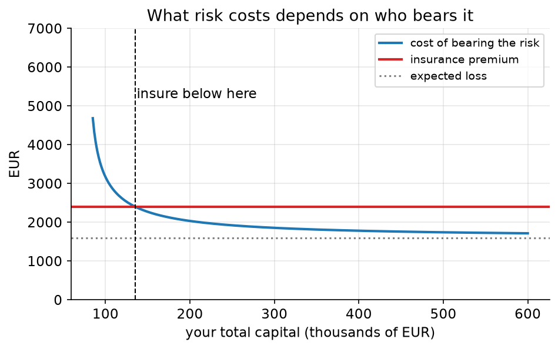
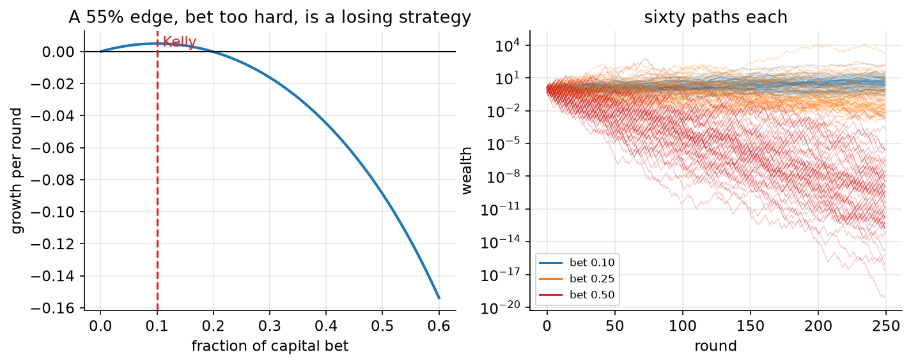
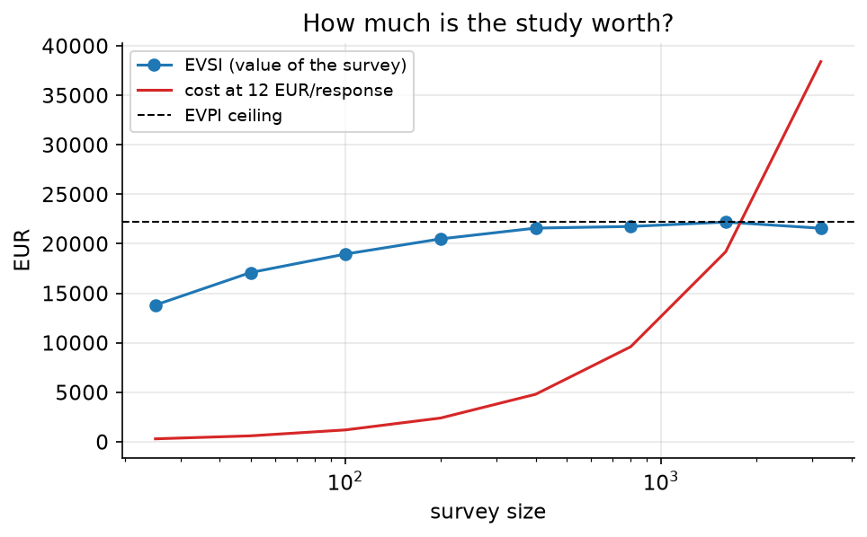

# 10. Money is not linear

> **The problem.** Three decisions in one chapter: should you insure an €80,000 shipment for a €2,400 premium; how much of your capital should you put behind a trade you believe in; and is it worth €2,400 to survey 200 customers before a product launch?
> **What you'll be able to do.** Handle decisions where the loss is not proportional to the error — which is most decisions involving money — and put a price on information before buying it.
> **Where this sits on the loop.** Step 7, taken seriously.
> **Runtime.** ~20 s. **Prereqs.** Chapters 02, 07.

Chapter 00 ended with a warning: when the loss is linear in the unknown, only
the posterior mean matters and the rest of the distribution is decoration. This
chapter is about the other case, which is where the money is. Ruin, insurance,
compounding, capacity, options — all of them bend the loss, and once it bends,
the shape of the posterior starts to matter more than its centre.

## 10.1 The same insurance, two different answers

```python
# --- setup ---
from pathlib import Path
import numpy as np
import matplotlib
matplotlib.use("Agg")
import matplotlib.pyplot as plt
from scipy import optimize

from bayeskit import hdi

SLUG = "10-money-is-not-linear"
FIG = Path("figures") / SLUG
FIG.mkdir(parents=True, exist_ok=True)
rng = np.random.default_rng(10)

plt.rcParams.update({
    "figure.figsize": (7, 4), "figure.dpi": 110, "savefig.dpi": 150,
    "savefig.bbox": "tight", "axes.grid": True, "grid.alpha": 0.3,
    "axes.spines.top": False, "axes.spines.right": False, "font.size": 11,
})

def save(fig, name):
    out = FIG / f"{name}.png"
    fig.savefig(out)
    plt.close(fig)
    print(f"[fig] {out}")
```

A shipment worth €80,000 has a 2% chance of being lost. Insurance costs €2,400.

```python
VALUE, P_LOSS, PREMIUM = 80_000.0, 0.02, 2_400.0
print(f"expected loss if uninsured: {P_LOSS * VALUE:,.0f} EUR")
print(f"premium:                    {PREMIUM:,.0f} EUR")
```

In pure expected-money terms this is settled: the expected loss is `1,600` and
the premium is `2,400`. Never buy insurance — and indeed, *in expectation*,
insurance is always a bad deal, because the insurer needs to eat.

Yet buying it is often correct, and the reason is that losing €80,000 is more
than twice as bad as losing €40,000 when you only have €100,000. The standard
way to encode that is to value **log wealth** rather than wealth: each additional
euro is worth slightly less than the one before, and losses near zero are
catastrophic.

The comparison is then between *certainty equivalents* — the sure amount you
would accept instead of the gamble.

```python
def certainty_equivalents(wealth):
    """What each option is worth, in guaranteed euros, under log utility."""
    uninsured = (1 - P_LOSS) * np.log(wealth) + P_LOSS * np.log(wealth - VALUE)
    insured = np.log(wealth - PREMIUM)
    return np.exp(uninsured), np.exp(insured)

for wealth in (2_000_000, 400_000, 150_000, 100_000, 90_000):
    ce_no, ce_yes = certainty_equivalents(wealth)
    print(f"wealth {wealth:>9,}: uninsured worth {ce_no:>10,.0f}, "
          f"insured worth {ce_yes:>10,.0f}  ->  "
          f"{'INSURE' if ce_yes > ce_no else 'self-insure'}   "
          f"(cost of bearing the risk: {wealth - ce_no:,.0f})")

gap = lambda w: ((1 - P_LOSS) * np.log(w) + P_LOSS * np.log(w - VALUE)) - np.log(w - PREMIUM)
print(f"\nbreak-even wealth: {optimize.brentq(gap, 80_001, 5_000_000):,.0f} EUR")
```

At €2,000,000 of capital, bearing the risk costs `1,632` euros of certainty
equivalent, less than the `2,400` premium: self-insure. At €100,000 it costs
`3,168`: buy the insurance. The crossover is at `135,261` euros.

**The same contract, the same probabilities, opposite decisions** — because the
consequences of the loss depend on who is bearing it. This is why the insurance
industry exists: the insurer is large enough that the risk costs them close to
its expected value, so there is a price band that is simultaneously profitable
for them and worth paying for you.

Two practical corollaries. Never evaluate a risk in isolation from the balance
sheet it sits on. And whenever someone says "the expected value is positive so
we should do it", ask what happens if it goes wrong twice in a row.



```python
w = np.linspace(85_000, 600_000, 300)
risk_cost = w - np.array([certainty_equivalents(x)[0] for x in w])
fig, ax = plt.subplots()
ax.plot(w / 1000, risk_cost, color="C0", lw=2, label="cost of bearing the risk")
ax.axhline(PREMIUM, color="C3", lw=2, label="insurance premium")
ax.axhline(P_LOSS * VALUE, color="0.5", ls=":", label="expected loss")
ax.axvline(135.261, color="k", ls="--", lw=1)
ax.annotate("insure below here", (137, 5200))
ax.set_xlabel("your total capital (thousands of EUR)")
ax.set_ylabel("EUR"); ax.set_ylim(0, 7000)
ax.set_title("What risk costs depends on who bears it")
ax.legend(fontsize=9)
save(fig, "insurance")
```

## 10.2 How much to bet

You have an opportunity that pays even money and wins 55% of the time. It is
genuinely favourable. What fraction of your capital do you put behind it?

Maximising expected *money* gives an absurd answer: expected value is
proportional to the stake, so bet everything, every time — and go broke with
probability 1. Maximising expected *log* wealth gives the **Kelly fraction**,
which for even money is simply `p − (1−p)`: the edge.

```python
P_WIN = 0.55
kelly = P_WIN - (1 - P_WIN)

def growth_rate(fraction, p=P_WIN):
    """Expected log growth per round — the thing that compounds."""
    return p * np.log(1 + fraction) + (1 - p) * np.log(1 - fraction)

print(f"Kelly fraction: {kelly:.3f}")
rounds, paths = 250, 4000
for fraction in (0.05, 0.10, 0.25, 0.50):
    wins = rng.random((paths, rounds)) < P_WIN
    wealth = np.prod(np.where(wins, 1 + fraction, 1 - fraction), axis=1)
    print(f"  bet {fraction:4.2f}: growth/round {growth_rate(fraction):+.5f}  "
          f"median wealth x{np.median(wealth):9.3g}  mean x{wealth.mean():10.3g}  "
          f"P(lost 90%+) {np.mean(wealth < 0.1):.3f}")
```

Betting the Kelly fraction of `0.100` multiplies your money by `3.87` over 250
rounds. Betting 0.25 — still less than a third of your capital, still on a bet
you win 55% of the time — leaves the median player with `0.24` of what they
started with, and `0.447` of players below a tenth of their stake. At 0.50 the
median outcome is `1.28e-10`.

Look at the mean column, though. At a fraction of 0.25 the *mean* final wealth
is `615` times the stake, while the median is `0.24`. Both are correct: a
vanishing fraction of paths win nearly every round and carry the entire average.
**Expected value is the wrong summary for anything that compounds**, because you
do not get to experience the average across parallel worlds — you live in one
path, and the median path is what happens to you.



```python
fractions = np.linspace(0.001, 0.6, 300)
g = np.array([growth_rate(f) for f in fractions])

fig, axes = plt.subplots(1, 2, figsize=(11, 3.8))
axes[0].plot(fractions, g, color="C0", lw=2)
axes[0].axhline(0, color="k", lw=1)
axes[0].axvline(kelly, color="C3", ls="--")
axes[0].annotate("Kelly", (kelly + 0.01, g.max() * 0.6), color="C3")
axes[0].set_xlabel("fraction of capital bet"); axes[0].set_ylabel("growth per round")
axes[0].set_title("A 55% edge, bet too hard, is a losing strategy")

for fraction, colour in [(0.10, "C0"), (0.25, "C1"), (0.50, "C3")]:
    wins = rng.random((60, rounds)) < P_WIN
    paths_w = np.cumprod(np.where(wins, 1 + fraction, 1 - fraction), axis=1)
    axes[1].plot(paths_w.T, color=colour, alpha=0.25, lw=0.7)
    axes[1].plot([], [], color=colour, label=f"bet {fraction:.2f}")
axes[1].set_yscale("log"); axes[1].set_xlabel("round"); axes[1].set_ylabel("wealth")
axes[1].set_title("sixty paths each"); axes[1].legend(fontsize=8)
save(fig, "kelly")
```

## 10.3 Betting on an edge you estimated

Now the part that connects to everything else in this guide. You do not know
that the win probability is 0.55. You have twenty past trades and thirteen of
them won.

```python
TRUE_P = 0.55                     # unknown to you
wins_seen, trades_seen = 13, 20

estimates = {
    "MLE (13/20)":                    wins_seen / trades_seen,
    "flat prior Beta(1,1)":           (1 + wins_seen) / (2 + trades_seen),
    "skeptical prior Beta(20,20)":    (20 + wins_seen) / (40 + trades_seen),
}
for name, p_hat in estimates.items():
    f = 2 * p_hat - 1                                   # Kelly fraction for this estimate
    print(f"{name:28s} p={p_hat:.4f}  bet {f:.3f}  "
          f"growth under the truth {growth_rate(f, TRUE_P):+.5f}")
print(f"{'if you knew the truth':28s} p={TRUE_P:.4f}  bet {2*TRUE_P-1:.3f}  "
      f"growth {growth_rate(2*TRUE_P-1, TRUE_P):+.5f}")

for name, p_hat in estimates.items():
    f = 2 * p_hat - 1
    wealth = np.prod(np.where(rng.random((4000, rounds)) < TRUE_P, 1 + f, 1 - f), axis=1)
    print(f"  {name:28s} median wealth x{np.median(wealth):8.3g}  "
          f"P(lost 90%+) {np.mean(wealth < 0.1):.3f}")
```

The maximum-likelihood bettor estimates a 65% win rate, bets `0.300` of capital
per trade, and has a growth rate of `-0.01620` — **negative**, on a genuinely
favourable bet. Their median wealth after 250 rounds is `0.0237` of what they
started with, and `0.645` of them lose more than 90%.

The flat-prior Bayesian does barely better: `0.273` and `-0.01067`. The
skeptical prior — which says "edges of more than a few points are rare",
exactly the prior chapter 07 argued for and chapter 09 estimated from data —
bets `0.100` and grows at `+0.00501`, ending with a median of `3.16`.

Two things are worth separating here.

First, the *asymmetry*: the growth curve in the figure above falls away much
faster to the right of the optimum than to the left. Betting half of Kelly costs
you a quarter of your growth; betting double Kelly costs you all of it. When a
loss function is that lopsided, the right response to uncertainty is to move
*toward the safe side*, and the more uncertain your estimate the further you
move. That is the real justification for the practitioner's rule of thumb "bet
half Kelly", which is otherwise unmotivated folklore.

Second, a caveat you should notice: log growth is *linear* in p, so a Bayesian
maximising expected log wealth uses the posterior mean and nothing else — the
width of the posterior does not enter. Averaging over your uncertainty was not
what saved the skeptical bettor. **Having a sensible prior was.** With twenty
trades and no prior information, a Bayesian and a maximum-likelihood bettor both
overbet, and both go broke. The lesson is not "be Bayesian", it is "your
estimate of an edge from twenty observations is mostly noise, and there is no
inference procedure that repairs that — only prior information can".

(The skeptical prior lands on exactly 0.55 here, which looks like magic and is
not: shrinking a 20-trade estimate halfway toward no-edge is what Beta(20,20)
does, and the true edge in this simulation happens to be about that size. What
generalises is the direction and the asymmetry, not the number.)

## 10.4 What is more data worth?

The last decision: launch a product into a new market. It costs €200,000, the
market has 20,000 potential customers, and each one who takes it up is worth €45
in margin. You don't know the take-up rate; your prior — from three similar
launches — is Beta(5, 15), a mean of 25%.

```python
LAUNCH_COST, MARGIN, MARKET = 200_000.0, 45.0, 20_000
break_even = LAUNCH_COST / (MARGIN * MARKET)

take_up = rng.beta(5, 15, 400_000)
profit = take_up * MARKET * MARGIN - LAUNCH_COST
value_now = max(profit.mean(), 0.0)                    # best you can do today

print(f"break-even take-up: {break_even:.3f}   prior mean: {take_up.mean():.3f}")
print(f"E[profit] = {profit.mean():,.0f}  ->  "
      f"{'LAUNCH' if profit.mean() > 0 else 'DO NOT LAUNCH'}")
```

The prior mean take-up of `0.250` clears the break-even of `0.222`, so today's
decision is to launch, with an expected profit of `25,082`.

But it is close, and you could survey customers first. How much is that worth?
Two quantities answer it.

**EVPI**, the expected value of perfect information: what you would pay for an
oracle. It is the expected regret of your current decision — the average amount
by which a perfect informant would improve on what you would have done anyway.

```python
evpi = np.mean(np.maximum(profit, 0)) - value_now
print(f"EVPI (value of an oracle): {evpi:,.0f} EUR")
```

`22,242` euros. **No study, survey, consultant or dataset about this launch can
ever be worth more than that**, because that is the entire value of removing all
uncertainty. This single number kills more bad research proposals than any other
calculation in this guide.

**EVSI**, the expected value of a *sample*: simulate the study you are
considering. Draw a possible truth from your current posterior, simulate what
the survey would say under that truth, work out what decision you would then
make, and score it against the truth. Average over everything.

```python
def evsi(n, reps=60_000):
    """Value of surveying n customers before deciding."""
    truth = rng.beta(5, 15, reps)                       # a possible world
    responses = rng.binomial(n, truth)                  # what the survey would find
    posterior_mean = (5 + responses) / (20 + n)         # what you would then believe
    expected_profit = posterior_mean * MARKET * MARGIN - LAUNCH_COST
    return np.mean(np.maximum(expected_profit, 0)) - value_now

print(f"{'survey size':>12s} {'EVSI':>9s} {'cost':>8s} {'net':>10s}")
for n in (50, 200, 500, 1000, 3000):
    v, cost = evsi(n), 12 * n                           # 12 EUR per response
    print(f"{n:>12,} {v:>9,.0f} {cost:>8,} {v - cost:>10,.0f}")
```

A survey of 200 people is worth `20,500` euros and costs `2,400`: net `18,100`,
easily the best of the options. Note the shape — EVSI rises steeply and then
flattens against the EVPI ceiling, while cost rises linearly, so the optimum is
small and further data is actively wasteful. Three thousand responses cost
`36,000` to buy `21,910` of value: a `-14,090` decision that would look
extremely rigorous in a slide deck.



```python
ns = np.array([25, 50, 100, 200, 400, 800, 1600, 3200])
values = np.array([evsi(int(n), reps=30_000) for n in ns])
fig, ax = plt.subplots()
ax.plot(ns, values, "o-", color="C0", label="EVSI (value of the survey)")
ax.plot(ns, 12 * ns, color="C3", label="cost at 12 EUR/response")
ax.axhline(evpi, color="k", ls="--", lw=1, label="EVPI ceiling")
ax.set_xscale("log"); ax.set_xlabel("survey size"); ax.set_ylabel("EUR")
ax.set_title("How much is the study worth?")
ax.legend(fontsize=9)
save(fig, "evsi")
```

## 10.5 The recipe

1. **Ask whether the loss is linear in the unknown.** If it is, the posterior
   mean is all you need and you can stop. If it bends — ruin, compounding,
   capacity limits, thresholds, options — carry the whole distribution.
2. **Evaluate risks against the balance sheet**, not in isolation. The same
   gamble is correct for one party and reckless for another.
3. **For anything that compounds, maximise expected log growth**, and look at
   the median path, not the mean.
4. **Move away from the optimum on the safe side** when the loss curve is
   asymmetric and your estimate is uncertain.
5. **Compute EVPI before commissioning any study.** It is a ceiling, it takes
   three lines, and it is very often smaller than the study's cost.
6. **Then compute EVSI for the study you can actually afford.** The optimum is
   usually much smaller than people expect, because value saturates and cost
   does not.

## Pitfalls

- **Maximising expected money for repeated bets.** It recommends maximum stakes
  and guarantees ruin. The mean of a compounding process is dominated by paths
  you will never live in.
- **Using a point estimate of an edge.** Overbetting is punished far more
  harshly than underbetting, and estimated edges are mostly noise.
- **Commissioning research without an EVPI.** If perfect information is worth
  €22,000, a €60,000 study is a bad idea however good its methodology.
- **Treating utility as an excuse.** Log utility is a modelling choice like any
  other. State it, and check whether the decision flips under a different
  curvature.
- **Ignoring the time cost of information.** The EVSI calculation above prices
  the survey but not the three weeks of delay. Chapter 07's version included it,
  and it dominated.
- **Assuming your loss function is someone else's.** The finance team's
  certainty equivalent is not the founder's. Get the loss from whoever bears
  the consequences.

## Exercises

**Exercise 10.1 — When does the insurance stop making sense?**
*Setup:* The insurer raises the premium from €2,400 to €5,000.
*Predict:* Does the break-even wealth go up or down, and by roughly how much?
*Reason:* A more expensive policy should be worth buying in fewer situations.
*Run:*
```python
for premium in (1_800.0, 2_400.0, 5_000.0, 8_000.0):
    g = lambda w: ((1 - P_LOSS)*np.log(w) + P_LOSS*np.log(w - VALUE)) - np.log(w - premium)
    try:
        w_star = optimize.brentq(g, 80_001, 50_000_000)
        print(f"premium {premium:>7,.0f}: insure if capital is below {w_star:>12,.0f}")
    except ValueError:
        print(f"premium {premium:>7,.0f}: never worth it at any capital level")
```
<details><summary>Reconcile</summary>

At €1,800 the break-even capital is `367,509`; at €2,400 it is `135,261`; at
€5,000 it is `83,883`; at €8,000, `80,427`. The band shrinks fast — and note it
never disappears, because as capital approaches the value of the shipment, the
uninsured loss approaches total ruin and log utility values avoiding that
almost without limit.

That last point is why catastrophe insurance is bought at premiums many times
the expected loss, and why it is not irrational to do so. The relevant question
is never "is the premium above the expected loss" — it always is — but "how
close does the bad outcome take me to zero".
</details>

**Exercise 10.2 — Half Kelly.**
*Setup:* The folklore rule is to bet half the Kelly fraction.
*Predict:* How much growth do you give up by halving your bet, compared with how
much you give up by doubling it?
*Reason:* Both are the same distance from the optimum in fractional terms.
*Run:*
```python
for f in (0.05, 0.10, 0.20, 0.30):
    print(f"bet {f:.2f} ({f/kelly:.1f}x Kelly): growth {growth_rate(f):+.5f}  "
          f"({growth_rate(f)/growth_rate(kelly)*100:6.1f}% of optimal)")
```
<details><summary>Reconcile</summary>

Half Kelly keeps `74.9`% of the optimal growth rate. Double Kelly keeps
`-2.8`% of it — that is, it is already *negative*, and the strategy loses money
over time. Triple Kelly is at `-323.5`%.

The asymmetry is the whole point, and it comes from the log: underbetting scales
your growth down, overbetting eventually makes the losing rounds unrecoverable.
Any decision with this shape — leverage, capacity commitments, inventory with
storage costs, staffing with overtime penalties — should be approached from the
conservative side, and the greater your uncertainty about where the optimum is,
the further from it you should sit.
</details>

**Exercise 10.3 — The study that cannot pay for itself.**
*Setup:* Your prior for the launch is much more confident: Beta(50, 150), same
mean of 25% but based on far more experience.
*Predict:* What happens to EVPI, and what does that imply about the survey?
*Reason:* The decision is the same; only the uncertainty changed.
*Run:*
```python
tight = rng.beta(50, 150, 400_000)
profit_tight = tight * MARKET * MARGIN - LAUNCH_COST
value_tight = max(profit_tight.mean(), 0.0)
print(f"tight prior: E[profit] {profit_tight.mean():,.0f}, "
      f"EVPI {np.mean(np.maximum(profit_tight, 0)) - value_tight:,.0f}")
print(f"loose prior: E[profit] {profit.mean():,.0f}, EVPI {evpi:,.0f}")
```
<details><summary>Reconcile</summary>

EVPI collapses from `22,242` to `2,536`. The expected profit barely moved
(`25,082` versus `25,020`), but the *value of information* fell by nearly a
factor of nine, because you were no longer likely to be making a mistake.

Information is worth something only in proportion to the chance that it changes
what you do. This is chapter 00's umbrella, restated in euros: a wide posterior
that never crosses a decision boundary is free, and a narrow one straddling the
boundary can be very expensive. Before funding a study, ask what result would
change the decision — and if no plausible result would, you have your answer
without the study.
</details>

## Takeaways

- Expected money is the right objective only when the stakes are small relative
  to what you have. Otherwise use a utility, and log is the workhorse.
- The same risk is worth insuring for one party and not another. Evaluate
  against the balance sheet.
- For compounding decisions, maximise expected log growth. Bet the Kelly
  fraction, never more, and look at the median path.
- Overbetting is punished asymmetrically. Uncertainty about the optimum is a
  reason to sit below it.
- No study can be worth more than EVPI, the expected regret of your current
  decision. Compute it first; it is three lines.
- EVSI saturates while cost grows linearly, so the optimal study is usually much
  smaller than proposed.

## Going deeper

- **The Bayesian Spine, module 22** (`curriculum/modules/22-decisions-bandits.md`) works EVSI through a full preposterior simulation and finds the optimal sample size for an A/B test, then moves to bandits, where acting and learning are the same move.
- **Module 06** (`curriculum/modules/06-estimates-are-decisions.md`) is the general theory: which summary of a posterior is optimal under which loss, including the newsvendor quantile this chapter's insurance argument generalises.
- **Module 21** (`curriculum/modules/21-state-space.md`) handles the case where the quantity you are betting on moves over time.
