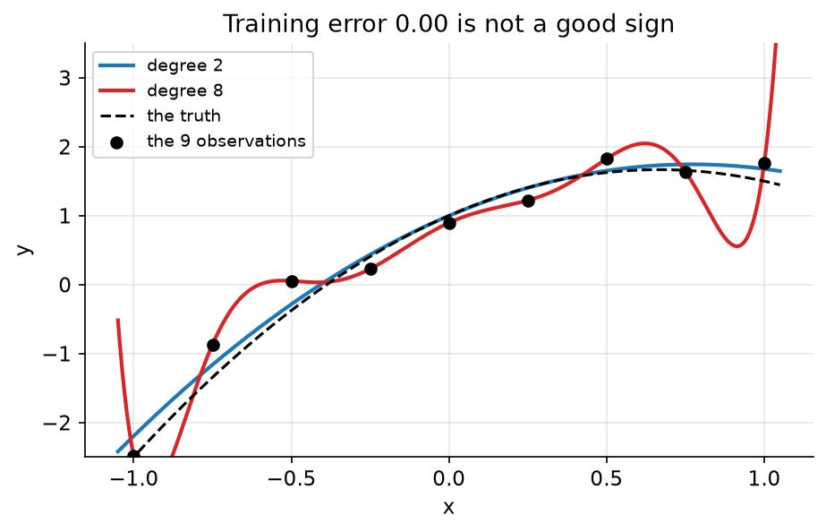
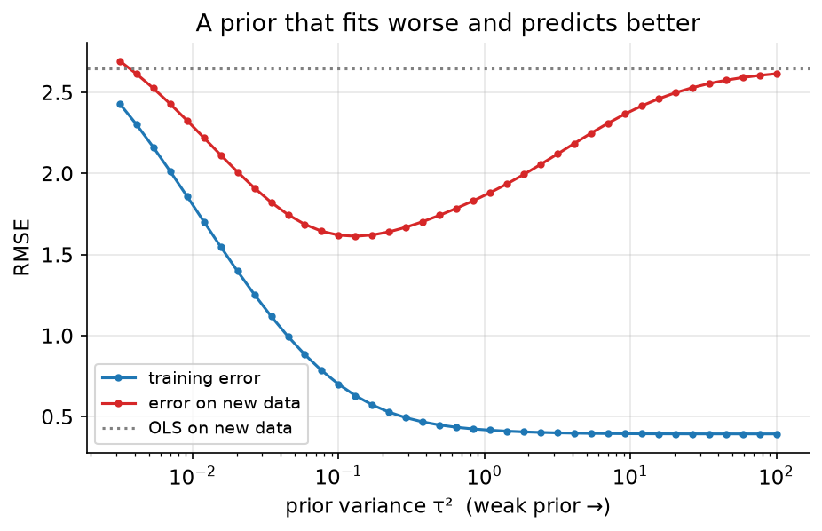

# 11. Regularisation is a prior

> **The problem.** Sixty-five customers, sixty candidate features, and a model that fits the training data beautifully and predicts nothing. You know the fix is "add regularisation". This chapter is about what that actually *is*.
> **What you'll be able to do.** Show that ridge regression is a Gaussian prior to machine precision, choose the penalty strength by estimating it rather than tuning it, and say precisely what a sparse penalty assumes about the world.
> **Where this sits on the loop.** Step 3, revisited: your model already had a prior; you just weren't writing it down.
> **Runtime.** ~15 s. **Prereqs.** Chapters 03–04, 09.

Every machine-learning practitioner regularises. Weight decay, L2, L1, dropout,
early stopping, data augmentation: all of them are ways of stopping a flexible
model from taking the training data too literally. All of them are also priors,
and seeing that changes what you can do with them.

## 11.1 Overfitting, in nine points

```python
# --- setup ---
from pathlib import Path
import numpy as np
import matplotlib
matplotlib.use("Agg")
import matplotlib.pyplot as plt
from scipy.optimize import minimize_scalar
from sklearn.linear_model import Ridge, Lasso
from sklearn.model_selection import KFold

SLUG = "11-regularisation-is-a-prior"
FIG = Path("figures") / SLUG
FIG.mkdir(parents=True, exist_ok=True)
rng = np.random.default_rng(11)

plt.rcParams.update({
    "figure.figsize": (7, 4), "figure.dpi": 110, "savefig.dpi": 150,
    "savefig.bbox": "tight", "axes.grid": True, "grid.alpha": 0.3,
    "axes.spines.top": False, "axes.spines.right": False, "font.size": 11,
})

def save(fig, name):
    out = FIG / f"{name}.png"
    fig.savefig(out)
    plt.close(fig)
    print(f"[fig] {out}")
```

```python
truth = lambda t: 1.0 + 2.0 * t - 1.5 * t ** 2
x = np.linspace(-1, 1, 9)
y = truth(x) + rng.normal(0, 0.35, 9)
x_test = np.linspace(-1, 1, 200)
y_test = truth(x_test) + rng.normal(0, 0.35, 200)

print(f"{'degree':>6s} {'train RMSE':>11s} {'test RMSE':>10s}")
for degree in (1, 2, 3, 5, 8):
    X, X_test = np.vander(x, degree + 1), np.vander(x_test, degree + 1)
    beta = np.linalg.lstsq(X, y, rcond=None)[0]
    print(f"{degree:6d} {np.sqrt(np.mean((y - X @ beta)**2)):11.4f} "
          f"{np.sqrt(np.mean((y_test - X_test @ beta)**2)):10.4f}")
```

Training error falls monotonically — `0.5076`, `0.2163`, `0.1886`, `0.1041`,
`0.0000` — and hits exactly zero at degree 8, where an 9-parameter polynomial
passes through 9 points. Test error falls and then rises: `0.5787`, `0.3481`,
`0.3624`, `0.4180`, `0.5155`. The degree-8 model has learned the noise, perfectly
and uselessly.



```python
fig, ax = plt.subplots()
grid = np.linspace(-1.05, 1.05, 300)
for degree, colour in [(2, "C0"), (8, "C3")]:
    beta = np.linalg.lstsq(np.vander(x, degree + 1), y, rcond=None)[0]
    ax.plot(grid, np.vander(grid, degree + 1) @ beta, color=colour, lw=2,
            label=f"degree {degree}")
ax.plot(grid, truth(grid), "k--", lw=1.5, label="the truth")
ax.scatter(x, y, color="k", zorder=5, label="the 9 observations")
ax.set_ylim(-2.5, 3.5); ax.set_xlabel("x"); ax.set_ylabel("y")
ax.set_title("Training error 0.00 is not a good sign")
ax.legend(fontsize=9)
save(fig, "overfit")
```

Nothing about this requires a Bayesian framing. But the fix does have one, and
it is exact.

## 11.2 Ridge regression *is* a Gaussian prior

Set up the harder version of the same problem: 65 observations, 60 candidate
predictors, of which only 6 actually matter.

```python
N, P, SIGMA = 65, 60, 1.0
X_train = rng.normal(0, 1, (N, P))
beta_true = np.zeros(P)
beta_true[:6] = [2.0, -1.5, 1.0, 0.8, -0.6, 0.5]
y_train = X_train @ beta_true + rng.normal(0, SIGMA, N)

X_holdout = rng.normal(0, 1, (2000, P))
y_holdout = X_holdout @ beta_true + rng.normal(0, SIGMA, 2000)

def posterior_mean(X, y, sigma2, tau2):
    """Bayesian linear regression with a Normal(0, tau2) prior on every coefficient."""
    A = X.T @ X / sigma2 + np.eye(X.shape[1]) / tau2
    return np.linalg.solve(A, X.T @ y / sigma2)

print("prior sd^2   penalty     max |ridge - posterior mean|")
for tau2 in (0.01, 0.1, 1.0, 10.0):
    lam = SIGMA ** 2 / tau2                                    # the claim
    ridge = Ridge(alpha=lam, fit_intercept=False).fit(X_train, y_train).coef_
    bayes = posterior_mean(X_train, y_train, SIGMA ** 2, tau2)
    print(f"{tau2:10.2f} {lam:9.2f}     {np.max(np.abs(ridge - bayes)):.3e}")
```

Agreement to `3.331e-16` — the same numbers, to the last bit of double precision.
Not "similar", not "analogous": ridge regression with penalty λ **is** the
posterior mean under a Normal(0, τ²) prior with

$$\lambda = \frac{\sigma^2}{\tau^2}$$

the same σ²/τ² that chapter 03 called "how many observations your prior is
worth". A strong penalty is a confident prior that the coefficients are small. A
weak penalty is a vague one.

And "no regularisation" is the τ² → ∞ limit: the flat prior, which asserts that
a coefficient of 10,000 is exactly as plausible as a coefficient of 0.1. That is
not neutrality, and it produces exactly the behaviour you would predict from
such a claim:

```python
def test_rmse(beta):
    return np.sqrt(np.mean((y_holdout - X_holdout @ beta) ** 2))

ols = np.linalg.lstsq(X_train, y_train, rcond=None)[0]
print(f"{'OLS (flat prior)':>22s}  train {np.sqrt(np.mean((y_train - X_train@ols)**2)):.4f}"
      f"   test {test_rmse(ols):.4f}")
for tau2 in (0.01, 0.05, 0.2, 1.0, 100.0):
    b = posterior_mean(X_train, y_train, SIGMA ** 2, tau2)
    print(f"{'prior variance ' + format(tau2, '.2f'):>22s}  "
          f"train {np.sqrt(np.mean((y_train - X_train@b)**2)):.4f}   "
          f"test {test_rmse(b):.4f}")
```

Ordinary least squares gets a training RMSE of `0.3941` and a test RMSE of
`2.6507`. A prior variance of 0.2 fits the training data *worse* (`0.5444`) and
predicts new data `1.6315` — better by 38%. And τ² = 100, which is practically
flat, reproduces the OLS disaster (`2.6151`), as it must.

**Deliberately fitting the training data worse is what bought the improvement.**
That is the bias-variance trade-off, and in Bayesian terms it is not a trade-off
at all but a straightforward consequence of having stated a sensible prior
instead of an absurd one.



```python
taus = np.logspace(-2.5, 2, 40)
train_err = [np.sqrt(np.mean((y_train - X_train @ posterior_mean(
    X_train, y_train, SIGMA**2, t)) ** 2)) for t in taus]
test_err = [test_rmse(posterior_mean(X_train, y_train, SIGMA**2, t)) for t in taus]

fig, ax = plt.subplots()
ax.plot(taus, train_err, "o-", ms=3, color="C0", label="training error")
ax.plot(taus, test_err, "o-", ms=3, color="C3", label="error on new data")
ax.axhline(test_rmse(ols), color="0.5", ls=":", label="OLS on new data")
ax.set_xscale("log")
ax.set_xlabel("prior variance τ²  (weak prior →)")
ax.set_ylabel("RMSE"); ax.set_title("A prior that fits worse and predicts better")
ax.legend(fontsize=9)
save(fig, "path")
```

## 11.3 Two ways to pick the strength, and they agree

Cross-validation is the standard answer: hold out folds, try penalties, keep
whichever predicts held-out data best.

The Bayesian answer is that τ² is a parameter like any other, so estimate it —
maximise the *marginal likelihood*, the probability of the data with the
coefficients integrated out. That is chapter 09's tau, one level up: the same
"how much do these things vary" question, asked about coefficients instead of
branches.

```python
lams = np.logspace(-2, 3, 40)
kf = KFold(5, shuffle=True, random_state=0)
cv_error = []
for lam in lams:
    fold_errors = [np.mean((y_train[va] - X_train[va] @ Ridge(
        alpha=lam, fit_intercept=False).fit(X_train[tr], y_train[tr]).coef_) ** 2)
        for tr, va in kf.split(X_train)]
    cv_error.append(np.mean(fold_errors))
lam_cv = lams[int(np.argmin(cv_error))]

def neg_log_evidence(log_tau2):
    """-log p(y | tau2), coefficients integrated out analytically."""
    tau2 = np.exp(log_tau2)
    C = SIGMA ** 2 * np.eye(N) + tau2 * X_train @ X_train.T
    _, logdet = np.linalg.slogdet(C)
    return 0.5 * (logdet + y_train @ np.linalg.solve(C, y_train))

tau2_evidence = float(np.exp(minimize_scalar(
    neg_log_evidence, bounds=(-8, 6), method="bounded").x))

print(f"cross-validation: lambda {lam_cv:.3f}  (tau^2 {SIGMA**2/lam_cv:.4f})  "
      f"test RMSE {test_rmse(posterior_mean(X_train, y_train, SIGMA**2, SIGMA**2/lam_cv)):.4f}")
print(f"marginal likelihood: lambda {SIGMA**2/tau2_evidence:.3f}  "
      f"(tau^2 {tau2_evidence:.4f})  "
      f"test RMSE {test_rmse(posterior_mean(X_train, y_train, SIGMA**2, tau2_evidence)):.4f}")
```

Cross-validation picks λ = `3.665`; the marginal likelihood picks `5.774`. Both
land in the flat region of the curve and both give test RMSE around 1.62–1.66,
against OLS's 2.65. They are estimating the same quantity by different routes,
which is a fact worth knowing: **cross-validating a penalty is empirical Bayes
with extra steps.**

The Bayesian route has two practical advantages. It needs no held-out folds,
which matters when data is scarce (here, splitting 65 rows five ways is painful).
And τ² can be given a prior and sampled along with everything else, so its
uncertainty propagates into the coefficients instead of being fixed at a point
estimate — which is exactly the hierarchical model of chapter 09, now with
coefficients playing the role of branches.

## 11.4 Sparsity: a different prior, a different claim

Ridge shrinks every coefficient toward zero but sets none of them exactly to
zero. Lasso does. The reason is entirely about the shape of the implied prior: a
Gaussian prior is smooth at zero, while the Laplace (double-exponential) prior
behind lasso has a sharp spike there.

```python
lasso = Lasso(alpha=0.1, fit_intercept=False, max_iter=20_000).fit(X_train, y_train)
ridge_best = posterior_mean(X_train, y_train, SIGMA ** 2, tau2_evidence)

print(f"lasso: {np.sum(np.abs(lasso.coef_) < 1e-10)} of {P} coefficients exactly zero, "
      f"test RMSE {test_rmse(lasso.coef_):.4f}")
print(f"ridge: {np.sum(np.abs(ridge_best) < 1e-10)} exactly zero "
      f"({np.sum(np.abs(ridge_best) < 0.05)} below 0.05), "
      f"test RMSE {test_rmse(ridge_best):.4f}")
```

Lasso zeroes `41` of 60 coefficients and gets a test RMSE of `1.0882` — a third
better than the best ridge. It wins because its prior is *true here*: most
coefficients really are exactly zero, and the Laplace prior's spike at zero says
so. Choose the prior that matches the world you are in, and you win; choose one
that doesn't, and you lose.

Two things people get wrong about this.

**The zeros come from the mode, not the posterior.** Lasso reports the *maximum*
of the posterior under a Laplace prior, and a mode can sit exactly at zero. The
posterior *mean* under the same prior is never exactly zero for any coefficient
— the posterior assigns zero probability to the event "this coefficient is
exactly 0". If you want a sparse model, you are asking for a mode; if you want
honest uncertainty about each coefficient, you get a distribution that never
quite excludes a small effect. These are different deliverables, and lasso's
sparsity is a property of the summary, not of the belief.

**Lasso's zeros are not a hypothesis test.** A coefficient being zeroed at some
λ does not mean the predictor is irrelevant; it means that at this penalty, on
this data, it did not pay for itself. Correlated predictors get zeroed
essentially at random among themselves (chapter 05's collinearity, again).

## 11.5 What this means for machine learning

- **Weight decay is a Gaussian prior on the weights**, with λ = σ²/τ². The
  identity in §11.2 holds for any model where you are adding `λ‖w‖²` to a
  negative log-likelihood, which includes every neural network trained with
  weight decay.
- **Cross-entropy loss is a negative log-likelihood** (Bernoulli or
  categorical), so "minimise cross-entropy plus L2" *is* "find the MAP under a
  Gaussian prior".
- **Early stopping is regularisation too**, though a messier one — it limits how
  far the weights travel from their small random initialisation, which acts like
  a prior centred at the start point with a width set by the learning schedule.
- **"No regularisation" is a strong claim**, not the absence of one. In an
  overparameterised model the flat prior is what produces the classic
  interpolation disaster.
- **Choosing the penalty by cross-validation is estimating a prior parameter**
  from data. If you find that idea uncomfortable, you have been doing it for
  years.

None of this makes your existing tools wrong. It makes them legible: you can now
say what your regularisation *believes*, check whether that belief matches your
problem, and reach for a different prior when it doesn't — a spike-and-slab or a
horseshoe when you expect genuine sparsity, a hierarchical prior when
coefficients come in related groups, a heavier-tailed prior when a few effects
really are large.

## Pitfalls

- **Regularising without standardising.** The penalty treats all coefficients
  alike, so a predictor measured in euros and one measured in millions get very
  different effective priors. Standardise, or set per-coefficient priors
  deliberately.
- **Penalising the intercept.** Shrinking the intercept toward zero asserts that
  the outcome is near zero when all predictors are at their mean. Usually
  nonsense; leave it unpenalised (`fit_intercept=True`, which sklearn does not
  penalise).
- **Reading lasso zeros as "no effect".** They are a consequence of the penalty
  and the correlation structure, not a test.
- **Tuning λ on the test set.** Then the test set is a training set and its
  error estimate is optimistic. Chapter 12 is about doing this properly.
- **Assuming more regularisation is safer.** τ² = 0.01 here gave test RMSE
  `2.2917`, worse than several weaker settings. The curve has a minimum in the
  middle and you have to find it.

## Exercises

**Exercise 11.1 — When the sparse prior is wrong.**
*Setup:* Change the truth so that all 60 coefficients are small but nonzero,
drawn from Normal(0, 0.3²), instead of 6 large ones.
*Predict:* Does lasso still beat ridge?
*Reason:* Lasso won by a third last time.
*Run:*
```python
dense_true = rng.normal(0, 0.3, P)
y_dense = X_train @ dense_true + rng.normal(0, SIGMA, N)
y_dense_holdout = X_holdout @ dense_true + rng.normal(0, SIGMA, 2000)
def dense_rmse(b):
    return np.sqrt(np.mean((y_dense_holdout - X_holdout @ b) ** 2))

las = Lasso(alpha=0.1, fit_intercept=False, max_iter=20_000).fit(X_train, y_dense)
rid = posterior_mean(X_train, y_dense, SIGMA ** 2, 0.1)
print(f"lasso: {np.sum(np.abs(las.coef_) < 1e-10)} zeros, test RMSE {dense_rmse(las.coef_):.4f}")
print(f"ridge: test RMSE {dense_rmse(rid):.4f}")
```
<details><summary>Reconcile</summary>

Lasso now zeroes `27` of 60 coefficients and scores `1.8276`; ridge scores
`1.7240`. Lasso has gone from winning by a third to losing, and it did so by
confidently deleting 27 predictors that all genuinely matter a little.

There is no universally correct regulariser, because there is no universally
correct prior. Sparsity assumptions win big when the truth is sparse and cost
you when it isn't, and the only way to know which world you are in is subject
knowledge or a model comparison (chapter 12). The Bayesian framing is useful
precisely because it makes the assumption sayable: "L1" is opaque, "most
coefficients are exactly zero" is something a domain expert can agree or
disagree with.
</details>

**Exercise 11.2 — The prior that says the answer.**
*Setup:* Suppose you knew the true coefficient scale exactly: the six real ones
average about 1.07 in magnitude, the rest are zero.
*Predict:* If you set τ² to the empirical variance of the true coefficients,
will you beat both cross-validation and the marginal likelihood?
*Reason:* You would be using information nobody has.
*Run:*
```python
tau2_oracle = float(np.var(beta_true))
print(f"oracle tau^2 {tau2_oracle:.4f}: test RMSE "
      f"{test_rmse(posterior_mean(X_train, y_train, SIGMA**2, tau2_oracle)):.4f}")
print(f"marginal likelihood tau^2 {tau2_evidence:.4f}: "
      f"{test_rmse(posterior_mean(X_train, y_train, SIGMA**2, tau2_evidence)):.4f}")
best = min((test_rmse(posterior_mean(X_train, y_train, SIGMA**2, t)), t)
           for t in np.logspace(-3, 2, 200))
print(f"best possible tau^2 {best[1]:.4f}: {best[0]:.4f}")
```
<details><summary>Reconcile</summary>

The oracle τ² of `0.1403` gives `1.6139`, the marginal likelihood's `0.1732`
gives `1.6218`, and the best achievable is `1.6130`. All three are
indistinguishable.

Two lessons. The marginal likelihood found essentially the right answer without
being told anything — this is what "estimate the prior from the data" buys.
And the curve is flat near its optimum, so agonising over the third decimal of
your penalty is wasted effort. Get the order of magnitude right and move on.
</details>

**Exercise 11.3 — What the trumpet knew.**
*Setup:* Chapter 04 warned about confusing uncertainty in the fit with
uncertainty in a new observation. Regularised point estimates report neither.
*Predict:* For a new customer, how much wider is the predictive interval than
the interval on the fitted value, in this 60-predictor problem?
*Reason:* Chapter 04's ratio was about 12×.
*Run:*
```python
A = X_train.T @ X_train / SIGMA**2 + np.eye(P) / tau2_evidence
Sigma_post = np.linalg.inv(A)
mean_post = Sigma_post @ (X_train.T @ y_train / SIGMA**2)
x_new = X_holdout[0]
mu_sd = np.sqrt(x_new @ Sigma_post @ x_new)
pred_sd = np.sqrt(mu_sd**2 + SIGMA**2)
print(f"prediction {x_new @ mean_post:.3f}: sd of the fitted value {mu_sd:.3f}, "
      f"sd of a new observation {pred_sd:.3f} (ratio {pred_sd/mu_sd:.2f})")
```
<details><summary>Reconcile</summary>

The fitted value has a standard deviation of `1.319` and a new observation
`1.655` — a ratio of only `1.25`, nothing like chapter 04's factor of twelve.

The difference is that here you have 60 parameters and 65 observations, so
parameter uncertainty is enormous and *dominates* the noise. In chapter 04 you
had three parameters and 180 observations, so parameter uncertainty was
negligible and the noise dominated. Same decomposition, opposite regimes.

The practical read: in the data-rich, few-parameter regime, work on reducing
noise (better features, better measurement). In the data-poor, many-parameter
regime, work on reducing parameter uncertainty (more data, stronger priors,
fewer features). Knowing which regime you are in tells you where the next
improvement will come from, and this three-line calculation tells you which one
it is.
</details>

## Takeaways

- Ridge regression is exactly the posterior mean under a Normal(0, τ²) prior,
  with λ = σ²/τ². Verified to machine precision, not by analogy.
- "No regularisation" is a flat prior asserting that huge coefficients are as
  plausible as small ones, and it behaves accordingly.
- Fitting the training data worse on purpose is how you predict better. The
  Bayesian version of that sentence has no paradox in it.
- Cross-validating a penalty and maximising the marginal likelihood estimate the
  same thing. The second needs no held-out data and can carry its uncertainty.
- Lasso's sparsity is a Laplace prior's spike at zero showing up in the *mode*.
  The posterior mean is never sparse, and the zeros are not tests.
- The right regulariser depends on the truth. Stating it as a prior makes the
  assumption arguable instead of opaque.

## Going deeper

- **The Bayesian Spine, module 14** (`curriculum/modules/14-bayesian-regression.md`) proves the ridge identity, derives the trumpet decomposition that exercise 11.3 uses, and shows cross-validated λ and empirical-Bayes λ agreeing across replicates.
- **Module 18** (`curriculum/modules/18-scale-and-misspecification.md`) covers the horseshoe prior — sparsity that does not have lasso's flaws — and the false-discovery machinery that goes with thousands of coefficients.
- **Module 25** (`curriculum/modules/25-deep-learning-lenses.md`) carries the identity into deep learning: weight decay ≡ MAP and cross-entropy ≡ maximum likelihood, both verified numerically, plus an honest account of which other deep-learning practices are Bayesian and which merely rhyme.
- **Statistical Rethinking, chapter 7** (`curriculum_material/statistical_rethinking/ch07-ulysses-compass.md`) is the overfitting story at length, including why regularising priors are the sensible default.
