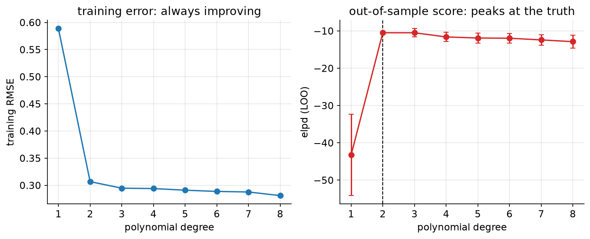

# 12. Which model, and how sure?

> **The problem.** You have six candidate models of the support queue and a polynomial whose degree you have to pick. Training error says "use the most complicated one". You know that's wrong. What says it isn't?
> **What you'll be able to do.** Score models by how well they predict data they have not seen, using one fit rather than many, and — the part usually skipped — say whether the difference between two models is bigger than its own uncertainty.
> **Where this sits on the loop.** Between steps 6 and 7: you have several golems that all pass their checks.
> **Runtime.** ~60 s. **Prereqs.** Chapters 06, 11.

Three questions get called "model selection" and they have three different
answers:

1. **Can this model produce data like mine?** That is chapter 06's posterior
   predictive check, and it is about a single model in isolation.
2. **Which of these models predicts new data best?** That is this chapter.
3. **Which model gives the right answer to a causal question?** That is chapter
   08, and — critically — neither of the other two can answer it.

## 12.1 Scoring a prediction

To compare predictions you need a score, and there is essentially one defensible
choice: the **log score**, the log probability the model assigned to what
actually happened. It is the only smooth score that cannot be gamed by
misreporting your uncertainty, and it is the same quantity as cross-entropy loss
in machine learning and as the log-likelihood in statistics — with the crucial
difference that here it is evaluated on data the model has not seen.

A model's total score on new data is called **elpd** — expected log pointwise
predictive density. Higher is better; the units are nats.

The obvious way to get it is a held-out set, but with 120 days or 65 customers
you cannot afford one, and a single split is noisy. Leave-one-out
cross-validation is better: score each point using a model fitted without it.
That would take 120 refits. **PSIS-LOO** gets the same answer from a single fit,
by re-weighting the posterior draws you already have to approximate what the
posterior would have been without each point, and — importantly — it reports a
diagnostic (Pareto k̂) that tells you when the re-weighting is not to be
trusted.

`bayeskit.psis_loo` implements it in about thirty lines and agrees with the
reference implementation to five decimals (see `tools/check_kit.py`).

## 12.2 Six models of the support queue

```python
# --- setup ---
from pathlib import Path
import numpy as np
import pandas as pd
import matplotlib
matplotlib.use("Agg")
import matplotlib.pyplot as plt
from scipy import stats

import numpyro
numpyro.set_host_device_count(4)
import jax
import jax.numpy as jnp
import numpyro.distributions as dist
from numpyro.infer import MCMC, NUTS, log_likelihood

from bayeskit import psis_loo, waic

SLUG = "12-which-model-and-how-sure"
FIG = Path("figures") / SLUG
FIG.mkdir(parents=True, exist_ok=True)
rng = np.random.default_rng(12)

plt.rcParams.update({
    "figure.figsize": (7, 4), "figure.dpi": 110, "savefig.dpi": 150,
    "savefig.bbox": "tight", "axes.grid": True, "grid.alpha": 0.3,
    "axes.spines.top": False, "axes.spines.right": False, "font.size": 11,
})

def save(fig, name):
    out = FIG / f"{name}.png"
    fig.savefig(out)
    plt.close(fig)
    print(f"[fig] {out}")
```

```python
tickets = pd.read_csv("data/tickets.csv")
y = tickets.tickets.values
weekend = tickets.weekend.values * 1.0
release = tickets.release.values * 1.0

def build(family, use_weekend, use_release):
    def model(weekend, release, tickets=None):
        eta = numpyro.sample("a", dist.Normal(3.0, 0.5))
        if use_weekend:
            eta = eta + numpyro.sample("b_weekend", dist.Normal(0, 1)) * weekend
        if use_release:
            eta = eta + numpyro.sample("b_release", dist.Normal(0, 1)) * release
        mu = jnp.exp(eta)
        if family == "poisson":
            numpyro.sample("tickets", dist.Poisson(mu), obs=tickets)
        else:
            phi = numpyro.sample("phi", dist.Exponential(0.1))
            numpyro.sample("tickets", dist.NegativeBinomial2(mu, phi), obs=tickets)
    return model

CANDIDATES = {
    "poisson, intercept only":     build("poisson", False, False),
    "poisson, + weekend":          build("poisson", True, False),
    "poisson, + weekend + release": build("poisson", True, True),
    "negbin, intercept only":      build("negbin", False, False),
    "negbin, + weekend":           build("negbin", True, False),
    "negbin, + weekend + release": build("negbin", True, True),
}

scores = {}
for name, model in CANDIDATES.items():
    mcmc = MCMC(NUTS(model), num_warmup=500, num_samples=500, num_chains=4,
                chain_method="parallel", progress_bar=False)
    mcmc.run(jax.random.PRNGKey(0), weekend=weekend, release=release, tickets=y)
    # log p(y_i | theta_s) for every draw s and every observation i
    ll = np.asarray(log_likelihood(model, mcmc.get_samples(), weekend=weekend,
                                   release=release, tickets=y)["tickets"])
    scores[name] = psis_loo(ll)
```

```python
best = max(scores.values(), key=lambda s: s["elpd"])
print(f"{'model':30s} {'elpd':>8s} {'se':>6s} {'vs best':>8s} {'se':>6s} "
      f"{'p_loo':>6s} {'max k':>6s}")
for name, s in sorted(scores.items(), key=lambda kv: -kv[1]["elpd"]):
    diff = s["elpd_i"] - best["elpd_i"]
    se_diff = np.sqrt(len(diff) * np.var(diff, ddof=1)) if s is not best else 0.0
    print(f"{name:30s} {s['elpd']:8.1f} {s['se']:6.1f} {diff.sum():8.1f} "
          f"{se_diff:6.1f} {s['p_loo']:6.1f} {s['khat'].max():6.2f}")
```

Read the table column by column.

**elpd** ranks the models: negative binomial with both predictors wins at
`-422.1`, and every negative binomial beats every Poisson. Note that the
*intercept-only negative binomial* (`-466.0`) beats the *fully specified
Poisson* (`-515.3`). Getting the noise model right matters more here than
getting the predictors right — which is not what most modelling effort is spent
on.

**vs best** is the difference, and its standard error. The runner-up is `-23.5`
± `5.9` behind: four standard errors, a real difference. When a difference is
within about two of its own standard errors, the data does not distinguish the
models and you should say so rather than picking a winner.

**p_loo** is the effective number of parameters. For the winning model it is
`3.7`, which matches its actual four parameters. For the Poisson models it is
`11.4` — against three actual parameters. **p_loo far above the real parameter
count is a misspecification alarm**: it means individual observations are
influencing the fit far more than a well-specified model would allow, which is
exactly what happens when a Poisson meets an overdispersed day.

**max k** is the Pareto diagnostic. All below 0.5 here, so the approximation is
reliable. Above 0.7 for any point, refit without that point or fall back to
explicit k-fold cross-validation.

## 12.3 Complexity, chosen by prediction

The other classic use: how complicated should the model be? Take thirty
observations from a quadratic and fit polynomials up to degree 8, with a
Gaussian prior on the coefficients (chapter 11) so nothing blows up.

```python
truth = lambda t: 1.0 + 2.0 * t - 1.5 * t ** 2
n, SIG = 30, 0.35
x = np.linspace(-1, 1, n)
y_poly = truth(x) + rng.normal(0, SIG, n)
x_new = np.linspace(-1, 1, 500)
y_new = truth(x_new) + rng.normal(0, SIG, 500)

rows = []
print(f"{'degree':>7s} {'train RMSE':>11s} {'new-data RMSE':>14s} "
      f"{'elpd_loo':>9s} {'p_loo':>7s}")
for degree in range(1, 9):
    X, X_new = np.vander(x, degree + 1), np.vander(x_new, degree + 1)
    A = X.T @ X / SIG ** 2 + np.eye(degree + 1) / 4.0      # Normal(0, 4) prior
    cov = np.linalg.inv(A)
    mean = cov @ (X.T @ y_poly / SIG ** 2)
    draws = rng.multivariate_normal(mean, cov, size=2000)
    ll = stats.norm.logpdf(y_poly[None, :], draws @ X.T, SIG)
    loo = psis_loo(ll)
    rows.append((degree, loo))
    print(f"{degree:7d} {np.sqrt(np.mean((y_poly - X @ mean)**2)):11.4f} "
          f"{np.sqrt(np.mean((y_new - X_new @ mean)**2)):14.4f} "
          f"{loo['elpd']:9.2f} {loo['p_loo']:7.2f}")
```

Training error falls all the way to degree 8, as it must. LOO peaks at degree
`2` — the true degree — with `-10.49`, and declines thereafter. And p_loo climbs
steadily from `2.45` to `5.87`, measuring the complexity the model is actually
using.

This is **Occam's razor as a consequence rather than a principle**. Nothing
penalises complexity by hand; a more flexible model simply spreads its
predictive probability over more possible datasets, so it assigns less to the
one that happened. Complexity control falls out of scoring predictions honestly.

But look at the differences before declaring victory:

```python
best_degree, best_loo = max(rows, key=lambda r: r[1]["elpd"])
print(f"best by LOO: degree {best_degree}")
for degree, loo in rows:
    diff = loo["elpd_i"] - best_loo["elpd_i"]
    print(f"  degree {degree}: {diff.sum():7.2f} +- "
          f"{np.sqrt(len(diff) * np.var(diff, ddof=1)):5.2f}")
```

Degree 3 is `-0.01` ± `1.12` behind degree 2, and degree 4 is `-1.13` ± `1.26`.
On thirty observations, LOO cannot distinguish a quadratic from a cubic. Degree
1, at `-32.74` ± `10.92`, is decisively out.

The honest report is: *"degrees 2 through 6 are indistinguishable on this data;
degree 1 is clearly worse"*, and then you pick among the survivors on other
grounds — simplicity, interpretability, or what the mechanism suggests. A
comparison table without its standard errors invites exactly the false precision
this whole guide is trying to remove.



```python
degrees = [r[0] for r in rows]
elpds = np.array([r[1]["elpd"] for r in rows])
ses = np.array([np.sqrt(len(r[1]["elpd_i"]) * np.var(
    r[1]["elpd_i"] - best_loo["elpd_i"], ddof=1)) for r in rows])
train = [np.sqrt(np.mean((y_poly - np.vander(x, d + 1) @ (np.linalg.solve(
    np.vander(x, d + 1).T @ np.vander(x, d + 1) / SIG**2 + np.eye(d + 1) / 4.0,
    np.vander(x, d + 1).T @ y_poly / SIG**2))) ** 2)) for d in degrees]

fig, axes = plt.subplots(1, 2, figsize=(11, 3.8))
axes[0].plot(degrees, train, "o-", color="C0")
axes[0].set_xlabel("polynomial degree"); axes[0].set_ylabel("training RMSE")
axes[0].set_title("training error: always improving")
axes[1].errorbar(degrees, elpds, yerr=ses, fmt="o-", color="C3", capsize=3)
axes[1].axvline(2, color="k", ls="--", lw=1)
axes[1].set_xlabel("polynomial degree"); axes[1].set_ylabel("elpd (LOO)")
axes[1].set_title("out-of-sample score: peaks at the truth")
save(fig, "occam")
```

## 12.4 Three things LOO is not

**Not a causal criterion.** Chapter 08's over-controlled regression had the best
R² and a badly wrong elasticity. LOO would have preferred it too. Predictive
score answers "which model forecasts best in a world that keeps running as it
has been", and a causal question is about a world you intervene in. Use the
graph, not the score.

**Not a substitute for checking.** LOO compares models to each other. If all
your candidates are bad, LOO will rank them and hand you the least bad one with
no indication that they are all wrong. Chapter 06's posterior predictive check
is what catches that, and it works on a single model.

**Not a hypothesis test.** An elpd difference of 4 ± 3 is not "significant at
p < 0.05" and should not be dressed up as such. The honest statement is a
difference and an uncertainty.

There is also a subtlety worth knowing: LOO assumes your observations are
exchangeable, so leaving one out is meaningful. For time series, spatial data,
or anything grouped, plain LOO is over-optimistic — the neighbouring points
still in the training set contain most of the information about the one you
removed. Use leave-a-block-out or leave-a-group-out instead. The `tickets` data
in §12.2 is borderline for exactly this reason: consecutive days are almost
certainly correlated, so all six elpd values are somewhat generous, though the
*ranking* is robust.

## 12.5 When two models tie

Very often the top few models are within a standard error of each other. Three
reasonable responses, in increasing order of effort:

- **Pick the simpler one.** Fewer parameters, easier to explain, less to break.
  Defensible whenever the difference is inside its own uncertainty.
- **Average them.** If model A and model B both predict well, the average of
  their predictive distributions usually predicts better than either — the same
  reason ensembles work in machine learning.
- **Build the model that contains both.** If you are torn between "with
  weekend" and "without", the honest model has a weekend coefficient with a
  prior that allows it to be near zero. Then you never choose; the posterior
  reports how much weekend matters, with uncertainty. This is usually the right
  answer and it is what chapter 11's regularisation is for.

```python
# averaging two predictive distributions, weighted by their LOO scores
names = ["negbin, + weekend + release", "negbin, + weekend"]
elpd = np.array([scores[n]["elpd"] for n in names])
weights = np.exp(elpd - elpd.max()); weights /= weights.sum()
print(f"LOO weights: {names[0]} {weights[0]:.4f}, {names[1]} {weights[1]:.4f}")
```

Here the weights are `1.0000` and `0.0000` — one model is 23 nats better, so
averaging has nothing to add. That is what a decisive comparison looks like, and
it is why you compute the weights rather than assuming a tie.

## Pitfalls

- **Comparing models fitted to different data.** Dropping rows with missing
  values in one model and not another makes the elpd values incomparable. Same
  rows, always.
- **Reporting elpd differences without standard errors.** Half the model
  comparisons in the literature would evaporate.
- **Ignoring Pareto k̂.** If any point has k̂ > 0.7 the approximation is unstable
  for that point, and the total is not to be trusted.
- **Using LOO on time series without blocking.** Neighbouring observations leak.
- **Selecting on LOO and then reporting the winner's fit as if it were
  pre-specified.** You searched over models; the winner's parameters are
  optimistically biased. If it matters, hold out a genuinely untouched set.
- **Believing p_loo is the parameter count.** It is an *effective* count, and
  when it exceeds the real one you have found a misspecification, not a bug.

## Exercises

**Exercise 12.1 — What if the noise model is right but the predictors are wrong?**
*Setup:* Compare the negative binomial with no predictors against the Poisson
with both.
*Predict:* Which wins, and by how much relative to the gap between the two
negative binomials?
*Reason:* The Poisson has more information; the negative binomial has more
flexibility about noise.
*Run:*
```python
a = scores["negbin, intercept only"]
b = scores["poisson, + weekend + release"]
diff = a["elpd_i"] - b["elpd_i"]
print(f"negbin-no-predictors minus poisson-with-predictors: {diff.sum():.1f} "
      f"+- {np.sqrt(len(diff)*np.var(diff, ddof=1)):.1f}")
```
<details><summary>Reconcile</summary>

The predictor-free negative binomial beats the fully specified Poisson by
`49.3` ± `23.7` nats — about two standard errors.

Getting the *shape of the noise* right was worth more than both predictors
combined. This is the opposite of where modelling effort usually goes: teams
spend weeks on feature engineering and minutes on the likelihood, which is
backwards for any count, duration, or bounded outcome. When your outcome is not
approximately Gaussian, the distributional assumption is the highest-leverage
choice you will make.
</details>

**Exercise 12.2 — Cross-validation the slow way.**
*Setup:* PSIS-LOO approximates leave-one-out. Check it by doing actual 10-fold
cross-validation on the polynomial problem at degree 2.
*Predict:* Will the two agree to within a nat?
*Reason:* One is an approximation of the other.
*Run:*
```python
from sklearn.model_selection import KFold
degree = 2
X = np.vander(x, degree + 1)
total = 0.0
for tr, va in KFold(10, shuffle=True, random_state=0).split(X):
    A = X[tr].T @ X[tr] / SIG**2 + np.eye(degree + 1) / 4.0
    cov = np.linalg.inv(A)
    mean = cov @ (X[tr].T @ y_poly[tr] / SIG**2)
    pred_var = np.einsum("ij,jk,ik->i", X[va], cov, X[va]) + SIG**2
    total += stats.norm.logpdf(y_poly[va], X[va] @ mean, np.sqrt(pred_var)).sum()
print(f"10-fold CV elpd {total:.2f}   PSIS-LOO elpd {rows[1][1]['elpd']:.2f}")
```
<details><summary>Reconcile</summary>

10-fold gives `-9.43` and PSIS-LOO gives `-10.49`: within about a nat, as
promised. A gap of this size is expected — the two estimate slightly different
quantities (10-fold trains on 90% of the data, LOO on 97%), each carries its own
Monte Carlo noise, and PSIS-LOO is an approximation on top of that.

The practical point is the cost. The exact version needed ten refits; PSIS-LOO
needed the one fit you already had. For a model that takes an hour to sample,
that is the difference between a routine check and a project.
</details>

**Exercise 12.3 — Scoring rules that lie.**
*Setup:* A machine-learning connection. Compare two forecasters of a coin that
comes up heads 70% of the time: an honest one saying 0.7, and an overconfident
one saying 0.9.
*Predict:* Under log score, which does better? Under accuracy (fraction of
correct point predictions)?
*Reason:* The overconfident forecaster is wrong about the probability but right
about which outcome is more likely.
*Run:*
```python
outcomes = rng.random(100_000) < 0.7
for name, p in [("honest, 0.7", 0.7), ("overconfident, 0.9", 0.9),
                ("cautious, 0.55", 0.55)]:
    log_score = np.mean(np.where(outcomes, np.log(p), np.log(1 - p)))
    accuracy = np.mean(outcomes == (p > 0.5))
    print(f"{name:20s} log score {log_score:+.4f}   accuracy {accuracy:.4f}")
```
<details><summary>Reconcile</summary>

The honest forecaster wins on log score — `-0.6107`, against `-0.7642` for the
overconfident one and `-0.6580` for the over-cautious one (less negative is
better) — while **all three have identical accuracy** (`0.7002`), because
accuracy only looks at which side of 0.5 the forecast falls.

That is why log score is the right currency for model comparison and accuracy is
not. Accuracy cannot distinguish a well-calibrated model from a wildly
overconfident one that happens to get the ordering right — and the difference
between those two matters enormously the moment you use the probabilities for a
decision, as chapter 13 does. Any *proper* scoring rule (log, Brier) is
maximised by reporting your true belief; accuracy is not proper, and rewards
exaggeration.
</details>

## Takeaways

- Score models by the log probability they assign to data they have not seen.
  PSIS-LOO gets that from a single fit, plus a diagnostic for when it fails.
- Always report the difference between models *and its standard error*. Inside
  two standard errors, the data does not distinguish them.
- p_loo far above the true parameter count is a misspecification alarm, not a
  bug.
- Occam's razor is a consequence of honest predictive scoring, not an extra
  principle: flexible models spread probability thinly.
- Getting the noise distribution right can matter more than getting the
  predictors right.
- LOO does not answer causal questions, does not replace posterior predictive
  checks, and is not a hypothesis test.

## Going deeper

- **The Bayesian Spine, module 17** (`curriculum/modules/17-model-checking.md`) covers the marginal likelihood as an alternative to LOO, with its built-in Occam factor, plus Bayes factors and Lindley's paradox — where a p-value of 0.0099 coexists with strong evidence *for* the null.
- **Statistical Rethinking, chapter 7** (`curriculum_material/statistical_rethinking/ch07-ulysses-compass.md`) is the definitive gentle treatment of information criteria and why regularising priors and out-of-sample scoring are two views of the same thing.
- **Module 18** (`curriculum/modules/18-scale-and-misspecification.md`) covers the M-open case: what to do when you know none of your candidate models is true, and stacking rather than selecting.
