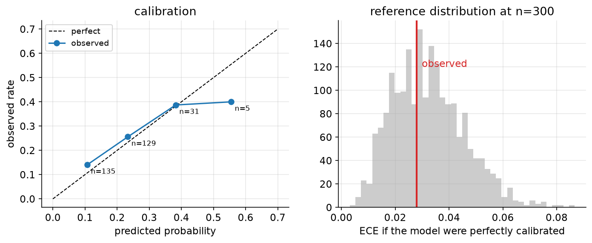
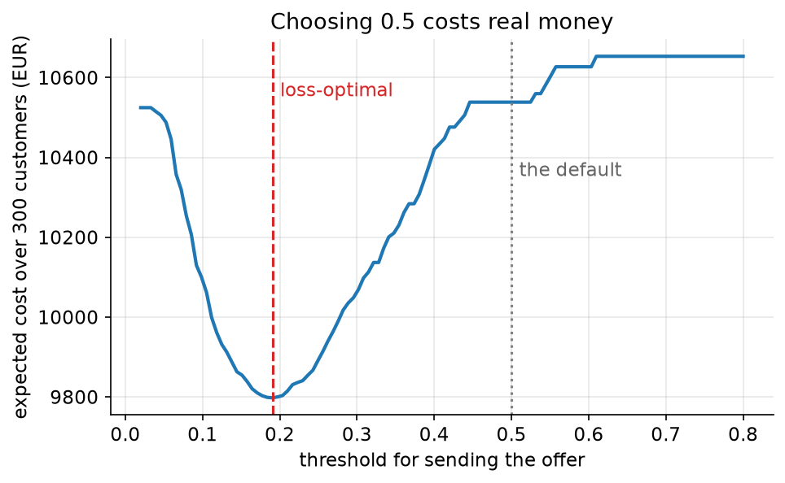

# 13. Probabilities that mean something

> **The problem.** Nine hundred subscribers, a model that predicts churn, and a €12 retention offer that works about a third of the time. Who do you send it to?
> **What you'll be able to do.** Fit a classifier that reports probabilities you can check, check them, and convert them into the action that minimises expected cost — which is almost never "predict the more likely class".
> **Where this sits on the loop.** Steps 5, 6 and 7 on a problem where all three are usually skipped.
> **Runtime.** ~25 s. **Prereqs.** Chapters 05, 07, 12.

Classification is where the four lines of chapter 00 pay off most visibly,
because a classifier's output is a probability, and a probability is useless
until it meets a loss function. Most deployed classifiers are evaluated on
accuracy, thresholded at 0.5, and never calibrated. Each of those three is a
mistake, and this chapter fixes them in order.

## 13.1 A model of churn

```python
# --- setup ---
from pathlib import Path
import numpy as np
import pandas as pd
import matplotlib
matplotlib.use("Agg")
import matplotlib.pyplot as plt

import numpyro
numpyro.set_host_device_count(4)
import jax
import numpyro.distributions as dist
from numpyro.infer import MCMC, NUTS
from sklearn.linear_model import LogisticRegression

from bayeskit import mcmc_summary, ece, calibration_curve, hdi

SLUG = "13-probabilities-that-mean-something"
FIG = Path("figures") / SLUG
FIG.mkdir(parents=True, exist_ok=True)
rng = np.random.default_rng(13)

plt.rcParams.update({
    "figure.figsize": (7, 4), "figure.dpi": 110, "savefig.dpi": 150,
    "savefig.bbox": "tight", "axes.grid": True, "grid.alpha": 0.3,
    "axes.spines.top": False, "axes.spines.right": False, "font.size": 11,
})

def save(fig, name):
    out = FIG / f"{name}.png"
    fig.savefig(out)
    plt.close(fig)
    print(f"[fig] {out}")
```

```python
churn = pd.read_csv("data/churn.csv")
features = ["tenure_months", "monthly_fee", "support_tickets"]
X_raw = churn[features].values.astype(float)
X = (X_raw - X_raw.mean(0)) / X_raw.std(0)         # standardise: chapter 03's rule
y = churn.churned.values

split = rng.permutation(len(churn))
train, test = split[:600], split[600:]
print(f"{len(churn)} subscribers, {y.mean():.3f} churned; "
      f"{len(train)} train / {len(test)} test")
```

The model is a logistic regression, which is the Bernoulli member of chapter
06's family: linear predictor, non-linear link.

```
churned_i ~ Bernoulli(p_i)
logit(p_i) = a + b · x_i
a ~ Normal(0, 1.5)      b ~ Normal(0, 1)
```

Those priors are not decoration — chapter 03's exercise 03.2 showed that a
"vague" Normal(0, 10) prior on log-odds asserts that essentially every customer
is a certainty. Normal(0, 1) on standardised predictors says a one-standard-
deviation change in a feature typically shifts the log-odds by about one, which
is a strong effect but not an absurd one.

```python
def churn_model(X, y=None):
    a = numpyro.sample("a", dist.Normal(0, 1.5))
    b = numpyro.sample("b", dist.Normal(0, 1).expand([X.shape[1]]).to_event(1))
    numpyro.sample("churn", dist.Bernoulli(logits=a + X @ b), obs=y)

mcmc = MCMC(NUTS(churn_model), num_warmup=800, num_samples=800, num_chains=4,
            chain_method="parallel", progress_bar=False)
mcmc.run(jax.random.PRNGKey(0), X=X[train], y=y[train])

chains = {k: np.asarray(v) for k, v in mcmc.get_samples(group_by_chain=True).items()}
named = {"a": chains["a"],
         **{f"b_{f}": chains["b"][..., j] for j, f in enumerate(features)}}
print(mcmc_summary(named).round(3).to_string())

sk = LogisticRegression(C=1e6, max_iter=2000).fit(X[train], y[train])
post = mcmc.get_samples()
print(f"\nsklearn (unpenalised): "
      f"{np.round(np.r_[sk.intercept_, sk.coef_[0]], 3)}")
print(f"posterior mean:        "
      f"{np.round(np.r_[post['a'].mean(), np.asarray(post['b']).mean(0)], 3)}")
```

The coefficients agree with sklearn to about three decimals — `-1.524` against
`-1.527` for the intercept — because with 600 observations and weak priors,
maximum likelihood and the posterior mean coincide. Every extra support ticket
raises the log-odds of churning by `0.299`; every standard deviation of tenure
lowers it by `0.646`.

What the posterior adds is everything downstream. Hold that thought until
§13.4.

## 13.2 Do the probabilities mean anything?

A model that says "30%" should be right 30% of the time on the cases it says
that about. That property is **calibration**, it is not automatic, and it is
checkable — it is a posterior predictive check (chapter 06) specialised to
probabilities.

```python
def predict(X_new):
    """Full posterior of the churn probability for each row: (draws, rows)."""
    logits = np.asarray(post["a"])[:, None] + np.asarray(post["b"]) @ X_new.T
    return 1 / (1 + np.exp(-logits))

P = predict(X[test])
p_hat = P.mean(axis=0)                       # posterior mean probability per customer

print(f"observed churn in the test set: {y[test].mean():.4f}")
print(f"average predicted probability:  {p_hat.mean():.4f}")
print(f"expected calibration error:     {ece(p_hat, y[test], bins=6):.4f}\n")

print(f"{'predicted':>10s} {'observed':>10s} {'customers':>10s}")
for pred, obs, count in calibration_curve(p_hat, y[test], bins=6):
    print(f"{pred:10.3f} {obs:10.3f} {int(count):10d}")
```

Average predicted `0.1973` against `0.2200` observed, and an expected
calibration error of `0.0279` — a typical gap of nearly three percentage points
between what the model claims and what happens. That sounds bad.

Is it? With 300 test customers, how big would the gap be even for a *perfectly*
calibrated model? The question answers itself the way everything in this guide
does: simulate.

```python
sim_ece = np.array([ece(p_hat, rng.binomial(1, p_hat), bins=6) for _ in range(2000)])
print(f"observed ECE {ece(p_hat, y[test], bins=6):.4f}; a perfectly calibrated "
      f"model at n={len(test)} would give {sim_ece.mean():.4f} "
      f"[{np.quantile(sim_ece, 0.055):.4f}, {np.quantile(sim_ece, 0.945):.4f}]")
```

A perfectly calibrated model at this sample size produces an average ECE of
`0.0324`, with an 89% range from `0.0133` to `0.0554`. The observed `0.0279`
sits *below* the average: this model's calibration is as good as calibration
gets at n = 300, and the alarming-looking three-point gap was sampling noise.

That is the point. **A raw calibration number is uninterpretable without its
reference distribution**, and the reference depends on the sample size and the
bin count. An ECE of 0.03 can mean "flawless" or "badly broken" depending on how
much data produced it, and the three lines above are what tell you which.



```python
tab = calibration_curve(p_hat, y[test], bins=6)
fig, axes = plt.subplots(1, 2, figsize=(11, 3.8))
axes[0].plot([0, 0.7], [0, 0.7], "k--", lw=1, label="perfect")
axes[0].plot(tab[:, 0], tab[:, 1], "o-", color="C0", label="observed")
for pred, obs, count in tab:
    axes[0].annotate(f"n={int(count)}", (pred, obs), fontsize=8,
                     xytext=(4, -10), textcoords="offset points")
axes[0].set_xlabel("predicted probability"); axes[0].set_ylabel("observed rate")
axes[0].set_title("calibration"); axes[0].legend(fontsize=9)
axes[1].hist(sim_ece, bins=40, color="0.8")
axes[1].axvline(ece(p_hat, y[test], bins=6), color="C3", lw=2)
axes[1].annotate("observed", (ece(p_hat, y[test], bins=6) + 0.002, 120), color="C3")
axes[1].set_xlabel("ECE if the model were perfectly calibrated")
axes[1].set_title(f"reference distribution at n={len(test)}")
save(fig, "calibration")
```

## 13.3 The threshold is not 0.5

Now the decision. A retention offer costs €12. A customer who churns costs €180
in lost lifetime margin. The offer works about a third of the time — call it 35%.

For a customer with churn probability p:

- **Do nothing:** expected cost = 180p
- **Send the offer:** expected cost = 12 + 0.65 × 180p

The offer is worth sending when 12 + 117p < 180p, that is, when p > 12/63.

```python
COST_OFFER, VALUE_LOST, EFFECT = 12.0, 180.0, 0.35
threshold = COST_OFFER / (VALUE_LOST * EFFECT)
print(f"send the offer whenever P(churn) > {threshold:.4f}")

def expected_cost(target):
    """Expected cost of a targeting policy, averaged over the whole posterior."""
    cost = np.where(target[None, :],
                    COST_OFFER + (1 - EFFECT) * P * VALUE_LOST,
                    P * VALUE_LOST)
    return cost.sum(axis=1)

policies = {
    "target nobody":                np.zeros(len(test), bool),
    "target everybody":             np.ones(len(test), bool),
    "target p > 0.5 (the default)": p_hat > 0.5,
    f"target p > {threshold:.2f} (loss-optimal)": p_hat > threshold,
}
for name, target in policies.items():
    c = expected_cost(target)
    print(f"  {name:32s} contacts {target.sum():3d}   expected cost "
          f"{c.mean():7,.0f} EUR  89% [{np.quantile(c, 0.055):,.0f}, "
          f"{np.quantile(c, 0.945):,.0f}]")

saving = expected_cost(policies["target nobody"]).mean() - expected_cost(
    p_hat > threshold).mean()
print(f"\nthe loss-optimal policy saves {saving:,.0f} EUR over 300 customers "
      f"({saving/len(test):.2f} EUR each)")
```

The default 0.5 threshold contacts `5` customers out of 300 and saves almost
nothing: `10,538` against `10,653` for doing nothing at all. The loss-optimal
threshold contacts `141` and brings the expected cost down to `9,798` — a saving
of `856` euros over 300 customers, `2.85` euros each.

**The model was the same. Only the threshold changed.** A team that had built
this classifier, reported 79% accuracy, deployed it at 0.5 and moved on would
have captured about 13% of the available value, and nothing in their metrics
would have shown the gap.

Check it against what actually happened, rather than against the model's own
beliefs:

```python
def realised_cost(target, seed):
    """What the policy would have cost on the actual outcomes."""
    r = np.random.default_rng(seed)
    saved = r.random(len(test)) < EFFECT               # did the offer work?
    churned = y[test].astype(bool) & ~(target & saved)
    return (target * COST_OFFER + churned * VALUE_LOST).sum()

for name, target in policies.items():
    costs = np.array([realised_cost(target, s) for s in range(400)])
    print(f"  {name:32s} actual cost {costs.mean():7,.0f} EUR")
```

On the real outcomes the ranking holds: `11,880` for doing nothing, `11,049`
for the loss-optimal policy. The saving is real, slightly smaller than the model
predicted (the model was under-predicting churn, as §13.2 found), and the
default threshold is still barely better than doing nothing.



```python
grid = np.linspace(0.02, 0.8, 120)
curve = [expected_cost(p_hat > t).mean() for t in grid]
fig, ax = plt.subplots()
ax.plot(grid, curve, color="C0", lw=2)
ax.axvline(threshold, color="C3", ls="--")
ax.annotate("loss-optimal", (threshold + 0.01, max(curve) - 100), color="C3")
ax.axvline(0.5, color="0.5", ls=":")
ax.annotate("the default", (0.51, max(curve) - 300), color="0.4")
ax.set_xlabel("threshold for sending the offer")
ax.set_ylabel("expected cost over 300 customers (EUR)")
ax.set_title("Choosing 0.5 costs real money")
save(fig, "threshold")
```

## 13.4 What the posterior adds

The coefficients matched sklearn, so what was the point of sampling?

```python
uncertain = int(np.argmax(P.std(axis=0)))
lo, hi = hdi(P[:, uncertain], 0.89)
print(f"most uncertain customer: P(churn) = {P[:, uncertain].mean():.3f}, "
      f"89% [{lo:.3f}, {hi:.3f}]")

borderline = int(np.argmin(np.abs(p_hat - threshold)))
print(f"customer closest to the threshold: p = {p_hat[borderline]:.4f}, "
      f"P(this customer is above the threshold) = "
      f"{np.mean(P[:, borderline] > threshold):.3f}")

p_plugin = 1 / (1 + np.exp(-(post["a"].mean() + X[test] @ np.asarray(post["b"]).mean(0))))
print(f"averaging over the posterior vs plugging in the mean: "
      f"max difference {np.max(np.abs(p_hat - p_plugin)):.4f}")
```

Three things, in increasing order of importance.

**Per-customer uncertainty.** The most uncertain customer's churn probability
ranges from `0.406` to `0.666` — the model genuinely does not know. A point
estimate hides that; a posterior lets you route the ambiguous ones to a human,
or to a cheaper intervention, or to a follow-up question.

**Uncertainty about the decision, not just the probability.** The customer
nearest the threshold has `0.478` posterior probability of being on the "send"
side. That is the honest description of a borderline case, and it is what you
would use to decide whether gathering one more feature is worth it (chapter 10's
EVSI, per customer).

**Averaging versus plugging in.** Here it barely matters: the largest difference
between the averaged prediction and the plug-in is `0.0054`. That is the *right*
answer at n = 600 with three predictors, and it is worth knowing that the
correction is small in this regime — but it grows with the number of parameters
and shrinks with data, so in a model with 200 features and 600 rows it would be
substantial, and always in the same direction: **plugging in the mean pushes
probabilities away from 0.5, making the model look more confident than it is.**

That last effect is one mechanism behind the overconfidence of large neural
networks, which are extreme cases of many parameters and a single point
estimate. Deep ensembles and Monte-Carlo dropout are, in this light, cheap
attempts to average over a posterior instead of plugging into one.

## 13.5 What to do on Monday

The whole of this chapter compresses to five steps you can run on any
classifier, Bayesian or not:

1. **Get probabilities, not labels.** If your model only emits classes, you
   cannot make a decision with it.
2. **Check calibration on held-out data**, and compare the error to what a
   perfectly calibrated model would give at that sample size. If it is badly
   off, fix it — Platt scaling and isotonic regression are the standard patches,
   and a proper model with sensible priors is the standard cure.
3. **Write down the cost of each mistake.** Both mistakes.
4. **Set the threshold from those costs**, not from 0.5, and check how flat the
   cost curve is around the optimum — flat means the exact value doesn't matter,
   steep means it does.
5. **Report the money.** "Saves €856 per 300 customers per period" is a
   sentence that gets acted on. "AUC 0.81" is not.

## Pitfalls

- **Reporting accuracy on an imbalanced problem.** Predicting "nobody churns"
  here gets 78% accuracy and is worth zero.
- **Thresholding at 0.5.** It is optimal only when the two errors cost the same,
  which they essentially never do.
- **Assuming a calibrated model stays calibrated.** Calibration is a property of
  a model *and a population*. Change the traffic mix, the season, or the
  marketing channel, and it goes stale.
- **Calibrating on training data.** Every model is calibrated on the data it was
  fitted to. Use held-out data.
- **Comparing ECE across datasets or bin counts.** ECE depends on both. Compare
  against a simulated reference, as in §13.2.
- **Treating the classifier's probability as the probability.** It is a
  probability under your model, on data like your training set, given the
  features you happened to record.

## Exercises

**Exercise 13.1 — How much do the costs have to change?**
*Setup:* Someone argues the offer really works 60% of the time, not 35%.
*Predict:* Does the threshold roughly halve? Does the saving roughly double?
*Reason:* The effect nearly doubled.
*Run:*
```python
for effect in (0.20, 0.35, 0.60):
    t = COST_OFFER / (VALUE_LOST * effect)
    cost = np.where((p_hat > t)[None, :],
                    COST_OFFER + (1 - effect) * P * VALUE_LOST,
                    P * VALUE_LOST).sum(axis=1).mean()
    print(f"offer works {effect:.0%} of the time: threshold {t:.3f}, "
          f"contacts {(p_hat > t).sum():3d}, expected cost {cost:7,.0f}")
```
<details><summary>Reconcile</summary>

At 20% effectiveness the threshold is `0.333` and you contact `36` customers; at
60% it is `0.111` and you contact `225`. Expected cost falls from `10,559` to
`7,620`.

The threshold moves inversely with the effect size, exactly as the algebra says
— but notice the *number contacted* moves far more than proportionally, because
the distribution of predicted probabilities is dense in that region. Small
changes in an assumed cost or effect can change who gets contacted enormously
while barely changing the total cost, which is a good reason to check the
sensitivity of the *policy*, not just the bottom line, before rolling it out.
</details>

**Exercise 13.2 — Accuracy is not the goal.**
*Setup:* Compare the accuracy of the two thresholds.
*Predict:* Which policy has higher accuracy, and does it match which has lower
cost?
*Reason:* Accuracy counts mistakes; the cost function weights them.
*Run:*
```python
for name, target in policies.items():
    if "target p" not in name:
        continue
    acc = np.mean((p_hat > (0.5 if "0.5" in name else threshold)) == y[test])
    print(f"{name:34s} accuracy {acc:.4f}   expected cost "
          f"{expected_cost(target).mean():7,.0f}")
print(f"{'predict nobody churns':34s} accuracy {np.mean(y[test] == 0):.4f}   "
      f"expected cost {expected_cost(np.zeros(len(test), bool)).mean():7,.0f}")
```
<details><summary>Reconcile</summary>

The 0.5 threshold has accuracy `0.7767` and costs `10,538`. The loss-optimal
threshold has accuracy `0.5767` — dramatically worse — and costs `9,798`.
Predicting that nobody churns has accuracy `0.7800`, *better than either
classifier*, and costs the most of all.

Accuracy and expected cost rank these policies in opposite orders. That is not a
quirk of this dataset; it is what happens whenever the classes are imbalanced
and the errors cost different amounts, which is most real problems. Optimising
accuracy is optimising a loss function that says a missed churner and a wasted
€12 offer are equally bad. Nobody believes that; it is just the default.
</details>

**Exercise 13.3 — Would more data fix the calibration?**
*Setup:* The ECE was `0.0279` against a reference of about `0.0324`.
*Predict:* If you had 3,000 test customers instead of 300, would the observed
ECE go up, down, or stay put — assuming the model is genuinely slightly
miscalibrated?
*Reason:* More data usually improves estimates.
*Run:*
```python
big_p = np.repeat(p_hat, 10)                      # same predictions, ten times as many
for n_label, probs in [("300", p_hat), ("3000", big_p)]:
    sims = np.array([ece(probs, rng.binomial(1, probs), bins=6) for _ in range(500)])
    print(f"n={n_label:>4s}: a perfectly calibrated model gives ECE "
          f"{sims.mean():.4f} (89% up to {np.quantile(sims, 0.945):.4f})")
```
<details><summary>Reconcile</summary>

The reference ECE for a perfectly calibrated model falls from `0.0330` at n=300
to `0.0099` at n=3000 — it shrinks like 1/√n, because it is pure sampling noise.
A genuinely miscalibrated model's ECE does *not* shrink; it converges to its
true miscalibration.

So more data does not improve calibration, it improves your *ability to detect*
miscalibration. At n=300 an ECE of 0.03 is indistinguishable from perfect; at
n=3000 it would be damning. This is the same distinction as chapter 04's two intervals: sample size
attacks your uncertainty about the model, never the model's own errors.
</details>

## Takeaways

- A classifier's job is to emit a calibrated probability. Labels are what you
  get after applying a loss function, and they are not the model's business.
- Check calibration on held-out data, and compare the error against what a
  perfectly calibrated model would produce at that sample size.
- The decision threshold is set by the cost ratio. Here it is 0.19; the default
  0.5 captured 13% of the available value.
- Accuracy can rank policies in the opposite order to expected cost. Report
  money.
- The posterior buys per-customer uncertainty, uncertainty about which side of
  the threshold a customer falls on, and a correction to overconfident
  probabilities that grows with model complexity.
- All of it is chapter 00's four lines, on a problem with a €12 price tag
  attached.

## Going deeper

- **The Bayesian Spine, module 15** (`curriculum/modules/15-glms-classification.md`) covers GLMs properly: separation and why any proper prior cures it, the MacKay moderated predictive that §13.4 measures, and censored survival models.
- **Module 22** (`curriculum/modules/22-decisions-bandits.md`) has the threshold rule in general form and the staged example where the correct rule and the 0.5 rule take opposite actions on the same patient.
- **Module 25** (`curriculum/modules/25-deep-learning-lenses.md`) applies the same calibration harness to a neural network, and works through temperature scaling and deep ensembles as posterior approximations.

---

**That is the guide.** The [capstone](../CAPSTONE.md) is a problem to work end
to end with no scaffolding, and the [README](../README.md) has the reading map
for going deeper on any thread you want to pull.
